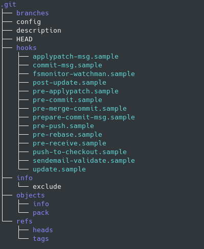

# 青训营笔记：Git

!!! abstract ""

    记录学习 Git 过程中的思考与实践。

    **组织逻辑：**以 `.git` 目录中的内容为主线，穿插着讲解一下 Git 命令，介绍命令功能，以及其如何改变 `.git` 目录的状态，必要时简述一下使用场景。

    # TODO: 阅读一下 Git 用户手册

    ??? info "参考文献"

        - 青训营课程
        - [Git 用户手册](https://git-scm.com/docs/user-manual)
<!-- more -->

## .git 目录

我们将回归 Linux 下一切皆文件的本质，通过了解每个命令如何改变 `.git` 目录的状态来学习 Git 命令。一个初始化的 `.git` 目录如下所示：



.git 目录（之后将以文本的形式呈现）
{ .caption }

!!! note "工作区 & 暂存区"

## HEAD

`HEAD` 可以理解为一个指向当前分支或提交的指针，当然从文件内容来看这应该被理解为一个引用。例如：

```txt title='HEAD'
ref: refs/heads/master
```
表示当前检出的分支是名为 "master" 的分支。`ref:` 前缀表明 HEAD 指向的是一个引用，而不是一个具体的提交 ID。`refs/heads/master` 就是 `.git` 下的路径，可以理解为一个符号链接。


## config

`.git/config` 文件是 Git 仓库的本地配置文件，它用于存储仓库特定的配置选项。Git 配置有三个级别：

1. **系统（--system）**：影响系统上的所有用户和仓库。配置文件通常位于 `/etc/gitconfig`。
2. **全局（--global）**：影响当前用户的所有仓库。配置文件通常位于 `~/.gitconfig`。
3. **本地（--local）**：只影响当前仓库。配置文件位于仓库目录中的 `.git/config`。

低级别的配置将覆盖高级别的配置。

!!! note "常用命令"

    - 提交第一步：用户名配置

        在提交代码之前，需要先配置用户名和邮箱，这些信息会出现在提交记录中
        ```console
        $ git config --global user.name "Your Name"
        $ git config --global user.email "your.email@example.com"
        ```
    - 换源基本功：insteadOf 

        通过配置 insteadOf 可以将 git:// 协议替换为 https:// 协议，方便在某些网络环境下使用
        ```console
        $ git config --local url."https://github.com/".insteadOf "git://github.com/"
        # git config --local url."<替换URL>".insteadOf "<原URL>"
        ```
        也可以通过配置 insteadOf 来通过配置镜像源
        ```console
        $ git config --local url."https://hub.fastgit.xyz/".insteadOf "https://github.com/"
        $ git config --local url."https://ghproxy.com/https://github.com/".insteadOf "https://github.com/"
        ```
    - 少敲几个键：别名配置

        通过配置别名可以简化常用命令，提高工作效率
        ```console
        $ git config --global alias.st status   # 设置 status 的别名为 st
        # git config --global alias.<别名> <命令>
        ```

此外，远程仓库相关的配置也在该文件中定义。

### Git Remote

??? HTTP Remote & SSH Remote 

可以为同一个远端仓库的不同命令设置不同的源

### 免密配置

- HTTP Remote: 不推荐。安全性和便利性都差点。
- SSH Remote: 推荐。生成算法推荐 ed25519。添加公钥到 Github 上。

## Object


## Git Config

改变 `.git/config` 的状态


## Git Add & Commit

改变的是 `.git/objects` 的状态。可以通过 `git cat-file -p` 命令查看改动细节。

!!! note "object ID"

    除了代码本身的信息，还有一个目录树的信息要维护。

## Objects

可能要记录一下对应格式？

- Blob: 存储文件的内容
- Tree: 存储文件的目录信息
- Commit: 存储提交信息
- Tag:

!!! note "关联"

    1. Commit ID->  Tree ID
    2. Tree ID -> Blob ID [Tree ID]
    3. Blob ID -> 文件内容

## Refs

`refs` 的内容就是对应的 **Commit ID** ，把 `ref` 当作指针，指向对应的 Commit 来表示当前的 Ref 对应的版本。 

refs/heads 前缀表示分支，refs/tags 前缀表示标签。

分支一般用于开发阶段，可以不断的添加 Commit 进行迭代

标签一般用于稳定版本，指向的 Commit 一般不会变更

## Annotation Tag

将导致 Tag Object 


## 追溯历史版本

- 获取当前版本代码

- 获取历史版本代码

    parent commit

## 修改历史版本

1. commit --amend
2. rebase
3. filter --branch

??? question "为什么配置了 Git 配置，但是依然没法拉取代码？"

??? question "为什么 Fetch 了远端分支，但本地当前的分支历史还是没有变化"
