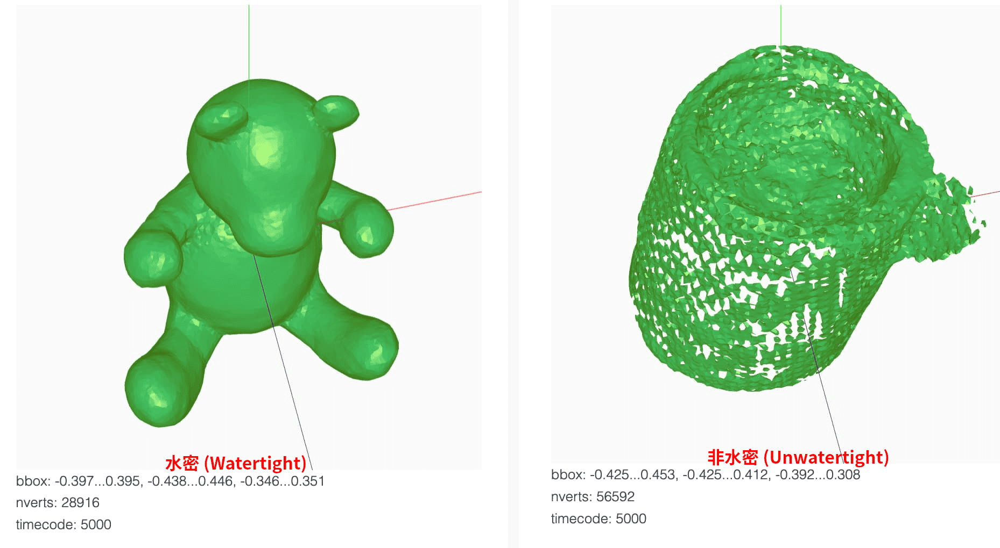

# 水密网格和非水密网格

在研究三维对抗中的一项防御方法 IF-Defense 时，遇到一个与曲面相关的概念 "watertight"。这里记录一下这个概念。

!!! info "参考文献"

    - ["watertight" and "unwatertight" meshes](https://support.einscan.com/en/support/solutions/articles/60000687687--watertight-and-unwatertight-meshes)。
<!-- more -->

!!! note "AI 总结"

    1. **水密网格与非水密网格**
        - **水密网格**：是一种网格模型，其中所有的孔洞都被自动填充，形成一个无间隙的封闭表面，适用于3D打印和虚拟现实等应用。
        - **非水密网格**：是一种网格模型，其中孔洞保持开放状态，没有进行填充，适合用于逆向工程、质量检测或模型的进一步编辑。
    2. **定义与名称的关系**
        - **关系**：定义与名称有直接关系。名称“水密网格”来源于其特性，即网格如同不透水的物体一样，没有任何间隙可以让“水”通过，这里的“水”是一个比喻，代表任何物质或光线。
        - **例子**：例如，一个水密网格模型就像一个装满水的容器，不会有水漏出来，因为所有的孔洞都被封闭了。相反，非水密网格就像一个有孔的篮子，水可以自由通过孔洞，因为它没有封闭的表面。
