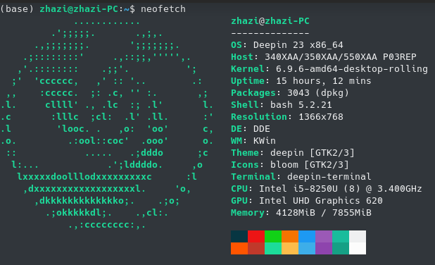
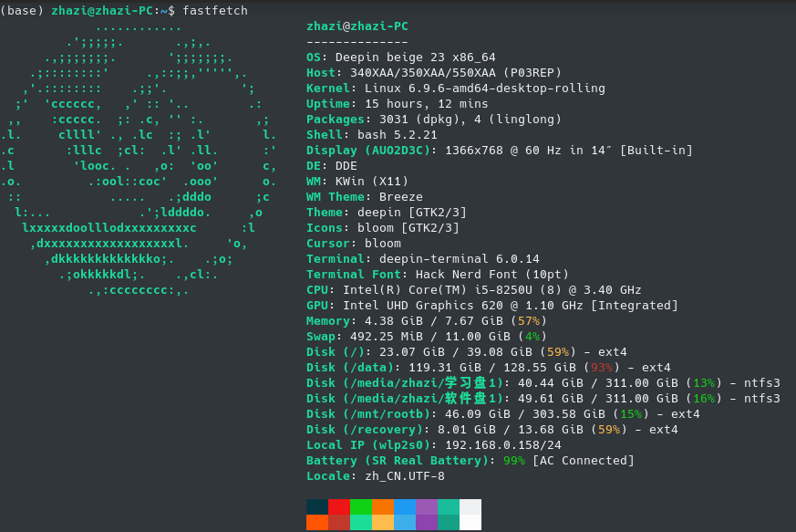
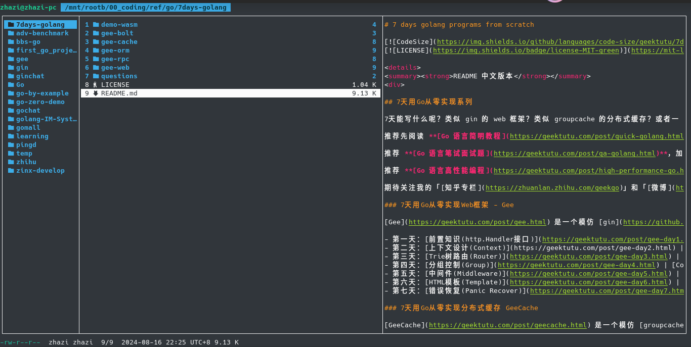
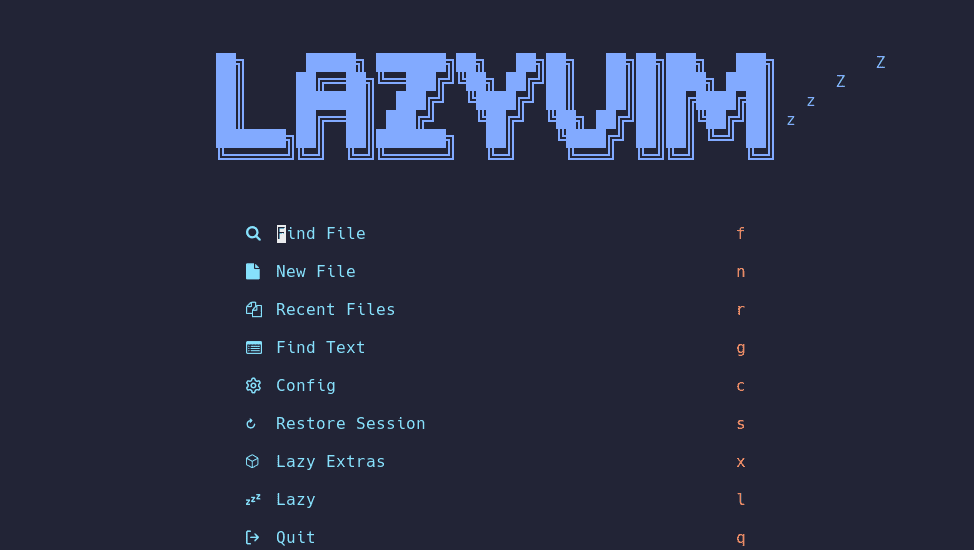

# 归档：linux 下一些有用的程序


随着服务器的使用时间增长，我们逐渐接触到一些好用的软件，并把他们融入到日常开发的工作流中。那么当我们获得新的服务器账号时，就需要进行一系列软件安装和基础配置以满足个人日常开发习惯。然而，每次获取新账号都重复进行相同的初始化操作效率低下，特别是许多安装命令需要反复查找甚至重新理解其用途。因此，该文档将用来记录一些常用的软件的一般安装方式，将安装命令和配置方案集中归档，便于后续参考。


## 一、安装 apt 能安装的程序

!!! note "无 root 安装"

    在使用实验室服务器时，我们通常没有 root 权限，因此无法直接使用 `apt install` 安装系统软件。那么有没有方法能在没有 root 权限的情况下安装软件并使用呢？有的兄弟，有的。基本流程是使用 `apt download` 下载对应的 .deb 包，然后使用 `dpkg -x` 将包解压并安装到指定位置（如用户目录下的 `.local` 目录）。需要注意的是，安装后需调整 PATH 环境变量以包含相关目录。通常是将安装路径下的 `bin` 和 `usr/bin` 文件夹路径添加到 PATH 中，因为这些目录通常是解压后的可执行文件存放的位置。例如，使用 `~/.local/` 作为安装路径，那么就可以通过在 `.bashrc` 或 `.zshrc` 中添加以下内容来更新 PATH：

    ```bash
    export PATH="$HOME/.local/bin:$HOME/.local/usr/bin:$PATH"
    ```

!!! warning "注意"

    - 上面提供的无 root 安装方法需要手动处理依赖关系，可能会遇到某些软件不安装在默认位置就无法正常运行的情况。
    - 下面描述的安装流程中，下载得到的文件名和软件版本可能有所不同，以下命令仅供参考。

### neofetch

??? tip "neofetch 简介"

    neofetch 是一个命令行系统信息工具，能够以美观的方式显示系统的基本信息，包括操作系统、内核版本、CPU、GPU、内存等。它支持多种 Linux 发行版和其他操作系统，并且可以通过配置文件自定义显示内容。

    

    neofetch 的输出信息
    { .caption }

```console
# 有 root 权限
$ apt install neofetch

# 无 root 权限
$ apt download neofetch
$ dpkg -x neofetch_7.0.0-1_all.deb ~/.local/
```

### fastfetch

??? tip "fastfetch 简介"

    fastfetch 是 neofetch 的现代替代品，具有更快的执行速度和更低的资源占用，适合在性能较低的设备上使用，同时提供更详细的系统信息展示。

    

    fastfetch 的输出信息
    { .caption }

```console
# 有 root 权限
$ apt install fastfetch

# 无 root 权限
$ apt download fastfetch
$ dpkg -x fastfetch_7.0.0-1_all.deb ~/.local/
```

### lua 

??? tip "Lua 简介"

    Lua 是一种轻量级、高效、可嵌入的脚本语言，常用于游戏开发、嵌入式系统、配置文件等领域。它以其简洁的语法、快速的执行速度和强大的扩展能力而闻名。Lua 的核心非常小巧，但通过其 C API 可以轻松扩展功能，使其成为许多应用程序的首选脚本语言。

    Lua 的主要特点包括：

    - 轻量级：核心库非常小，适合资源受限的环境
    - 可嵌入：可以轻松集成到 C/C++ 项目中
    - 动态类型：变量无需声明类型，运行时自动确定
    - 垃圾回收：自动内存管理，减少内存泄漏风险
    - 协程支持：内置协程机制，方便实现并发编程

    Lua 广泛应用于游戏开发（如 World of Warcraft、Angry Birds）、嵌入式系统、Web 服务器（如 OpenResty）等领域。其简洁的语法和强大的扩展能力使其成为许多开发者的首选脚本语言。

这里以安装 5.2 版本为例

``` console
# 有 root 权限
$ apt install lua5.2

# 无 root 权限
$ apt download lua5.2
$ dpkg -x lua5.2_5.2.4-1.1build3_amd64.deb ~/.local/
```

无 root 安装的话建议自己创建一个 lua 符号链接

```console
$ ln -s ~/.local/usr/bin/lua5.2 ~/.local/usr/bin/lua
```

### fd

??? tip "fd 简介"

    fd 是一个简单、快速、用户友好的文件搜索工具，旨在替代传统的 `find` 命令。它提供了更直观的语法、更快的搜索速度和更友好的默认设置。fd 使用 Rust 编写，具有出色的性能和跨平台支持。

    fd 的主要特点包括：

    - **简洁语法**：默认使用正则表达式，支持智能大小写匹配
    - **快速搜索**：并行化搜索，速度远超传统 find 命令
    - **彩色输出**：搜索结果高亮显示，易于阅读
    - **智能忽略**：自动忽略 `.gitignore` 中的文件和目录
    - **Unicode 支持**：完全支持 Unicode 字符集

    

    fd 命令演示
    { .caption }

```console
# 有 root 权限 + ubuntu 19.04 以后
$ sudo apt-get install fd-find

# 无 root 权限
$ apt download fd-find
$ dpkg -x fd-find_7.4.0-2ubuntu0.1_amd64.deb ~/.local/
```
### fzf

??? tip "fzf 简介"

    fzf 是一个命令行模糊查找工具，用于快速搜索和选择文件、命令历史、进程等。它通过模糊匹配算法提供高效的交互式搜索体验。

    fzf 主要特点包括：

    - **快速模糊搜索**：支持实时模糊匹配
    - **交互式界面**：提供直观的搜索界面
    - **高度可定制**：支持自定义键绑定和显示样式
    - **管道集成**：可与 shell 和其他命令无缝集成
    - **跨平台支持**：支持 Linux、macOS 和 Windows

    

    fzf 界面预览
    { .caption }

TODO: 解释一下没有包的时候是怎么处理的
```console
# 有 root 权限 + Ubuntu 19.10+
$ sudo apt-get install fzf 

# 无 root 权限 + Ubuntu 19.10+
$ apt download fzf
$ dpkg -x fzf_0.20.0-1ubuntu0.1_amd64.deb ~/.local/

# 找不到软件包
$ wget https://github.com/junegunn/fzf/releases/download/v0.55.0/fzf-0.55.0-linux_amd64.tar.gz
$ tar zxf nvim-linux64.tar.gz
$ mv fzf ~/.local/usr/bin/
```

### zoxide

??? tip "zoxide 简介"

    **TODO**


## 二、安装其他包管理器

### Flatpak

??? tip "Flatpak 简介"

    Flatpak 是一个用于 Linux 系统的应用程序分发框架，旨在简化应用程序的打包、分发和安装过程。基于容器技术为应用程序提供隔离的运行环境，确保应用程序的依赖项与系统其他部分隔离，从而提高安全性和稳定性。

    Flatpak 的主要特点包括：

    - **跨发行版支持**：应用程序可以在不同的 Linux 发行版上运行，无需重新打包
    - **沙箱隔离**：应用程序在隔离的环境中运行，减少对系统的影响
    - **依赖管理**：应用程序自带依赖项，避免与系统库冲突
    - **版本控制**：支持同时安装多个版本的应用程序
    - **自动更新**：通过 Flathub 等仓库自动获取更新

    Flatpak 使用 OCI（Open Container Initiative）格式进行打包和分发，这种格式基于容器技术，能够高效地封装应用程序及其依赖项。应用程序被打包为 `.flatpak` 文件，包含所有必要的运行时和库，确保在不同系统上的一致性。

    

    Flatpak
    { .caption }

```console
# 需要 root 权限
$ sudo apt install flatpak

# 安装完成后，添加 Flatpak 仓库
$ flatpak remote-add --if-not-exists flathub https://flathub.org/repo/flathub.flatpakrepo
```

### Snap

??? tip "Snap 简介"

    Snap 是 Canonical 公司开发的软件打包和部署系统，主要用于 Ubuntu 系统。它的主要特点于 Flatpak 类似，提供了沙盒化的应用程序环境，简化了软件安装和更新过程。

    Snap 使用 `.snap` 格式进行打包和分发，这种格式基于 SquashFS 文件系统，能够高效地封装应用程序及其依赖项。每个 Snap 包都是自包含的，包含应用程序及其所有依赖项，确保在不同系统上的一致性。Snap 还支持自动更新和版本回滚功能，使得应用程序的管理更加便捷。

    

    Snap
    { .caption }

```console
# 需要 root 权限
$ sudo apt install snapd
```

### Cargo

??? tip "Cargo 简介"

    Cargo 是 Rust 编程语言的包管理器和构建系统。它负责管理 Rust 项目的依赖项、编译、测试和发布等任务。Cargo 提供了简单易用的命令行工具，使得 Rust 项目的开发和管理更加高效和便捷。

    Cargo 的主要功能包括：

    - **依赖管理**：通过 `Cargo.toml` 文件声明和管理项目依赖
    - **构建系统**：自动处理项目的编译和链接过程
    - **测试支持**：内置测试框架，支持单元测试和集成测试
    - **文档生成**：自动生成项目文档
    - **发布管理**：支持将项目发布到 crates.io（Rust 的包仓库）
    - **工作区支持**：管理多个相关项目组成的 workspace

    Cargo 使用 `Cargo.toml` 文件来定义项目的元数据和依赖关系。通过 `Cargo.lock` 文件确保构建的可重复性。Cargo 还支持自定义构建脚本和丰富的插件系统，可以扩展其功能以满足特定需求。

    

    Cargo
    { .caption }

访问[官方网页](https://www.rust-lang.org/tools/install)获得最新的安装命令，下面的命令仅供参考。

``` console
# 使用 rustup 安装 Rust 工具链（包括 Cargo）
$ curl --proto '=https' --tlsv1.2 -sSf https://sh.rustup.rs | sh
```

## 三、安装 Cargo 能安装的程序

### Joshuto

??? tip "Joshuto 简介"

    Joshuto 是一个基于终端的文件管理器，灵感来自 Ranger，用 Rust 编写。它旨在提供一个高效且用户友好的界面，用于直接从终端导航和管理文件。 Joshuto 为终端文件管理体验带来了现代功能，使其成为传统文件管理器的强大替代品。

    介绍视频: [【文件在指尖飞舞 - 终端文件管理器Joshuto】](https://www.bilibili.com/video/BV1Zo4y1G7QZ/?share_source=copy_web)

    

    Joshuto 界面展示
    { .caption }

```console
# 安装最新发布的版本
cargo install joshuto

# 从最新版本的代码安装
cargo install --git https://github.com/kamiyaa/joshuto.git --force
```

### Yazi

??? tip "Yazi 简介"

    Yazi 是一个用 Rust 编写的异步终端文件管理器，旨在提供快速、现代化的文件管理体验。它结合了传统文件管理器的功能和现代终端工具的优点，具有出色的性能和丰富的功能。
    
    Yazi 提供了更详细的文档支持，其操作逻辑与 Joshuto 基本一致，这使得从 Joshuto 迁移到 Yazi 变得更加容易。
    
    Yazi 的主要特点包括：
    
    - **异步架构**：充分利用现代硬件性能，提供更快的响应速度
    - **快速响应**：即时显示文件和目录，提升操作效率
    - **多标签支持**：支持同时管理多个目录，方便多任务处理
    - **文件预览**：支持文本、图片和视频预览，直观查看文件内容
    - **批量操作**：提供便捷的文件批量重命名和操作功能
    - **插件支持**：支持功能扩展，满足个性化需求
    - **自定义主题**：可配置界面颜色和样式，打造个性化界面
    - **跨平台支持**：兼容 Linux、macOS 和 Windows 系统

    介绍视频: [【【命令行必备】Yazi：最强文件管理器】](https://www.bilibili.com/video/BV1yRkCYVEUT/?share_source=copy_web)

```console
cargo install yazi-fm yazi-cli
```
然后，参考[文档](https://yazi-rs.github.io/docs/quick-start)进行进一步的配置。

### rg

??? info "about ripgrep"

```bash title="安装 ripgrep"
cargo install ripgrep
```
### mcfly

??? info "about mcfly"

```bash title="安装 mcfly"
cargo install mcfly
```

### lsd

??? info "about lsd"

```bash title="安装 lsd"
cargo install lsd
```

使用前需要初始化，在 .bashrc 中添加如下命令即可

```bash title=".bashrc"
  TODO
```

### bat

??? info "about bat"

```bash title="安装 bat"
cargo install bat
```

### zellij

??? info "about zellij"

```bash title="安装 zellij"
cargo install zellij
```

## 四、安装 neovim + Lazyvim

### 1. 安装 Nerd Font 字体

到 [这个网页](https://www.nerdfonts.com/font-downloads) 中挑选喜欢的字体，然后复制它的压缩包下载链接

```bash title="下载 JetBrainsMono"
wget https://github.com/ryanoasis/nerd-fonts/releases/download/v3.2.1/JetBrainsMono.zip
```

解压字体文件到合适的位置

```bash
unzip JetBrainsMono.zip -d ~/.local/share/fonts
```

可能需要先创建一下这个文件夹

```bash
mkdir -p ~/.local/share/fonts
```

使用 `fc-cache` 命令安装字体文件

```bash
fc-cache -fv
```

输出中应该包含如下所示的一行：


### 2. 安装 python3 环境（需要 root)

```bash
sudo apt install python3 python3-venv python3-pip
```

### 3. 安装 NPM

#### 3.1 安装 NVM (Node Version Manager)

注：访问 [这个仓库](https://github.com/nvm-sh/nvm) 获得最新的安装命令，下面的命令仅供参考。

```bash
curl -o- https://raw.githubusercontent.com/nvm-sh/nvm/v0.40.1/install.sh | bash
```

#### 3.2 使用 NVM 安装合适的 node

先检查能安装什么版本

```bash
nvm ls-remote
```

这里安装 v20 的 LTS 版本

```bash
nvm install 20
```

### 4. 安装 Neovim

注：访问 [官方仓库](https://github.com/neovim/neovim) 获得最新的发布版本，下面的命令仅供参考。

为了使用一些新的特性，这里需要安装最新版本，因此使用 Releases 中的预构建版本。

```bash
wget https://github.com/neovim/neovim/releases/download/v0.10.1/nvim-linux64.tar.gz
tar zxf nvim-linux64.tar.gz
```

把解压文件存放在一个合适的位置，然后在 `$PATH` 包含的路径中建立一个符号链接来指向 nvim

```bash
mv nvim-linux64 ~/.local/usr/
ln -s ~/.local/usr/nvim-linux64/bin/nvim ~/.local/usr/bin/nvim
```

### 5. 安装 LazyVim

下载 `LazyVim/starter` 将其做为 `nvim` 的配置即可，之后打开 `nvim` 会自动初始化一切

```bash
git clone https://github.com/LazyVim/starter ~/.config/nvim
nvim
```

### 6. 一些简单的配置



!!! info "参考资料"

    - [bilibili: Neovim从新手到高手系列之轻松安装LazyVim](https://www.bilibili.com/video/BV1uE421u7xE)

## 五、安装 z.lua

??? info "about z.lua"

    TODO

该程序使用 lua 编写，需要先安装 lua，如果没有 root 权限也可以参考无 root 安装 lua 一节进行安装。另一方面，该程序是自包含的，因此只需要将 z.lua 文件存放到一个合适的位置并在初始化时指定即可。

```bash title="下载 z.lua"
git clone https://github.com/skywind3000/z.lua.git
mv z.lua/z.lua ~/.local/usr/
```

在 .bashrc 中配置 z.lua 的初始化命令并开启增强模式和 fzf 支持。个人使用习惯上偏好双字母的命令，因此设置其名称为 `zz`。其他配置见 [这个文档](https://github.com/skywind3000/z.lua/blob/master/README.cn.md)。

```bash title=".bashrc"
export _ZL_MATCH_MODE=1
export _ZL_CMD='zz'
eval "$(lua ~/.local/usr/z.lua  --init bash enhanced fzf)"
```

## 六、安装 cargo 能安装的程序

??? info "about ripgrep"

```bash title="安装 ripgrep"
cargo install ripgrep
```

??? info "about mcfly"

```bash title="安装 mcfly"
cargo install mcfly
```

??? info "about lsd"

```bash title="安装 lsd"
cargo install lsd
```

使用前需要初始化，在 .bashrc 中添加如下命令即可

```bash title=".bashrc"
  TODO
```

??? info "about bat"

```bash title="安装 bat"
cargo install bat
```

??? info "about zellij"

```bash title="安装 zellij"
cargo install zellij
```

## 七、安装 fzf

```bash
wget https://github.com/junegunn/fzf/releases/download/v0.55.0/fzf-0.55.0-linux_amd64.tar.gz
tar zxf nvim-linux64.tar.gz
mv fzf ~/.local/usr/bin/
```

## 八、设置别名

```shell title=".bashrc"
alias lgit="lazygit"
alias jo="joshuto"
alias ls='lsd'
alias ll='lsd -alF'
alias la='lsd -A'
alias l='lsd -CF'
```

## 九、安装 lazygit

先获取最新的版本号，再根据版本号下载发布的最新压缩包，解压后安装即可。

```bash
LAZYGIT_VERSION=$(curl -s "https://api.github.com/repos/jesseduffield/lazygit/releases/latest" | grep -Po '"tag_name": "v\K[^"]*')
curl -Lo lazygit.tar.gz "https://github.com/jesseduffield/lazygit/releases/latest/download/lazygit_${LAZYGIT_VERSION}_Linux_x86_64.tar.gz"
tar xf lazygit.tar.gz lazygit
install lazygit ~/.local/usr/bin
```

!!! info "参考资料"

    - [官方仓库的 install 一节](https://github.com/jesseduffield/lazygit?tab=readme-ov-file#ubuntu)

## 其他

### AppImage


AppImage
{ .caption }

AppImage 是一种跨 Linux 发行版的应用程序打包格式，无需安装即可运行。它提供了"一次打包，到处运行"的解决方案。

AppImage 的主要特点包括：

- **无需 root 权限**：AppImage 可以直接运行，无需管理员权限，适合在受限环境中使用
- **不修改系统文件**：AppImage 不会在系统中安装任何文件，所有内容都包含在单个可执行文件中
- **便携式运行**：AppImage 可以在任何支持 Linux 的系统上运行，无需额外的依赖或配置
- **支持大多数 Linux 发行版**：AppImage 兼容主流的 Linux 发行版，如 Ubuntu、Fedora、Debian 等
- **自包含依赖**：每个 AppImage 都包含应用程序所需的所有依赖项，确保在不同系统上的一致性
- **易于分发**：开发者只需打包一个文件即可分发应用程序，用户下载后即可直接运行

- **非沙盒化**：与 Flatpak 和 Snap 不同，AppImage 直接访问系统资源，没有沙盒隔离机制，适合需要深度系统集成的应用
- **需要手动更新**：与 Flatpak 和 Snap 的自动更新不同，AppImage 不提供自动更新功能，用户需要手动下载新版本并替换旧版本


!!! note "使用方式"

    1. 下载 AppImage 文件

    2. 赋予其可执行权限，确保 AppImage 文件是可执行的

        ```console
        $ chmod +x YourApp.AppImage
        ```

    3. 直接运行 AppImage 文件

        ```console
        $ ./YourApp.AppImage
        ```

### Miniconda

TODO

首先，在这里下载 Miniconda 最新版本的安装脚本。

```console
$ wget https://repo.anaconda.com/miniconda/Miniconda3-latest-Linux-x86_64.sh
```

然后，运行下载的脚本并按提示完成 Miniconda 的安装 ~~一路 Enter 到底完事~~。

```console
$ sh Miniconda3-latest-Linux-x86_64.sh
```
