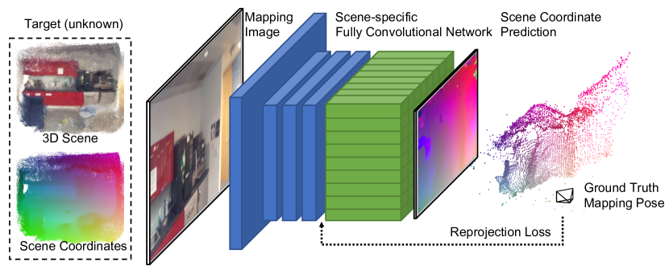

# ACE: 在几分钟内完成视觉重定位模型的训练

**偶然遇到这篇论文，惊讶于其兼顾高效和精准的实验结果，最终决定记录一下。**

视觉重定位是指在计算机视觉领域中的一个任务，其目标是通过分析场景中的视觉信息来确定相机的位置和姿态（即相机的位置和朝向）。在以往基于学习的视觉重定位器需要数小时或数天的训练时，如下图所示，ACE 可以在不到 5 分钟的时间内达到相同的精度。

这里只关注一个问题：**ACE 是怎么做到既高效又精准的？**

??? info "论文基本信息"

    - 论文链接：[arxiv](https://arxiv.org/abs/2305.14059)
    - 项目链接：[网站](https://nianticlabs.github.io/ace/)
    - 代码链接：[github](https://github.com/nianticlabs/ace)
    - AI 摘要：**ACE** 是一种高效的场景坐标回归系统，能够在 5 分钟内将新场景映射到网络中，并达到最先进的重定位精度。它利用 MLP 头部进行高效训练，并采用梯度解耦和课程训练策略，无需深度图或 3D 模型即可快速训练。与现有的场景坐标回归系统相比，**ACE** 的映射速度提高了 300 倍，同时保持了相同的精度和更小的存储需求。

## 背景

### 视觉定位任务

观测，是一个智能体的感知世界的基础。对于一个具有观测能力的智能体而言，其可以借助传感器（例如：相机），在场景中 $p$ 位置朝 $q$ 方向获得一次观测结果。但是，要在世界中进行交互，智能体首先要面对一个重要的问题 —— Where am I?

视觉定位任务试图让智能体自己解决这一问题，具体来说，我们希望训练一个模型能通过观测信息推断出自己的位置（或位姿）。在本文中，我们将关注于 2D 视觉定位任务:

!!! tip "目标"

    **一个模型 $f: \mathbb{R}^{H\times W\times C} \rightarrow \mathbb{R}^3\times \mathbb{R}^3$。**对任给的一张在位置 $p$ 面向 $q$ 方向拍摄的 RGB 图像 $I$，有: $f(I) = \{p, q\}$。

### 场景坐标回归

在 ACE 之前，已经有很多基于学习的方法，其中比较突出的是**场景坐标回归**(Scene Coordinate Regression，**SCR**) 方法，其也是 ACE 的基础。基本想法是让网络预测像素点在场景中的 3D 坐标，然后使用 **PnP** 算法求解相机的位姿，通常使用比较鲁棒的 **RANSAC** 系列。

!!! tip "新目标"

    **一个模型 $f: \mathbb{R}^{2} \rightarrow \mathbb{R}^3$。**对任给的一张在位置 $p$ 面向 $q$ 方向拍摄的 RGB 图像 $I$，有: $g(\mathcal{C})= \{p, q\}$。其中 $\mathcal{C} = \{(x_i, f(x_i)) | x_i \in I\}$，$g(\cdot)$ 为位姿求解器。

#### 目标函数

不难想到，我们可以通过真值 $\{p, q\}$ 将预测的 3D 点投影回 2D 平面，然后使用 $I$ 作为监督信号来训练这样一个网络。记 ${\pi_{p,q}}$ 为投影函数，则目标函数可以写为如下形式：

$$
    \underset{w}{\arg\min} \sum_{I\in\mathcal{I}_{M}}\ \sum_{x_i \in I} \mathcal{L}[x_i, \pi_{p, q}(f_w(x_i))],
$$

其中 $f_w(\cdot)$ 是我们要训练的模型，$f$ 通常是一个全卷积网络，其参数记为 $w$；$mathcal{I}_M$ 表示训练集中的所有图像；$\mathcal{L}$ 是一个评估像素级误差的损失函数。

#### 一个标准的训练过程

一个标准的 SCR 网络训练过程如下图所示。尽管任务的粒度是像素级的，但因为预测与场景关联，因此在训练时 batch 中数据的粒度是图像级的。

- 前向过程：$f$ 接受图像 $I$，输出对每个像素点的预测坐标，这构成了一个点云 $\mathcal{P}$。
- 反向过程：使用 groud truth 的 $\{p, q\}$ 将 $\mathcal{P}$ 投影成图像 $I'$，然后计算图像间的误差并回传。

作者指出，尽管在标准训练中的迭代中同时优化了数千个像素点的预测，但是，它们都来自同一图像。因此，它们的损失和梯度将高度相关。这导致训练变的低效，要实现全局的L收敛变的更加困难。个人感觉，这和训练多言语模型时先把数据混合再训练的原因是类似的，学好一个语言后开始学习其他语言，新的学好了旧的就忘了。

## 方法

针对上节所述的问题，一个基本的解决思路是：把不同图像的单点预测任务随机打乱， 将 batch 中颗粒度降为像素级。然而，但这种将图像离散化的做法又会导致卷积网络无法发挥其作用，卷积层的表达能力及其使用全卷积架构的高效计算是 SCR 的关键。因此

TODO:

1. 怎么理解 MLP 是场景相关的？
2. 混合后，怎么进行的重投影？

### 梯度解相关
