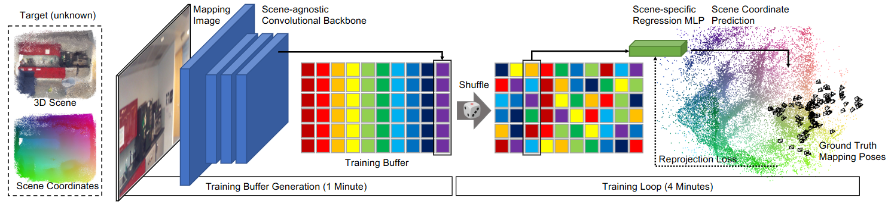

# ACE: 在几分钟内完成视觉重定位模型的训练

> 偶然遇到这篇论文，惊讶于其兼顾高效和精准的实验结果，最终决定记录一下。

视觉重定位是指在计算机视觉领域中的一个任务，其目标是通过分析场景中的视觉信息来确定相机的位置和姿态（即相机的位置和朝向）。在以往基于学习的视觉重定位器需要数小时或数天的训练时，如下图所示，ACE 可以在不到 5 分钟的时间内达到相同的精度。

这里只关注一个问题：**ACE 是怎么做到既高效又精准的？**

??? info "论文基本信息"

    - 论文链接：[arxiv](https://arxiv.org/abs/2305.14059)
    - 项目链接：[网站（很炫，快去看！）](https://nianticlabs.github.io/ace/)
    - 代码链接：[github](https://github.com/nianticlabs/ace)
    - AI 摘要：**ACE** 是一种高效的场景坐标回归系统，能够在 5 分钟内将新场景映射到网络中，并达到最先进的重定位精度。它利用 MLP 头部进行高效训练，并采用梯度解耦和课程训练策略，无需深度图或 3D 模型即可快速训练。与现有的场景坐标回归系统相比，**ACE** 的映射速度提高了 300 倍，同时保持了相同的精度和更小的存储需求。

??? info "参考文献"

    - [Accelerated Coordinate Encoding: Learning to Relocalize in Minutes using RGB and Poses](https://arxiv.org/abs/2305.14059)
    - [Niantic Research Presents:State of the ARt in Relocalization with Machine Learning](https://nianticlabs.com/news/research-ace)
    - [Map-Relative Pose Regression for Visual Re-Localization](https://arxiv.org/abs/2404.09884)
    - [PnP(Perspective-n-Point)问题：各种算法总结分析](https://zhuanlan.zhihu.com/p/399140251)

## 背景

本节，我们导入一些背景知识。

### 视觉重定位任务

观测是一个智能体的感知世界的基础。对于一个具有观测能力的智能体而言，其可以借助传感器（例如相机），在场景中 $t$ 位置朝 $R$ 方向获得一次观测结果。视觉重定位任务要求智能体能在**记忆过的场景**中，**从观测结果反推出观测状态**。在本文中，讨论的对象是图像的视觉重定位任务，观测结果是一张图像，观测状态是相机的位姿 $(t, R)$。  

<video controls style="display: block; width: 100%; height: auto;">
<source src="https://nianticlabs.github.io/ace/assets/carousel/12scenes_office2_5b_small.mp4" type="video/mp4">
</video>

ACE 在训练阶段用 5 分钟形成场景表示，然后重新进入该场景时可以依据查询图像反推出相机位姿。
{ .caption }

视觉重定位通常分为两个阶段：1. **建图阶段**。给定一组映射图像及其姿态，这些图像和姿态都表示在同一个坐标系中，构建一个场景表示。2. **查询阶段**。给定一张查询图像，估计其姿态，即相对于场景的位置和方向。  

### PnP（Perspective-n-Point）

前有位姿估计，所以了解 PnP 会很有用。PnP（Perspective-n-Point）问题是一个经典的计算机视觉问题，旨在通过已知的 3D 空间点及其在 2D 图像上的投影，求解相机在三维空间中的位姿（即旋转矩阵 $R$ 和平移向量 $t$）。

!!! note "PnP 问题"

    **已知**：$n$ 个点在**世界坐标系**下的坐标 $P_1^W, P_2^W, \ldots, P_n^W$，这些点相应在**像素坐标系**下的坐标 $p_1, p_2, \ldots, p_n$，相机内参矩阵 $K$ 。  
    **求解**：相机坐标系相对于世界坐标系的位姿。  

    由于是已知 $n$ 个点的 3D-2D 对应关系，所以这个问题被称作 PnP 问题。

PnP 这个概念即可以指问题也可以指求解该问题的算法。对于本文，我们只需要知道 PnP 算法是求解 PnP 问题的算法即可。

### RANSAC

在实际应用 PnP 算法时，提供的 3D-2D 点对应关系可能包含噪声或误匹配点（称为“外点”），这会导致 PnP 算法的估计结果不准确。常用的解决方案是 RANSAC（Random Sample Consensus，随机抽样一致）。

RANSAC 是一种鲁棒的估计算法，专门用于从包含异常值的数据集中估计模型参数。它通过多次随机抽样，从数据中筛选出符合模型的数据点（称为“内点”），从而剔除异常值的影响。因此，RANSAC 可以作为 PnP 算法的优化工具，提高位姿估计的鲁棒性。

对于本文来说，PnP 算法是一个求解相机位姿的方法，而 RANSAC 算法是一种优化工具，用于从噪声或异常值中估计出可靠的位姿。两者的结合使得相机位姿估计在存在误匹配点的情况下依然能够保持高精度和鲁棒性。

## 现状

本节，我们快速的回顾视觉重定位技术的研究现状。

### 现有方法

论文中提到的视觉重定位技术主要包括四类方法，各自有不同的建图方式和查询方式。

- **图像检索**

    * **建图阶段**：将场景中的映射图像及其相机姿态保存为数据库，构建用于近邻检索的图像索引。
    * **查询阶段**：对查询图像提取全局特征，在数据库中检索最相似的映射图像，以其位姿作为估计结果。
    * **优缺点**：实现简单、查询速度快、存储开销低，但精度有限，仅能提供粗略位姿，难以满足高精度要求。

- **位姿回归**

    * **建图阶段**：使用已有映射图像和其位姿训练一个回归网络，将图像直接映射到相机位姿。场景地图被隐式地编码到神经网络参数中。
    * **查询阶段**：将查询图像输入网络，输出预测位姿。部分方法结合图像检索，回归相对于参考图像的相对位姿。
    * **优缺点**：无需进行显式建图和三维建模，运行效率高；但对训练数据依赖强，泛化能力弱，精度在当前基准上落后于下面两类方法。

- **特征匹配**

    * **建图阶段**：使用运动结构重建恢复技术（SfM）对训练集图像进行三维重建，得到含有局部特征描述子的点云地图。
    * **查询阶段**：从查询图像中提取局部特征，与地图中的三维点匹配，获得 2D–3D 对应关系，然后通过 PnP（Perspective-n-Point）算法与 RANSAC 求解相机位姿。
    * **优缺点**：具备很高的定位精度，鲁棒性强，适用于多种复杂环境；但建图耗时较长，地图存储体积大，并且存在隐私的风险。

- **场景坐标回归**

    * **建图阶段**：训练一个模型，使其能够将像素坐标回归到对应的三维场景坐标（Scene Coordinate），实现隐式建图。
    * **查询阶段**：输入查询图像，网络输出像素对应的场景坐标，再通过 PnP + RANSAC 估计相机姿态。
    * **优缺点**：与位姿回归方法类似，隐式建图的使得地图体积较小且隐私安全；但训练时间长，泛化能力好于位姿回归方法但有限，对每个场景都需要重新训练。

对于本文，我们主要关注的是**场景坐标回归（Scene Coordinate Regression）**方法。为了行文方便，之后使用 **SCR** 缩写代表这类方法。

### SCR 的训练瓶颈

SCR 方法展现出了良好的重定位精度，但每进入一个新场景都需要重新进行训练。而为了让视觉重定位器能够在新的环境中工作，可能需要等待数小时乃至数天的时间，直到重定位器完成场景的预处理（建图阶段）。只有到那时，它才能估计相机的位置和方向，以支持导航或增强现实（AR）等实时应用。这引出了论文的研究目标：加速 SCR 的训练时间。

这里有一段关于研究意义的论证值得一看：

> 通常，加速训练时间在我们社区中最多只能引起适度的兴趣。这在“训练一次，部署多次”的场景中是有些道理的。然而基于学习的视觉重新定位并不属于这一类别，因为每次遇到新场景时都需要进行训练。

对于视觉重定位器，训练完成后是对当前场景能做到 “一次训练多次部署”。而场景几乎是无穷无尽的（室内、室外、甚至可能包括虚拟世界），所以需要不停的训练新的重定位器。因此快速训练是刚需，加速训练过程的研究具有极大的实际意义。

## 方法

本节，我们进入正题，看看 ACE 的主要创新。不过在此之前，展开介绍 SCR 是非常有必要的。

### 场景坐标回归（SCR）

视觉重定位任务的目标是通过单个 RGB 图像 \( I \) 估计相机姿态 \( \mathbf{h} \)。这里相机姿态被定义为将相机空间中的坐标 \( \mathbf{e}_i \) 映射到场景空间中的坐标 \( \mathbf{y}_i \) 的刚体变换，因此 \( \mathbf{y_i} = \mathbf{he}_i \)。SCR 通过图像到场景的对应关系来估计姿态：

\[ 
\mathbf{h}=g(\mathcal{C}),\mathrm{~with~}\mathcal{C}=\{(\mathbf{x}_i,\mathbf{y}_i)\},
\tag{1}
\]

其中 $\mathcal{C}$ 表示 2D 像素位置 $\mathbf{x}_i$ 与 3D 场景坐标 $\mathbf{y}_i$ 之间的对应关系集合。函数 $g$ 表示一个鲁棒的位姿求解器。通常，$g$ 包括一个 PnP 最小求解器，并在 RANSAC 循环中运行，随后进行优化。

SCR 的关键思想是学习一个用于预测任意 2D 像素位置对应的 3D 场景点的函数：

$$
\mathbf{y}_i=f(\mathbf{p}_i;\mathbf{w}),\mathrm{~with~p}_i=\mathcal{P}(\mathbf{x}_i,I),\quad(2)
\tag{2}
$$

其中，$f$ 是一个由可学习参数 $\mathbf{w}$ 控制的神经网络，$p_i$ 是从图像 $I$ 中以像素位置 $x_i$ 为中心提取的图像块。因此，$f$ 实现了从图像块到三维坐标的映射，$f: \mathbb{R}^{C \times H_P \times W_P} \rightarrow \mathbb{R}^3$。

SCR 在所有映射图像 $I_M$ 训练网络，使用对应的真值位姿 $h_i^*$ 作为监督信号来学习函数 $f$，目标函数为：

$$
\underset{\mathbf{w}}{\operatorname*{\operatorname*{argmin}}}\sum_{I\in\mathcal{I}_{\mathbf{M}}}\sum_{i}\ell[\mathbf{x}_{i},\overbrace{f(\mathbf{p}_{i};\mathbf{w})}^{\mathbf{y}_{i}},\mathbf{h}_{i}^{*}],
\tag{3}
$$

其中 $\ell$ 是衡量估计的 3D 场景点与真值场景点（通过像素坐标和真值位姿计算得到）差距的损失函数。

# TODO
### 任务分解

{ width=80% }

场景无关的编码器（且用 CNN）、场景有关的任务头的思路来自于[2208.06933] Visual Localization via Few-Shot Scene Region Classification:

> 我们的核心思想是，场景无关特征提取器有助于快速场景记忆，而场景特定训练也有助于提高准确性和效率。这一见解促使我们将流行的端到端场景坐标回归流程解耦为场景无关特征提取器和场景特定坐标估计器。

使用的是现成的通用特征编码器 SuperPoint。

ACE 创新点在于任务头使用 Shared MLP 回归头，以及场景无关编码器的训练方式（N 头 N 场景并行训练）

### 梯度解相关

<video controls style="display: block; width: 100%; height: auto;">
<source src="https://nianticlabs.github.io/ace/assets/training_ani.mp4" type="video/mp4">
</video>

针对上节所述的问题，一个基本的解决思路是：把不同图像的单点预测任务随机打乱， 将 batch 中颗粒度降为像素级。然而，但这种将图像离散化的做法又会导致卷积网络无法发挥其作用，卷积层的表达能力及其使用全卷积架构的高效计算是 SCR 的关键。因此

buffer + shuffle 操作实现梯度解相关 （最惊艳的创新）

一张图一张的学习 => 同时学习不同的图 类比 NLP 中，一个语料一个语料的学习 => 把不同语料混合起来学习

### 渐进式训练

像素级重投影损失来自 Eric 之前的工作[2002.12324] Visual Camera Re-Localization from RGB and RGB-D Images Using DSAC
    这边还没太理解，很 TM 复杂，但不是重点，可以忽略之。
    粗略的读了之后，直觉上的理解是：创新点在于更平滑的渐进式训练，原来是分类处理，差的太多就用更宽松的损失函数，差的不多则使用更严格的损失函数，是间断的过渡。现在用 tan 函数实现类似的效果，是连续的过渡。

## 总结

### 为什么快？
编码器预训练（小时级降到分钟级）
只需要训一个回归头，而且参数量也小（Shared MLP）
buffer + shuffle 操作实现梯度解相关 => 可以使用更大的学习率
渐进式训练 => 保持前期平稳收敛，过渡到后期实现加速。

### Take-home Message

