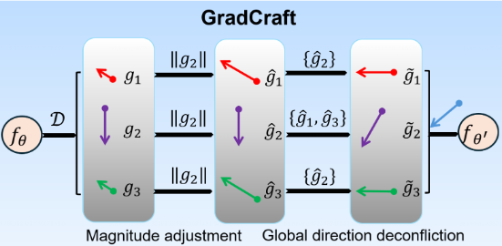
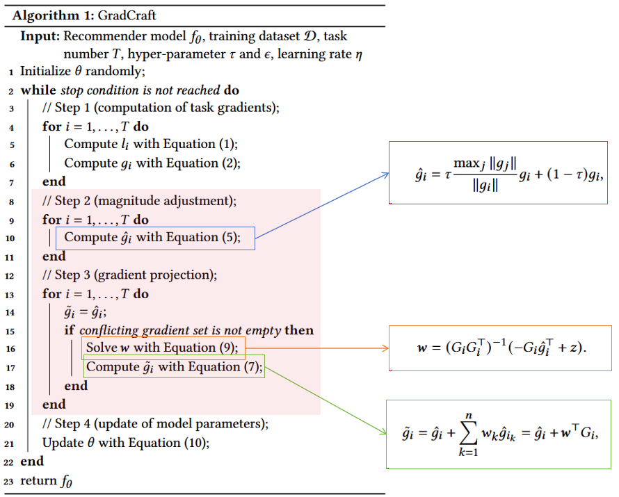
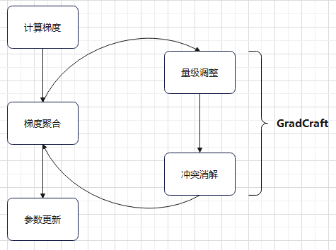

# GradCraft: Elevating Multi-task Recommendations through Holistic Gradient Crafting

> 逛知乎时看到了这篇论文的介绍，感觉能用到我的任务中，在此记录备用。

在多任务学习中，每个 task 都将给出一个梯度，在更新时需要将所有 task 给出的梯度进行聚合，确定一个最终的梯度进行更新。之前研究在聚合梯度时，对梯度大小和梯度方向的处理存在不足，论文针对这一不足提出了一种动态调整梯度（包括大小和方向）的聚合方法 **GradCraft**。本文只关注两个问题：**1.** GradCraft 算法流程？**2.** 代码如何与算法对应？

??? info "论文信息"

    - 论文链接：[arxiv](https://arxiv.org/abs/2407.19682)
    - 中文版本：[知乎](https://zhuanlan.zhihu.com/p/715709607)
    - 代码链接：[github](https://github.com/baiyimeng/GradCraft)
    - 补充材料：[pdf](https://www.cvlibs.net/publications/Mescheder2019CVPR_supplementary.pdf)
    - AI 摘要：**GradCraft** 是一种创新的多目标学习方法，它通过精细调控不同任务的梯度幅度和方向来优化多任务学习中的性能。该方法首先动态调整梯度幅度，确保它们与最大梯度范数对齐，从而避免某些任务在优化过程中占据主导地位。接着，GradCraft 采用投影技术来解决梯度间的方向冲突，确保所有任务在更新模型参数时能够和谐共进。这种方法在多任务学习中实现了梯度的全局平衡，提高了模型在处理多个目标时的效率和准确性。通过一系列实验验证了GradCraft的有效性，展示了其在多目标学习领域的应用潜力。

<!-- more -->

## 问题分析

梯度可以拆解为大小和方向两部分，因此有两种 naive 的聚合方式，这里称为**加权聚合**和**方向调整聚合**。前者保持梯度方向不变，根据特定标准如不确定性调整梯度大小，以有效平衡不同任务的关注度，但是在处理任务冲突（梯度方向相反）时存在局限性，表现出不稳定的性能。后者保持梯度大小不变，专注于调整梯度方向，减少任务间的负面余弦相似度，但通常只在任务对之间进行，缺乏全局非冲突的保证，并且忽略了梯度大小对方向调整的影响。概括来说，忽略梯度大小差异可能导致某些任务压倒其他任务，从而导致整体性能不佳。而忽略梯度方向差异则可能遇到某些任务之间的冲突，导致聚合结果不理想。论文所提出的 GradCraft 考虑了这些不足，是一种即调整梯度大小也调整梯度方向的方法。

??? info "梯度聚合策略简介"

    看代码的时候遇到了很多看不懂的名称，问了 ai 发现是梯度聚合策略的名称，补充在这里。

    | 方法名称       | 描述                                                         |
    |----------------|--------------------------------------------------------------|
    | **gradcraft** | 本篇论文方法 |
    | single | 单任务学习，每个任务独立训练，不考虑任务间的共享信息。 |
    | average | 平均梯度，将所有任务的梯度平均后用于更新模型参数。 |
    | uncertainty | 不确定性加权，根据每个任务的不确定性来加权梯度。 |
    | imtl-l | 加权多任务学习的一种特定策略，可能涉及线性权重分配。 |
    | dwa | 动态权重平均，动态调整任务权重，以平衡任务性能。 |
    | mgda | 多梯度下降算法，寻找最优权重分配以平衡不同任务的梯度。 |
    | gradnorm | 梯度归一化，通过归一化每个任务的梯度大小来平衡学习速率。 |
    | pcgrad | 项目冲突梯度，解决任务冲突，调整梯度方向以找到对所有任务有利的解决方案。 |
    | pcgrad+ | PCGrad的改进版本，进一步解决多任务学习中的梯度冲突问题。 |
    | gradvac | 梯度疫苗，减少多任务学习中的灾难性遗忘。 |
    | imtl | 加权多任务学习，为不同任务分配权重，以平衡它们的重要性。 |
    | imtl-g | IMTL的变体，可能涉及梯度信息来调整任务权重。 |
    | dbmtl | 深度贝叶斯多任务学习，结合深度学习和贝叶斯方法。 |
    | gpcgrad | 广义PCGrad，解决更广泛的梯度冲突问题。 |
    | cagrad | 聚合梯度，通过连接和平均梯度来寻找对所有任务有利的方向。 |

## GradCraft 算法

GradCraft 算法可以分为两步：量级调整和冲突消解。前者实现梯度大小上的平衡，后者实现梯度方向上的平衡，下面展开叙述。



### 量级调整

GradCraft 对**梯度大小**的态度是：**不要让差异过于显著（例如跨越多个数量级）**。具体来说，算法会依据范数最大的那个梯度的大小对其他梯度进行调整，公式如下：

$$
{\hat{g}}_{i}=\tau{\frac{\mathrm{max}_{j}\Vert g_{j}\Vert}{\Vert g_{i}\Vert}}g_{i}+\left(1-\tau\right)g_{i}.
$$

其中，$g_i$ 表示第 $i$ 个梯度，$\tau\in[0,1]$ 是超参数。这一调整确保了两两梯度之间的大小差异不超过 $\frac{1}{\tau}$ 倍。

### 冲突消解

称梯度 $g_i$ 与 $g_j$ 冲突当且仅当两者的内积为负（ 即：$\left<g_i,g_j\right> <0$）。以往的方法往往只考虑了两两梯度之间的冲突。而 GradCraft 对**梯度方向**的态度是：**要在全局范围内消除方向上的冲突**。具体来说，对于每个梯度 $g_i$，我们记录所有与之冲突的梯度为：

$$
G_{i}=[\hat{g}_{i_{1}},\cdot\cdot\cdot,\hat{g}_{i_{n}}]\in\mathbb{R}^{n\times d}.
$$

其中，$g_{i_j}$ 表示第 $i$ 个梯度的第 $j$ 个**冲突梯度**。GradCraft 使用投影来确保其梯度不会与其他任务的梯度冲突，投影目标是找到一个不会与 $G_i$ 中任一梯度冲突的**去冲突梯度梯度** $\widetilde g_i$，其满足下面的等式：

$$
G_{i}\widetilde{g_{i}}=z,
$$

这里 $z=\left[\epsilon\Vert\hat{g}_{i}\Vert\Vert\hat{g}_{i_{1}}\Vert,\cdots,\epsilon\Vert\hat{g}_{i}\Vert\Vert\hat{g}_{i_{n}}\Vert\right],$ $\epsilon>0$ 是调整相似度的因子，值越高表示期望的正相似度越高。注意这里 $\widetilde g_i$ 通过投影得到，假设其形式为$\tilde{g}_{i}=\hat{g}_{i}+\sum_{k=1}^{n}w_{k}\hat{g}_{i_{k}}=\hat{g}_{i}+w^{\top}G_{i}$，则有：

$$
\begin{align}
&\quad\tilde{g}_{i}=\hat{g}_{i}+w^{\top}G_{i}\\
\Rightarrow  &\quad\tilde{g}_{i}^{\top}=\hat{g}_{i}^{\top}+G_{i}^{\top}w\\
\Rightarrow  &\quad G_i\tilde{g}_{i}^{\top}=G_i\hat{g}_{i}^{\top}+G_iG_{i}^{\top}w\\
\Rightarrow &\quad G_{i}G_{i}^{\top}w=-G_{i}\tilde{g}_{i}^{\top}+z\\
\Rightarrow &\quad w=\left(G_{i}G_{i}^{\top}\right)^{-1}\left(-G_{i}\tilde{g}_{i}^{\top}+z\right).
\end{align}
$$

**注**：由于参数的维度远大于梯度的数量，因此可以合理地假设矩阵 $G_i$ 为满秩矩阵，从而有最后一步推导。

## 算法流程

算法伪代码如下：



可以归纳为如下程序框图：



## 代码分析

基于加权的方法通常在计算损失时进行加权从而对梯度加权，避免了对梯度的访问，从而避免了对优化器的额外设置。相对地，涉及梯度方向的方法因为无法避免的要对梯度进行操作，因此需要对优化器进行额外的设置。根据仓库代码，GradCraft 实现时的思路是给优化器上一层包装，通过一个自定义的 `backward` 过程接管梯度的计算。见代码路径 `GradCraft/models/basemodel.py` 的 287 行:

```python title="basemodel.py", hl_lines="3 4 8"
def customized_optimizer(method, optimizer, num_tasks, hyper=None, device=None):
    # ... other methods
    elif method == 'gradcraft':
        return GlobalPCGradMagnitudePositive(optimizer, num_tasks, b=0, r=hyper['r'], e=hyper['e'], device=device)
    else:
        return optimizer

optim = customized_optimizer(method=method, optimizer=optim, num_tasks=self.num_tasks, hyper=hyper, device=self.device)
```

在这里给优化器加了一层包装，然后是 394 行开始：

```python linenums="394" hl_lines="4" title="basemodel.py"
  y_pred = model(x).squeeze()
  loss_list = [loss_func[i](y_pred[:, i], y[:, i], reduction='mean') for i in range(self.num_tasks)]

  optim.backward(loss_list)
  optim.step()
```

实际上使用了自定义的 `backward` 方法接管方向传播过程。该方法在 `GradCraft/solvers/global_pc_grad_magnitude_positive.py` 中定义，见 42 行：

```python linenums="42", hl_lines="14 16", title="global_pc_grad_magnitude_positive.py"
def backward(self, objectives):
    '''
    calculate the gradient of the parameters

    input:
    - objectives: a list of objectives
    '''

    grads, shapes, has_grads = self._pack_grad(objectives)
    mag = [torch.norm(g) for g in grads]
    mag_cur = [self.b * self.mag_old[i] + (1. - self.b) * mag[i] for i in range(len(grads))]
    self.mag_old = mag_cur

    grads = [self.r * (grads[i] * max(mag_cur) / mag_cur[i]) + (1. - self.r) * grads[i] for i in range(len(grads))]

    pc_grad = self._project_conflicting(grads, has_grads)
    pc_grad = self._unflatten_grad(pc_grad, shapes[0])
    self._set_grad(pc_grad)
    return
```

可以看到，第 55 行进行了量级调整，第 57 行进行了冲突消解，这与在论文中读的的内容一致。那么进一步深入 `_project_conflicting` 方法。见同文件 103 行：

```python linenums="103", hl_lines="12-20" title="global_pc_grad_magnitude_positive.py"
    def _project_conflicting(self, grads, has_grads):
        shared = torch.stack(has_grads).prod(0).bool()
        grads = torch.stack(grads)
        num_task = len(grads)

        def proj_one(g):
            inner_products = torch.sum(g * grads, dim = -1)
            negative_indices = torch.where(inner_products < 0.)[0]
            if len(negative_indices) == 0:
                return g
            else:
                G = torch.gather(input=grads, index=negative_indices.unsqueeze(1).expand(-1, grads.size(1)), dim=0)
                left = torch.matmul(G, G.T)
                right = -torch.matmul(G, g.unsqueeze(1))
                conflict_norm = torch.norm(G, dim=1)
                right_extra = (self.e * g.norm() * conflict_norm).unsqueeze(1)
                right = right + right_extra
                conflict_weights = torch.matmul(torch.inverse(left), right)
                res = torch.matmul(G.T, conflict_weights).squeeze(-1)
                return g + res
```

这里代码写的很直白，在函数 `proj_one` 中依据前面推导的两个公式对冲突梯度进行消解。至此，所提出的算法与代码已经一一对应，本文的目标完成。
