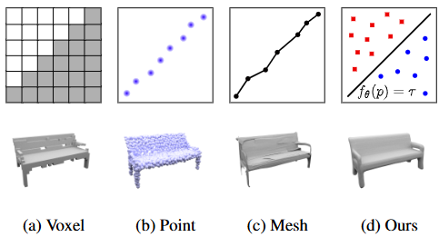

# Occupancy Networks: Learning 3D Reconstruction in Function Space

> 阅读 IF-Defense 遇到占据网络的概念，在此记录相关内容。

在对抗攻防中，防御方发展出一类基于输入净化的方法，通过将对抗样本恢复为良性样本来实现防御。**IF-Defense** ---一项点云对抗防御中的经典工作---正属于这类方法。它先将点云重建为网格，然后在网格层面消除异常的形变，从而实现防御。而 IF-Defense 所使用的曲面重建方法是这篇论文所提出的占据网络。因此，为了更好的理解 IF-Defense 的方法和代码实现，特在此记录相关内容。

??? info "论文信息"

    - 论文链接：[arxiv](https://arxiv.org/abs/1812.03828)
    - 代码链接：[github](https://github.com/autonomousvision/occupancy_networks)
    - 补充材料：[pdf](https://www.cvlibs.net/publications/Mescheder2019CVPR_supplementary.pdf)
    - AI 摘要：**占据网络**是一种新型的三维重建方法，它通过学习连续的三维**占据函数**来隐式表示三维表面，从而克服了以往方法在分辨率和拓扑结构方面的局限性。该方法能够以无限分辨率编码三维结构，同时保持较低的内存占用。此外，占据网络能够从多种输入类型（例如点云、单张图像和低分辨率体素表示）中重建三维几何形状，并在多个基准测试中取得了有竞争力的结果。
<!-- more -->

## 背景

**不必要的背景介绍在此省略，Related Work 还有实验也一并省略，这些不是本文关注的重点。**

### 三维表示形式不统一
与二维视觉中不同的是，在三维视觉中，研究人员尚未在“用什么形式表达三维信息” 这一问题上达成共识。很难说一个理想的三维数据表示形式是什么样的，因为**现有的表示各有优劣，没有一种形式能完全盖过一切。**不过，我们可以分析现有的数据表示有什么问题，然后看看能否改进这些问题，从而接近那个“理想的形式”。

### 现有表示形式的缺陷
现有的三维数据表示形式大致可分为三类：基于体素的表示、基于点的表示和基于网格的表示。

基于体素的表示是 2D 图像像素到 3D 情况的推广。 这种表示最直接的问题是内存占用随着分辨率的提高呈**立方增长**。虽然可以通过一些自适应技术（如 Octree）来减少内存占用，但这些技术会导致复杂的实现，并且现有的数据自适应算法并不能在根本上解决问题，提升的分辨率仍然有限。

因此，基于点云、网格的表示被引入作为体素的替代表示。但是，使用点云表示 3D 图形丢失了点与点之间的连接信息，需要额外的后处理步骤才能从模型中提取出 3D 几何图形。另一方面，现有的网格表示方法通常基于模板网格，通过模板网格的形变来逼近目标图形，因此这种表示不允许任意拓扑。更直接的问题是，这两种方法的点(顶点)数量都受到限制，因此在图形分辨率上也存在限制。

不同的三维数据表示方法
{ .caption }

那么，有没有一种既能节省内存，又能从数据中高效推断出任意分辨率的表示形式呢？☝🤓 ，这就是这篇论文所关注的问题。

## 方法

### 占据函数
占据函数 $f:\mathbb{R}^3\rightarrow \{0,1\}$ 将任意空间坐标 $p=(x,y,z)$ 映射为 $0$ 或 $1$。其中 $0/1$ 表示该点在表面内/外。注意占据函数对于不同的曲面 $C$ 有不同的形式，所以更具体的写法应该是

$$
f: (p, C) \mapsto o, \quad
\mathbb{R}^3\times \{曲面的集合\} \rightarrow \{0,1\}. 
$$

显然，如果我们有这么一个函数，那么我们就可以依据占据函数来界定整个连续空间中的物体表面，这也就意味着，**无限的分辨率**。

### 占据网络
看到这基本上就知道作者想要做什么了：**训练一个占据网络来拟合占据函数。**

思路是把占据情况的预测问题视为一个二分类问题，把离散的占据信息(0/1 分类)转为连续的占据率信息(置信度)来处理，**将 3D 表面表示为分类器的连续决策边界**。因此后续可以使用占据网络的决策边界来重建曲面（等值面提取）。如前面所述，占据函数与要建模的曲面关联，而网络对 $C$ 曲面的信息来自于我们对该曲面的观测结果 $x$，因此网络实际是接受观测值做为输入，形式上，这个二分类网络可以写为：

$$
f_{\theta}: (p, x) \mapsto o, \quad
\mathbb{R}^3\times \mathcal{X} \rightarrow [0,1].
$$

## 实现

**以下是个人理解，与原文有出入**
**TODO：为文字内容搭配对应的代码** 

首先考虑用分类网络的方式来实现一个朴素的占据网络：设计一个简单的二分类网络，训练时用空间点坐标 $(x, y, z)$ 做为输入，把该点的占据情况 $o$ 作为监督信号，进行有监督训练。

这是一套非常标准的方案，但显然存在着问题。比如**同样的输入可能会对应不同的标签**，同一个坐标可能在上一个图形中被占据，在下一个图形中又没有被占据，导致了训练时存在二义性，这也是为什么前面的公式中我们需要观测信息。对于重建任务，所提供的观测信息包括图像、点云、体素等，可以使用对应模态的编码器对它们进行编码，然后把编码结果作为网络的条件输入，帮助网络区分不同的图形。

那么，怎么把编码结果应用于网络的条件控制？

### 条件批归一化
论文中使用了条件批归一化（Conditional Batch Normalization, CBN）来实现这一点。CBN 是 Batch Normalization 的扩展，它允许 Batch Normalization 层的两个参数（$\gamma$ 和 $\beta$）依据外部条件 $c$ 动态调整，从而实现条件控制。这里我们把编码结果做为条件，通过 CBN 实现条件控制。

*[CBN]: Conditional Batch Normalization 
*[BN]: Batch Normalization

### 潜空间表示

**TODO: 整理文字**  

论文还引入了一个编码器 $g_{\phi}(\cdot)$ 来编码样本信息。一个样本由一组连续空间中的坐标点及其对应的占据信息组成。在 $p = (x, y, z)$ 坐标的基础上增加一个表示用来占据信息的 $o$，形式上，这个编码器可以写为:

$$
g_{\phi}: (p, o) \mapsto z, \quad \mathbb{R}^3 \times \{0, 1\} \rightarrow \text{Latent Space}\ \mathcal{Z}
$$

把 $(p, o)$ 视为随机变量，这个编码器表示了一个条件分布 $p(z|(p，o))$。之后参考 VAE 的做法，约束这个分布，使其服从一个简单的先验分布(通常为标准正态分布)，方便后续做无条件重建时采样潜在变量，此外，这样做得到的潜在空间在结构上会更平滑一点。

需要注意的是，这块内容实际上没什么用。因为在推理时没有占据率信息，所以实际上无法计算潜在变量，论文中引入这个主要是为了研究占据网络是否可以学习 3D 形状的内存高效表示，同时保留尽可能多的细节。

## 怎么使用占据网络？
