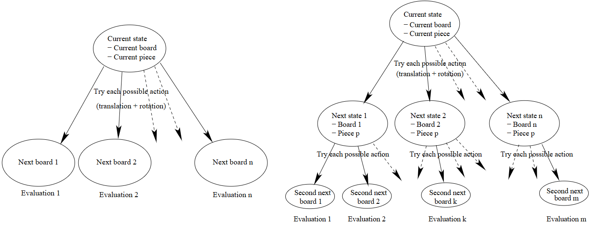

# 翻译：Building Controllers for Tetris

## Abstraction
这篇文章有两个目的：一是对为广为人知的视频游戏 Tetris 构建控制器的这一问题进行综述，二是对如何实现最佳性能做出贡献。典型解决方案的关键组成部分包括特征设计和特征权重优化。我们提供了一份清单，列出了我们在文献和实现中找到的所有特征，并提及了用于权重优化的方法。我们还强调了这样一个事实，即 Tetris 的性能指标必须非常小心地比较，因为（1）它们具有相当大的方差，并且（2）微小的实现选择可能会对最终得分产生重大影响。这次综述的直接兴趣在于，直接从不同的工作中收集想法可能会产生新的想法。我们展示了我们如何构建了一个性能优于先前已知最佳控制器的控制器。最后，我们简要讨论了这一实现如何让我们赢得了 2008 年强化学习竞赛的 Tetris 赛道奖项。

## 1. Introduction

俄罗斯方块是一款流行的电子游戏，由阿列克谢·帕基特诺夫（Alexey Pajitnov）于 1985 年创作。游戏在一个 10×20 的网格上进行，不同形状的方块从顶部落下（见图1）。玩家需要选择每个方块的放置位置：玩家可以水平移动或旋转方块。当一行填满后，该行将被移除，其上方的所有格子将向下移动一行。游戏的目标是在游戏结束前（即方块堆顶部没有足够的空间放置新的方块时）尽可能多地移除行。Fahey 的网站（Fahey，2003）上提供了关于俄罗斯方块的详细规范。

在本文中，我们回顾了尝试构建俄罗斯方块控制器的文献，并提供了这些文献中涉及的特征函数的参考文献。据我们所知，目前文献中尚无此类综述。对于人类玩家来说，俄罗斯方块游戏的主要难点在于方块可能会从游戏区域顶部快速落下：如此短的时间通常会使决策过程变得困难。然而，这个问题在与 ai 玩家打交道时不会出现这种情况，因为与控制器的决策速度相比，方块的下落速度可以忽略不计：事实上，我们在本文中讨论的控制器能够在当今的台式计算机上每秒进行数万次移动。

图 1：左侧：Tetris 游戏的屏幕截图。右侧：方块的七种形状。
{ .caption }

俄罗斯方块游戏被几位研究人员选作基准优化问题：目标是找到一个控制器来最大化平均得分（Burges，1997），这总是有限的，因为已知每局游戏都以概率1结束。这个问题因其计算难度而闻名。在测试中确实存在大量状态（大约 $7.0 \times 19^{8} = 5.6 \times 10^{9}$ 个棋盘配置[^1]），甚至仅仅提前知道两块积木的内容就足以使最大化平均得分的策略成为一个 NP 完全问题（Demaine、Hohenberger 和 Liben-Nowell，2003）。

文章的结构如下：第 2 节我们描述现有的“俄罗斯方块”控制器。第 3 节报告了合成不同类型控制器的困难。在第 4 节中，我们提出了自己的程序 BCTS，该程序赢得了 2008 年强化学习竞赛。BCTS 是 Building Controllers for Tetris Systems 的缩写。第 5 节给出了结论并列出了两个开放性问题。

## 2. EXISTING TETRIS CONTROLLERS

大多数Tetris控制器的实现（Tsitsiklis和van Roy，1996；Bertsekas和Tsitsiklis，1996；Kakade，2001；Lagoudakis，Parr和Littman，2002；Ramon和Driessens，2004；Farias和van Roy，2006；Szita和Lorincz，2006；Llima，2005）都是**单方块控制器（one-piece controller）**，即仅使用当前棋盘和当前方块知识的控制器。控制器还可以使用下一个方块的知识（Fahey，2003；Bohm，Kokai和Mandl，2005），如原始Tetris设置中可能的那样，可以做出利用方块组合的决策，被称为**双方块控制器（two-piece controller）**。

所有控制器都依赖于**评估函数（evaluation function）**。在给定的游戏状态下（即 (1) 当前棋盘配置，(2) 当前方块，以及 (3) 可选的下一个方块），所有可能的动作（即当前方块的位置和方向选择）都由评估函数进行评估。然后，控制器选择评估值最高的动作。图2 展示了这个过程。在图2a 中，我们可以看到单方块控制器的原理（即单层评估过程）。从当前状态（当前棋盘和当前方块）开始，尝试每种可能的动作，并得出新的棋盘，并通过评估函数进行评估。然后，选择获得最佳评估值的动作。在图2b 中，我们可以看到双方块控制器的原理（即双层评估过程）。从当前状态开始，尝试每种可能的动作，并得出新的棋盘，其中下一个方块是已知的。对于每个状态，都会尝试所有可能的后续动作，并通过评估函数对最终的棋盘进行评估。然后，我们在第一个状态下执行导致找到最佳评估的状态的动作。

理论上，可以通过在每个阶段对所有可能的方块进行操作评估并取平均值来计算多阶段的预判。然而，据我们所知，由于这需要巨大的计算时间，这种深入的搜索从未被实施过。因此，**构建一个俄罗斯方块控制器的问题归结为构建一个好的评估函数**。理想情况下，这个函数应该对好的决策返回高值，对坏的决策返回低值。评估函数通常是特征函数的组合，通常（但并非总是；例如参见Böhm等人，2005年）是一个加权的总和。每个特征函数旨在捕捉行动和状态的某些相关特性。一个特征的例子是堆叠中的空洞[^2]数量，其关联权重通常是负数：创建的空洞越多，评估值越低。

实际上，设计一个基于特征的俄罗斯方块控制器包括两个步骤。第一步是选择一组能够提取关于游戏的相关信息的特征，这通常由专家完成。表2.1 提供了我们在此提到的作品中引入的特征的综合列表。第二步是调整特征的相对权重。在文献中，这种调整是手动或自动完成的（通过强化学习或一些优化技术）。我们现在更详细地讨论我们认为最重要的工作。在2.1小节中，我们讨论了手写控制器，在2.2小节中讨论了强化学习方法，在2.3小节中讨论了通用优化方法。在2.4小节中，我们对最佳方法给出了最终评论。

图 2. (a) 单层评估过程。(b) 双层评估过程。
{ .caption }

### 2.1 Hand-written controllers

据我们所知，目前最好的单方块控制器是由 Dellacherie（Fahey，2003年）开发的，并且是手工调整的。Dellacherie 通过反复试验，手动设置了一组有效的特征及其权重。令人惊讶的是，这个手工编写的控制器在性能上超过了文献中的其他单方块控制器，即使那些控制器的权重是自动调整的。在总共 56 场比赛中，Dellacherie 的算法平均得分约为 660,000 行。此外，这个每局 660,000 行的测量结果是在原始俄罗斯方块游戏的实现上进行的，正如我们将在第 3 节中看到的，这比大多数研究人员考虑的常规简化俄罗斯方块设置要困难。由于该算法的源代码在 Fahey 的网站上免费提供，我们对其进行了逆向工程，并确定了其特征及其权重。Dellacherie 的评估函数是以下特征的线性组合：

$$
\begin{align}
& - \text{(Landing height)} + \text{(Eroded piece cells)} - \text{(Row transitions)} \\
& - \text{(Column transitions)} - 4 \times \text{(Holes)} - \text{(Cumulative wells)}
\end{align}
$$

其中涉及的特征在下面的汇总表中有详细说明。
Fahhey(2003) 创建了一个两方块控制器，其中一些原始特征的权重也是手工调整的。他报告了 7200000 行的游戏得分。只进行了一场比赛，这花了一周的时间。

??? info "常见手工特征汇总表"

    | Feature                | Description                                                         | 描述                                                  |
    |------------------------|-------------------------------------------------------------------- |-------------------------------------------------------|
    | Max height             | Maximum height of a column                                          | 一列的最大高度                                        |
    | Holes                  | Number of empty cells covered by a full cell                        | 被完整单元格覆盖的空单元格数量                        |
    | Column height          | Height of each column                                               | 每列的高度                                            |
    | Column difference      | Height difference between each pair of adjacent columns             | 相邻两列之间的高度差                                  |
    | Landing height         | Height where the last piece is added                                | 最后一个方块下落位置的高度                            |
    | Cell transitions       | Number of fill to empty or empty to fill cell transitions           | 从满到空或从空到满的单元格转换次数                    |
    | Deep wells             | Sum of well depths, except for wells with depth = 1                 | 除深度为 1 的井外，所有井深度的总和                   |
    | Embedded holes         | Sort of weighted sum of holes (not precisely documented)            | 孔洞加权的总和（不精确记录）                          |
    | Height differences     | Sum of the height differences between adjacent columns              | 相邻列之间的高度差的和                                |
    | Mean height            | Mean height of columns                                              | 列的平均高度                                          |
    | Δ max height           | Variation of the maximum column height                              | 最大列高度的方差                                      |
    | Δ holes                | Variation of the hole number                                        | 孔洞数量的方差                                        |
    | Δ height differences   | Variation of the sum of height differences                          | 高度差之和的方差                                      |
    | Δ mean height          | Variation of the mean column height                                 | 平均列高度的方差                                      |
    | Removed lines          | Number of rows completed at the last move                           | 上一步放置完成的行数                                  |
    | Weighted cells         | Full cells weighed by their height                                  | 根据其高度加权填充的单元格                            |
    | Wells                  | Sum of the depth of the wells                                       | 所有井的深度之和                                      |
    | Full cells             | Number of occupied cells on the board                               | 板上占用单元格的数量                                  |
    | Eroded piece cells     | (Move × Number of bricks eliminated from the last piece added)      | (最后一步移除的行数)×(最后添加的一块砖的数量)         |
    | Row transitions        | Number of horizontal cell transitions                               | 水平单元格转换的数量                                  |
    | Column transitions     | Number of vertical cell transitions                                 | 垂直单元格转换的数量                                  |
    | Cumulative wells       | \( \sum_{w=1}^{n} (1 + 2 + ... + \text{depth}(w)) \)                | \( \sum_{w=1}^{n} (1 + 2 + ... + \text{depth}(w)) \)  |
    | Min height             | Minimum height of a column                                          | 一列的最小高度                                        |
    | Max – mean height      | Maximum column height – Mean column height                          | 最大列高度−最小列高度                                 |
    | Mean – min height      | Mean column height – Minimum column height                          | 平均列高度−最小列高度                                 |
    | Mean hole depth        | Mean depth of holes                                                 | 孔深的平均值                                          |
    | Max height difference  | Maximum difference in height between two columns                    | 两列之间的最大高度差                                  |
    | Adjacent column holes  | Number of holes, where adjacent holes in the same column count once | 相邻孔在同一列只计数一次的孔洞数量                    |
    | Max well depth         | Maximum depth of a well                                             | 井的最大深度                                          |
    | Hole depth             | Number of full cells in the column above each hole                  | 每个孔上方填充的单元格数量                            |
    | Rows with holes        | Number of rows having at least one hole                             | 至少有一个孔的行数                                    |
    | Pattern diversity      | Number of different transition patterns between adjacent columns    | 相邻列之间不同转换模式的数量                          |

### 2.2 Reinforcement Learning Approaches

强化学习文献中有多部作品以俄罗斯方块游戏为研究对象。Carr (2005) 在一篇综述中提到了其中一些工作。在强化学习领域（Sutton and Barto, 1998），算法旨在调整权重，使评估函数能够很好地逼近每个状态（回想一下，状态包括 (1) 当前棋盘布局，(2) 当前方块，以及 (3) 可选的下一个方块）的最佳预期未来得分。由于状态数量巨大，状态空间通常通过模拟来访问。

强化学习领域中关于俄罗斯方块的最早工作似乎是由 Tsitsiklis 和 van Roy（1996）完成的。他们的方法使用了一种基于特征的值迭代方法。所获得的控制器基于两个特征（堆积高度和空洞数量），并且平均得分较低（在 30 分左右）。然而，他们的工作表明，使用基于特征的评估函数比仅仅选择实现最高即时奖励的移动效果更好（根据他们的说法，大多数情况下，后一种方法无法得分）。后来，Bertsekas 和 Tsitsiklis（1996）提出了 $\lambda$-策略迭代算法，并将其应用于俄罗斯方块。这种方法推广了标准的值迭代和策略迭代算法（Bellman，1957）。评估函数通过一组更精致的特征的加权和来近似，并通过模拟来估计。他们报告说，在 100 场比赛中平均得分为 3,200 行。另外两项强化学习工作重用了他们的特征集。在第一项工作中，Kakade（2001）应用了一种自然策略梯度方法，并报告说平均得分约为每局 6,800 行，但没有具体说明平均了多少局游戏的得分。在第二项工作中， Farias 和 van Roy（2006）应用了一种线性规划方法，在 90 场比赛中平均得分为 4,700 行。 Lagoudakis 等人（2002）应用了最小二乘策略迭代方法，并使用了一些原始特征，报告说平均得分在 1,000 到 3,000 行之间。该算法仅在开始时收集一次样本，并且与 $\lambda$-策略迭代方法相比，显示出有趣的收敛特性。尽管并没有取得非常好的性能（平均每局约 50 行），但为了完整性，我们也应该提到 Ramon 和 Driessens （2004）使用关系强化学习的工作。

### 2.3 General Purpose Optimization Approaches

一种替代强化学习的方法是使用通用优化来调整权重，其中算法直接寻找使相应控制器表现良好的权重，而不是尝试近似期望得分。与强化学习相反，由此产生的评估函数没有任何特定的语义。例如，GNU 实现中的 XTRIS 机器人涉及六个特征，其相对权重通过遗传算法进行了调整（Lima, 2005）。该算法在 18 代 50 组系数上进化了 20 次，在 500 台机器的小时内分布在 20 个工作站上。

在一个非常接近原始俄罗斯方块游戏的模拟器上，作者报告说平均每局游戏清除 50,000 行。 Bohm 等人（2005）还报告了一种有趣的进化方法，试图优化具有文献特征的控制器和几个原始特征。然而，他们的结果无法与其他大多数工作进行比较，因为他们只考虑了两方块控制器。此外，由于运行时间的原因，他们没有对 10×20 板上的结果进行平均。

最近， Szita 和 Lörincz （2006）应用了交叉熵方法（见 De Boer 等人, 2004），这是一种更接近于进化算法的方法，其中控制器的种群围绕高斯分布进化。他们使用了 Bertsekas 和 Tsitsiklis （1996）的特征，并在 30 个游戏中报告了平均 350,000 行的分数，超过了强化学习方法的结果，这些方法使用了相同的特征。

### 2.4 Final comments of the best approach

对当前技术水平的综述引出了几点评论。一方面，Dellacherie 提出的特征似乎是最具竞争力的。即便是使用人工设定的权重，Dellacherie 的控制器目前仍然取得了最好的效果。另一方面，一些优化算法（如 Szita 和 Lőrincz, 2006；Böhm 等, 2005；Llima, 2005）被认为是在为特定特征集合调整权重方面最为成功的方法。

至于强化学习方法（试图利用俄罗斯方块问题的最优控制结构）未能取得良好结果的原因，很可能是因为以当前该领域的先进技术而言，俄罗斯方块问题仍然过于困难。在线性架构下，估计最优得分的难度可能太大。

## 3. ON THE DIFFICULTY OF COMPARING DIFFERENT TETRIS CONTROLLERS

我们前面提到了多个俄罗斯方块控制器作者报告的平均得分。本节将强调这样一个事实：比较不同的俄罗斯方块控制器，尤其是在其性能基于不同实现方式评估的情况下，是一件非常困难的事情。

首先，我们将在第 3.1 节指出，不同研究中的游戏设定常常存在差异。接着，在第 3.2 节我们将论证俄罗斯方块控制器的平均得分存在较大的偏差，并解释如何推导置信区间。最后，在第 3.3 节我们将展示，由于某些微妙的细节，控制器的性能可能会出现显著变化。

### 3.1 Tetris problem variations

我们之前已经提到，有些研究采用单方块控制器，而另一些则考虑双方块控制器。Fahey 设计了一个双方块控制器，他解释说，当下一个方块未知时，他算法中相应的单块控制器相比于其他单块控制器表现得很差。这表明，预知下一个方块可以显著提升控制器的性能。反过来看，这也说明当前关于单块控制器的研究成果在与少数几篇涉及双块控制器[^3]的工作（如 Fahey, 2003；Böhm 等人 2025）相比时，可能被显著低估了。
从大多数研究者所考虑的俄罗斯方块问题来看，它与 Fahey（2003）所定义的原始游戏略有不同。通常会做出一些简化，以便将注意力集中在自动玩家的核心问题上，即为当前方块选择一个位置和旋转方向。
在原始游戏中（即 Fahey，2003 所定义的版本），当前方块出现在游戏区域内，并逐渐下落。当没有足够的空间在区域顶部生成新方块时，游戏结束。而大多数实现（如 Tsitsiklis 和 van Roy, 1996；Bertsekas 和 Tsitsiklis, 1996；Kakade, 2001；Lagoudakis 等, 2002；Ramon 和 Driessens, 2004；Farias 和 van Roy, 2006；Szita 和 Lőrincz, 2006），包括我们自己的实现，都采用了如下的简化设定：控制器只需要决定当前方块在哪一列、以什么朝向落下。
在这种简化设定中，游戏被适度简化了：在控制器做出决策之前，方块不会出现在游戏区域内。这就相当于总是有足够的空间在区域顶部用来调整方块的朝向并选择投放的列。这一点造成了重要差异，因为整个棋盘的空间都可用于放置方块，包括最上方的几行。
此外，我们更倾向于避免出现方块无法从棋盘一侧移动到另一侧的情况，这种情况通常由于堆叠太高而发生。简化后的俄罗斯方块游戏比原始游戏更容易，因此控制器通常能消除更多的行[^4]。

### 3.2 The large deviation in Tetris scores

令人惊讶的是，尽管大多数作者似乎意识到俄罗斯方块成绩存在较大偏差，但几乎没有人提供置信区间。据我们所知，Szita 和 Lőrincz（2006）是唯一提供此类置信区间的出版物。下面我们将解释如何推导这些置信区间。

Fahey（2003）曾推测，对于一个固定策略的俄罗斯方块游戏，其得分遵循指数分布[^5]。事实上，由于得分（消除的行数）是一个整数，一个更合理且在质量上更接近的猜测是得分服从几何分布。该猜测背后的直觉如下：大致来说，墙体的最大高度在游戏过程中类似于一维随机游走：它会上升和下降，这取决于随机生成的方块；有时它会回落到底部空行。最终得分与游戏持续时间高度相关——即随机游走首次触顶所花费的时间。这个时间对应的随机变量通常被称为“击中时间”（hitting time），其渐近行为已知服从几何分布定律[^6]。

然而，尽管几何分布比指数分布是更好的猜测，Fahey 的猜测却在实验中被证实对许多控制器是成立的（这些控制器的得分在95%的置信度下符合指数分布），这是通过 Szita 和 Lőrincz（2006）采用 Kolmogorov-Smirnov 统计检验得出的。在这一猜测（或几何分布猜测）下，得分的标准差等于（或非常接近[^7]）其期望值（Billingsley, 1995）。这一事实在实践中非常有意义，因为它可以用来评估置信区间。

在通过多次游戏来评估平均得分时，标准统计分析可以告诉我们：置信区间的宽度会随着游戏次数的增加而缩小，而随着标准差的增大而扩大。对于给定的置信水平，更大的标准差意味着需要更多的游戏次数。由于在俄罗斯方块中，得分的标准差等于得分本身，控制器越好，其精确评估就越困难。

更具体地说，置信区间具有如下形式（参见任何一本概率论教材，例如 Billingsley（1995）中对这一内容的通用介绍）：在某个概率 \( p \) 下，通过 \( N \) 局游戏得到的平均得分 \( \hat{\mu} \) 与期望得分 \( \mu \) 之间的差异满足以下关系，其中标准差 \( \sigma = \mu \)：

$$
|\mu - \hat{\mu}| \leq \frac{k \sigma}{\sqrt{N}} = \frac{k \mu}{\sqrt{N}} \simeq \frac{k \hat{\mu}}{\sqrt{N}}
$$

其中，\( k \) 是一个常数，取决于所选的置信概率 \( p \)（典型的取值关系为：当 \( p = 0.68 \) 时，\( k = 1 \)；当 \( p = 0.95 \) 时，\( k = 2 \)；当 \( p = 0.997 \) 时，\( k = 3 \)）。等价地，这可以推导出如下的**相对置信区间**：

$$
\frac{|\mu - \hat{\mu}|}{\hat{\mu}} \leq \frac{k}{\sqrt{N}} .
$$

### 3.3 Tetris implementations subtleties

我们刚刚看到，总体而言，为俄罗斯方块控制器推导出的置信区间范围较大。在实现模拟器时，我们进一步注意到某些实现细节会对性能指标产生显著影响。本文将以 Dellacherie 控制器为例，探讨这些细节及其对游戏分数的影响。

一个关键细节（现有文献均未明确提及）在于基于评估的控制器在游戏结束时的处理逻辑。当最高评分的操作会导致游戏结束，而其他低评分操作仍可继续时，更合理的策略是直接排除那些导致游戏结束的操作——不评估这类操作能延长游戏时长从而提高分数。按此规则，仅当所有可选操作都会导致游戏结束时游戏才终止。我们按此方式实现 Dellacherie 算法时，其平均可完成 5,000 ± 20% 行。若允许控制器评估导致游戏结束的操作，其性能会骤降至 850,000 ± 20%。

实际上，多数俄罗斯方块实现将游戏结束判定定义为当前方块无法放入 10 × 20 的游戏板（即方块堆叠超出边界）。但细读 Bertsekas 与 Tsitsiklis (1996) 的描述会发现，他们将结束条件定义为"顶部行任意方格被填满且方块堆触及网格顶端"，这相当于将有效游戏区域缩小为 10 × 19。这个细微差异对分数影响巨大：在 10 × 19 版中，Dellacherie 算法仅能完成 2,500,000 ± 20% 行，而非 5,200,000 ± 20%。因此我们认为第 2 节引用的 Bertsekas 等人实验结果相对于其他强化学习研究是被低估的。

鉴于游戏规则和控制器实现的微小细节都会显著影响分数，在比较不同方法时需要格外谨慎。由于多数研究采用不同的实现方案，前人报道的结果实际上缺乏可比性。特别当需要将 Dellacherie 分数与简化版俄罗斯方块设置（多数研究者采用）对比时，其基准应视为 5,000,000 ± 20% 行（在原始俄罗斯方块模拟器[^8]上的结果）而非 660,000 ± 27%。公平比较不同控制器的唯一方法是在相同模拟器上多次运行测试。为此，我们开发了可配置的优化版模拟器并实现了多种控制器[^9]。

## 4. THE 2008 REINFORCEMENT LEARNING COMPETITION

基于对俄罗斯方块相关文献的仔细分析，我们实现了一个控制器，它结合了先前成功的特征设计和特征权重优化。我们将该程序命名为 BCTS，即“为俄罗斯方块系统构建控制器（Building
Controllers for Tetris Systems）”。我们采用交叉熵方法（Szita 和 L˝orincz，2006）训练了一个控制器，使用了 Dellacherie（Fahey，2003）中的高性能特征以及表 2.1 中提到的两个原始特征：孔深度（Hole depth）和带孔行数（Rows with holes）。我们在此给出对权重进行交叉熵优化后获得的评估函数：

$$
\begin{align}
& -12.63 \text{ (Landing height)} + 6.60 \text{ (Eroded piece cells)} - 9.22 \text{ (Row transitions)} - 19.77 \text{ (Column transitions)} \\
& -13.08 \text{ (Holes)} - 10.49 \text{ (Cumulative wells)} - 1.61 \text{ (Hole depth)} - 24.04 \text{ (Rows with holes)}.
\end{align}
$$

在大多数研究者所采用的简化版俄罗斯方块设定中（参见第 3.1 节），该控制器以 95% 的概率实现了平均消除 \(35,000,000\pm 20\%\) 行的成绩。尽管我们未在真实版俄罗斯方块游戏（依据 Fahey, 2003 的规范）中进行测试，但通过在一个 \(10\times 16\) 的简化版棋盘上进行游戏实验，我们保守估计该控制器在真实游戏中的得分下限为 \(910,000\pm 5\%\) 行（置信概率 95%）。这一结论的合理性在于：简化版棋盘上的所有可行操作在真实版 \(10\times 20\) 棋盘上同样可行，因为所有方块的高度均不超过 4。关于 BCTS 构建的更多细节可参阅 Thiery 与 Scherrer（2009）的研究。

基于本文献综述工作，BCTS 近期赢得了 **2008 年强化学习竞赛**。该竞赛要求俄罗斯方块控制器在修改后的游戏版本中运行，其中部分游戏属性（如棋盘尺寸、消除 1/2/3/4 行的得分规则）可能发生变化，人工智能玩家需自适应不同环境。竞赛采用的性能指标[^10] 比本文讨论的自然指标具有更低的方差。虽然竞赛以强化学习为框架，但允许使用任何方法。我们在前述控制器基础上增加了名为 **“模式多样性”** 的创新特征——该特征通过分析相邻两列顶部形成的图案并统计不同图案的数量，促使控制器确保棋盘能容纳任何方块而不产生空洞。据与 Marek Petrik 和 Istvan Szita 的个人交流，获得亚军和季军的人工智能玩家同样采用了 **交叉熵方法** 进行调参。我们认为，**特征选择的优势** 是赢得竞赛的关键因素。  

## 5. CONCLUSION AND OPEN QUESTIONS
本综述的一个观察发现是，诸如交叉熵方法（Szita与L˝orincz，2006）或进化算法（B¨ohm等，2005；Llima，2005）等优化方法目前取得的成效远超强化学习方法。然而，强化学习方法提供了优秀的理论工具，尤其能计算最优俄罗斯方块策略的预期得分（价值函数）。事实上，我们通过价值迭代算法（Puterman，1994；Sutton与Barto，1998）成功构建了缩小版俄罗斯方块（5×5棋盘）的精确最优玩家。在此缩小棋盘上，最优策略的预期得分值为13.7行。面对标准尺寸的俄罗斯方块棋盘时，尽管强化学习算法受维度灾难所困，且在需要近似时难以准确预估未来得分，但其优势在于能持续评估未来得分而非仅追求最大化。虽然交叉熵和遗传算法等优化方法在俄罗斯方块中表现更优，但它们无法提供关于理论最高得分的信息。这引出了我们的首个开放性问题：值得沿此方向继续探索，借助强化学习框架估算最优玩家得分的期望值上限。

本综述遗留的第二个开放性问题是：何种优化方法最适合俄罗斯方块？当前最先进的权重调优方法（Llima，2005；B¨ohm 等，2005；Szita 与 L˝orincz，2006）因采用不同实现方式和特征设计而无法直接比较。此外，与其他两项研究及强化学习方法不同，B¨ohm等（2005）仅考虑了两方块控制器，因此其相对于单方块控制器的性能仍属未知。若能在相同条件下实施并运行这些方法，将有助于判断交叉熵方法在何种情况下优于遗传算法（若存在这种情况），以及此类结论是否专属于俄罗斯方块或可推广至其他问题领域。
关于最佳可能得分。这引出了我们的第一个悬而未决的问题。继续朝这个方向进行研究，以便估算出基于强化学习框架的最佳玩家得分预期值的上限，将会非常有趣。

## 6. REFERENCES

1. **Bellman, R. E.** (1957). *Dynamic Programming*. Princeton University Press, Princeton, NJ.  
2. **Bertsekas, D. and Tsitsiklis, J.** (1996). *Neurodynamic Programming*. Athena Scientific.  
3. **Billingsley, P.** (1995). *Probability and measure*. John Wiley & Sons, New York, N.Y., 3rd edition.  
4. **Boer, P. de, Kroese, D., Mannor, S., and Rubinstein, R.** (2004). A tutorial on the cross-entropy method. *Annals of Operations Research*, Vol. 1, No. 134, pp. 19–67.  
5. **Böhm, N., Kókai, G., and Mandl, S.** (2005). An Evolutionary Approach to Tetris. *The Sixth Metaheuristics International Conference (MIC2005)*.  
6. **Burgiel, H.** (1997). How to Lose at Tetris. *Mathematical Gazette*, Vol. 81, pp. 194–200.  
7. **Carr, D.** (2005). Applying reinforcement learning to Tetris. Technical report, Computer Science department of Rhodes University.  
8. **Demaine, E. D., Hohenberger, S., and Liben-Nowell, D.** (2003). Tetris is hard, even to approximate. *Proc. 9th International Computing and Combinatorics Conference (COCOON 2003)*, pp. 351–363.  
9. **Fahey, C. P.** (2003). Tetris AI, Computer plays Tetris. [http://colinfahey.com/tetris/tetris_en.html](http://colinfahey.com/tetris/tetris_en.html).  
10. **Farias, V. and Roy, B. van** (2006). *Tetris: A study of randomized constraint sampling*. Springer-Verlag.  
11. **Kakade, S.** (2001). A natural policy gradient. *Advances in Neural Information Processing Systems (NIPS 14)*, pp. 1531–1538.  
12. **Lagoudakis, M. G., Parr, R., and Littman, M. L.** (2002). Least-squares methods in reinforcement learning for control. *SETN '02: Proceedings of the Second Hellenic Conference on AI*, pp. 249–260, Springer-Verlag, London, UK.  
13. **Llima, R. E.** (2005). Xtris readme. [http://www.iagora.com/~espel/xtris/README](http://www.iagora.com/~espel/xtris/README).  
14. **Puterman, M.** (1994). *Markov Decision Processes*. Wiley, New York.  
15. **Ramon, J. and Driessens, K.** (2004). On the numeric stability of gaussian processes regression for relational reinforcement learning. *ICML-2004 Workshop on Relational Reinforcement Learning*, pp. 10–14.  
16. **Sutton, R. and Barto, A.** (1998). *Reinforcement Learning, An introduction*. BradFord Book. The MIT Press.  
17. **Szita, I. and Lőrincz, A.** (2006). Learning Tetris Using the Noisy Cross-Entropy Method. *Neural Computation*, Vol. 18, No. 12, pp. 2936–2941.  
18. **Thiery, C. and Scherrer, B.** (2009). Construction d’un joueur artificiel pour Tetris. *Revue d’Intelligence Artificielle*, Vol. 23, pp. 387–407.  
19. **Tsitsiklis, J. N. and Roy, B. van** (1996). Feature-Based Methods for Large Scale Dynamic Programming. *Machine Learning*, Vol. 22, pp. 59–94.  

[^1]: 这个个数字是一个估计值，因为它包括了一些不可能的配置（参见 Fahey, 2003）。  
[^2]: 一个个洞是指被有填充格包围的空格。  
[^3]: 回想一下，一个单件控制器可以很容易地扩展到两件控制器设置（见图2）。  
[^4]: 请注意，有了这个常见的简化，通过让当前块掉落然后水平移动来填补空洞”变得不可能。然而，这并没有什么区别，因为根据 Fahey 对原始游戏的规定实现的控制器（Fahey, 2003）也没有利用这种能力。  
[^5]: 这是俄罗斯方块游戏的典型特性。没有理由相信其他游戏具有相同的属性。  
[^6]: 这可以被视为著名的 Perron-Frobenius 定理的结果（Billingsley, 1995）：设 \(\lambda\) 是与随机游走相关的随机矩阵的最大（按模）非 1 特征值。当时间 \(t\) 趋向于无穷大时，随机游走在时间 \(t\) 仍然处于非吸收状态的概率等同于 \(a^t\)（其中 \(a\) 是某个常数）。因此，击中时间为确切 \(t\) 的概率等同于 \(a(t-1) - a^t\)，这与 \(t\) 成比例。  
[^7]: 参数 \(p\) 的几何分布的平均值为 \(1/p\)，标准差为 \(\sqrt{(1-p)/p^2}\)（Billingsley, 1995）。当 \(p\) 非常小（这是 Tetris 控制器表现良好的情况），标准差等同于 \(1/p\)。  
[^8]: 尽管在比通常的简化设置更严格的实现中获得了 660,000 ± 27% 的分数，但这已经是已知的最佳性能。  
[^9]: C 源代码在此处可用：http://gforge.inria.fr/projects/mdptetris。  
[^9]: The C source code is available here: http://gforge.inria.fr/projects/mdptetris.  
[^10]: 该性能是指在固定次数的交互后所获得的总分，其中输掉游戏不会受到惩罚（除了将游戏重置为最初的空状态）。   
