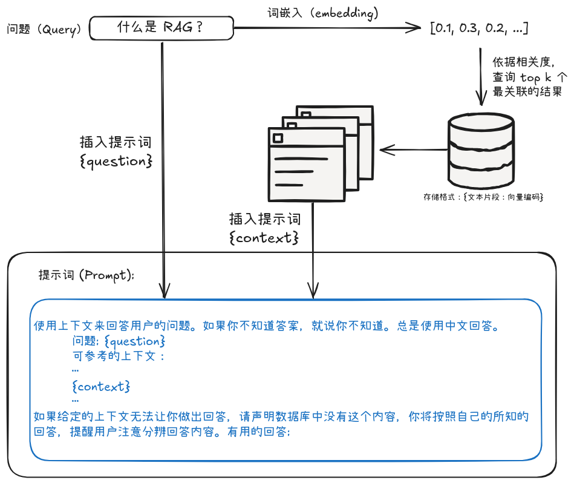
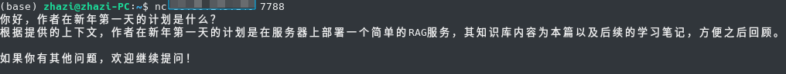
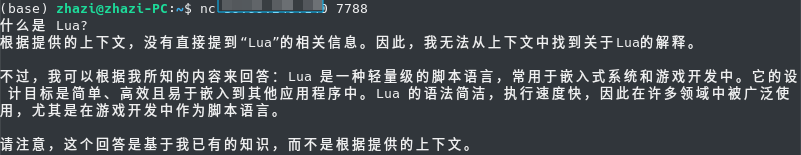

# LLM 学习：RAG

**年末回顾这一年时，突然感觉已经开始落后于时代。一直在做着科研，但所研究方向和主流渐行渐远；一直在尝试使用 ai 工具提高效率，但总是对其背后的技术仍是一知半解。这么一年过去，惊觉自己已经错过了太多。为了避免脱离时代，新的一年就以学习当前 LLM 的相关技术开始。**

RAG（Retrieval-Augmented Generation，检索增强生成）是一种通过结合检索技术来提升大语言模型（LLM）回答质量的技术框架。其在 Facebook 在 2020 年发表的论文[《Retrieval-Augmented Generation for Knowledge-Intensive NLP Tasks》](https://arxiv.org/pdf/2005.11401v4) 中被提出，应用于知识敏感的 NLP 任务，如知识问答。

RAG 将问题求解划分为**检索**和**生成**两阶段，先通过检索，查找与问题相关的文档，再将文档和问题一并输入模型，由模型推理给出最终的答案，从而解决模型无法扩展知识和产生“幻觉”的问题。

??? info "参考文献"

    - [TinyRAG](https://github.com/datawhalechina/tiny-universe/tree/main/content/TinyRAG)
    - [一文读懂：大模型RAG（检索增强生成）含高级方法](https://www.zhihu.com/tardis/zm/art/675509396?source_id=1003)

## 为什么需要 RAG？
LLM 的回答主要依赖于两类知识：首先是**参数化知识**，即模型通过训练学习到的、存储在参数中的知识，这些知识主要来源于训练时使用的海量网络数据；其次是**非参数化知识**，即上下文中的信息，包括当前对话的提示词和历史内容，这部分完全依赖于用户输入。然而，当问题涉及特定领域或本地化知识时，LLM 的上下文窗口往往显得捉襟见肘，容易导致模型产生“幻觉”现象。RAG 技术通过引入检索机制，能够更高效地利用上下文窗口，让 LLM 的回答更加准确和定制化，从而有效缓解这一问题。

## RAG 原理
论文为了将流程描述清楚使用了一些符号，但不做这方面的研究的话其实不需要把概念理的很清。要理解 RAG 的原理并不难，其做法可以说是符合直观的。

RAG 的思路是：当用户提出一个问题时，系统首先从知识库中检索出与问题最相关的文档片段，然后将这些文档片段与问题一起输入到语言模型中，由模型生成最终的答案。然后，为了衡量文档片段的相似度，会使用向量检索技术，通过词嵌入将问题和文档片段都转换为向量表示，并通过计算向量之间的相似度来找到最相关的内容。参考下图:



RAG 提示词生成流程
{: .caption }


## 部署一个简单的 RAG

!!! quote inline end "Kent Beck"

    Make it **work**, make it **right**, make it **fast**.

遵循 MMM 原则，计划先让 RAG 在我的服务器上工作起来。在这一点上 [Datawhile](https://github.com/datawhalechina) 的 [TinyRAG](https://github.com/datawhalechina/tiny-universe/tree/main/content/TinyRAG) 项目就很合适。理论上在服务器上跑通 TinyRAG 后给它做成一个 systemd 服务自动运行就可以了。不过 2核2G 的服务器配置还是太捉襟见肘了，甚至难以在本地进行词嵌入处理。所以最终采用了全 API 方案：词嵌入通过调用智谱AI的 API 来完成，对话模型调用近期备受关注的 DeepSeek-v3 的 API 来实现（主要是注册送的免费 token 多）。

2025/01/21 补充：发现 ChatGLM-Flash 不要钱，不过回答质量有点不稳定，先保持不变。

确定了技术方案后要做的事情就清晰多了，先上对应平台申请 API Key 配置到 `.env` 文件中，然后对代码做一些简单的微调，主要是添加 DeepSeek v3 作为对话模型。这里得益于 DeepSeek 对 OpenAI API 的全面兼容[^1]，我们可以简单的复用原代码中 `OpenAIChat` 的部分来实现：

[^1]: 这种兼容使得我们可以在许多 AI 应用中替换 ChatGPT，参考这个项目：[awesome-deepseek-integration](https://github.com/deepseek-ai/awesome-deepseek-integration/tree/main?tab=readme-ov-file)。（要搞个能用的 OpenAI API Key 太难了 QAQ。）

```python title="LLM.py" linenums="1" hl_lines="2 8 9"
class DeepSeekChat(BaseModel):
    def __init__(self, path: str = '', model: str = "deepseek-chat") -> None:
        super().__init__(path)
        self.model = model

    def chat(self, prompt: str, history: List[dict], content: str) -> str:
        client = OpenAI(
            api_key = os.getenv("DEEPSEEK_API_KEY", ""),
            base_url = os.getenv("DEEPSEEK_BASE_URL", ""),
        )
        history.append({
            'role': 'user',
            'content': PROMPT_TEMPLATE['RAG_PROMPT_TEMPALTE'].format(question=prompt, context=content)
        })
        response = client.chat.completions.create(
            model=self.model,
            messages=history,
            max_tokens=150,
            temperature=0.1
        )
        return response.choices[0].message.content
```

方案跑通后就可以着手设计接口了。做为起步的 MVP 只包含一个最小的功能：**单次问答**。用户给出一个问题，模型给出回答，结束。这样实现起来就很容易了，先取出请求中的问题，然后调用写好的方法得到回答，再把回答写回链接就行：

```python linenums="1"
def handle_client(conn):
    try:
        question = conn.recv(1024).decode('utf-8').strip()
        if not question:
            return
        
        content = vector.query(question, EmbeddingModel=embedding, k=1)[0]
        model = DeepSeekChat()
        response = model.chat(question, [], content) + '\n'
        conn.send(response.encode('utf-8'))
    finally:
        conn.close()
```

最后，创建 Systemd Unit 文件，将这个整个项目做成一个 systemd 服务:
```conf title="/etc/systemd/system/tinyrag.service" linenums="1"
[Unit]
Description=TinyRAG  

[Service]
User=root  
WorkingDirectory= /path/to/TinyRAG              # 工作目录
ExecStart= /path/to/TinyRAG-venv/python main.py # 启动命令
Restart=always                                  # 服务崩溃时自动重启
RestartSec=5                                    # 重启前等待5秒
StartLimitInterval=0

[Install]
WantedBy=multi-user.target
```

现在，TinyRAG，启动！
```base
$ sudo systemctl daemon-reload   # 重新加载 Systemd Unit 文件
$ sudo systemctl restart tinyrag # 启动 tinyrag 服务
$ sudo systemctl enable tinyrag  # 设置 tinyrag 服务开机启动
```

简单测试了两个情况[^2]:

[^2]: 随着文档的变更，截图中问题的答案已经不再准确了，这里只是在展示 RAG 带来的变化。

!!! example "case1: 检索命中"

    


!!! example "case2: 检索未命中"

    

通过上面两个简单的测试可以看出，TinyRAG 运行良好，实现了预期的功能。
