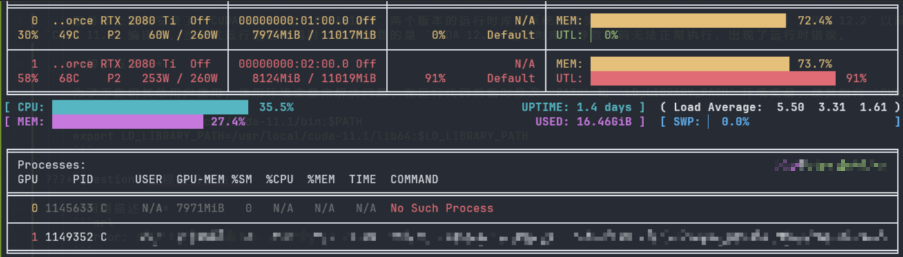

# 记录：小问题归档

**记录一些小问题的解决方案。**

???+ question "Git 报错：可疑的所有权"

    **问题描述:**
    ```srl
    fatal: detected dubious ownership in repository at '<REDACTED_PATH>'
    To add an exception for this directory, call:

            git config --global --add safe.directory <REDACTED_PATH>
    ```

    **问题分析:**

    该信息是 Git 发出的安全警告，表明在 `<REDACTED_PATH>` 目录下的 Git 仓库检测到了可疑的所有权。这意味着该仓库的文件所有权或权限设置不符合 Git 的安全预期，可能存在安全风险。通常情况是，Git 检测到该仓库中的某些文件的所有者与当前用户不一致，因此会触发此错误。解决方案包括更改文件的所有权，或按照提示信息添加该目录为信任目录。

    **解决方案:**

    按它说的做。
    ```srl
      git config --global --add safe.directory <REDACTED_PATH>
    ```

???+ question "CUDA 运行时错误：版本不匹配"

    **问题描述：**
    ```srl
    RuntimeError:
    The detected CUDA version (12.2) mismatches the version that was used to compile
    PyTorch (11.1). Please make sure to use the same CUDA versions.
    ```
    **问题分析:**

    服务器上同时安装了 `CUDA 11.1` 和 `CUDA 12.2` 两个版本的运行时库。系统管理员将 `CUDA` 符号链接设置为指向 `CUDA 12.2` 以满足最新的需要。然而，代码运行环境中的 `PyTorch` 是基于 `CUDA 11.1` 编译的，当尝试运行这些代码时，由于加载的是 `CUDA 12.2` 运行时库，导致代码无法正常执行，出现了运行时错误。

    **解决方案:**

    为了不影响其他用户使用，使用环境变量来解决问题，在运行代码前临时修改 `PATH` 和 `LD_LIBRARY_PATH` 环境变量，使其指向 `CUDA 11.1` 的安装路径。
    ```srl
    export PATH=/usr/local/cuda-11.1/bin:$PATH
    export LD_LIBRARY_PATH=/usr/local/cuda-11.1/lib64:$LD_LIBRARY_PATH
    ```

???+ question "进程端口被占用"

    **问题描述：**
    ```srl
    OSError: [Errno 98] Address already in use
    ```

    **问题分析：**

    在服务器某端口上运行程序，意外登出后该程序仍然占用端口，想重新运行代码就会报错：端口被占用。本来可以 `Ctrl + C` 停止程序解除占用，但重新登录后是新的会话，无法使用该方案。

    **解决方案：**
    
    先找到占用端口的进程的 PID，然后手动 Kill 掉

    1. 查找占用端口的进程：
    ```srl
    lsof -i:<Port>
    ```
    2. 结束占用端口的进程
    ```srl
    kill -9 <PID>
    ```

???+ question "幽灵进程：显卡被占用，但进程不存在"

    **问题描述：**

    显卡被某各进程占用，但通过 nvitop、nvidia-smi 等方式查找进程时显示：Not Such Process。使用 kill 命令无法杀死进程，因为它不存在，像是一个幽灵进程。

    

    幽灵进程
    { .caption }

    **参考资料：**

    - [GPU RAM occupied but no PIDs](https://stackoverflow.com/questions/59431784/gpu-ram-occupied-but-no-pids/59431785#59431785)

    **解决方案：**
  
    使用如下命令查看占用 GPU RAM，该命令可以显示这些幽灵进程的 PID:
    ```rsl
    sudo fuser -v /dev/nvidia*
    ```
    之后手动 kill 进程即可。

