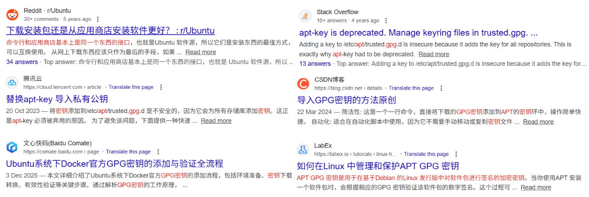
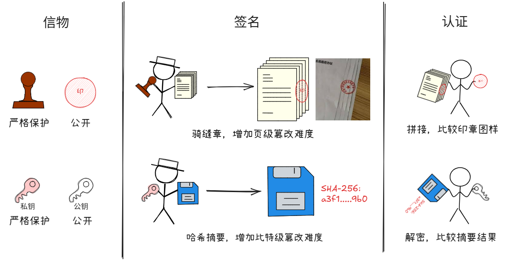

# 为什么 Linux 下安装一些软件时需要做额外的步骤？



围绕apt安装产生的那些问题
{ .caption }

如果你平时主要使用手机或桌面系统（比如 Windows 或 macOS），那么“安装软件”这件事几乎不需要思考——打开应用商店，点一下“安装”，等一会儿，就能用了。

Linux 下当然也有“应用商店”（比如 GNOME Software 或 KDE Discover），但更基础、使用更广的方式，是命令行里的 **包管理器**（如 `apt`、`yum`、`dnf` 等）。最常见的：

```bash
sudo apt install 软件名
```

可以理解为在终端里点击“安装”按钮：系统会自动从官方仓库下载软件、处理依赖，并完成配置。

对于大多数常见软件（文本编辑器、浏览器、开发工具……），只要它们在发行版的官方仓库里，体验其实和你在其他系统里看到的“一键安装”差不多：简单、安全、无需额外操作。

但当你尝试安装一些流行却**在官方源里版本较旧 / 不符合预期**的软件（比如 Docker Engine、Kubernetes）时，情况就变了。以在 Unbuntu 下安装 Docker Engine 为例，官方文档会给出一连串的命令：

```bash
# Add Docker's official GPG key:
sudo apt update
sudo apt install ca-certificates curl
sudo install -m 0755 -d /etc/apt/keyrings
sudo curl -fsSL https://download.docker.com/linux/ubuntu/gpg -o /etc/apt/keyrings/docker.asc
sudo chmod a+r /etc/apt/keyrings/docker.asc

# Add the repository to Apt sources:
sudo tee /etc/apt/sources.list.d/docker.sources <<EOF
Types: deb
URIs: https://download.docker.com/linux/ubuntu
Suites: $(. /etc/os-release && echo "${UBUNTU_CODENAME:-$VERSION_CODENAME}")
Components: stable
Signed-By: /etc/apt/keyrings/docker.asc
EOF

sudo apt update
```

这时你可能会困惑：

> 我真的是在安装软件吗？什么是 GPG 密钥？怎么像是在改系统文件？会影响我的系统吗？.....

这个困惑非常正常——因为这些步骤看起来不像“安装”，倒像是在“配置系统”。

但换个角度看：无论什么系统，“安装软件”从来不只是复制文件，它还包含验证来源、校验签名、解析依赖、配置环境等环节。只不过在通常情况下，这些环节被自动化并隐藏了起来。

而当你要安装**第三方来源**的软件时，系统会要求你**显式地参与其中几步**：导入密钥、添加软件源、刷新索引……这不是为了增加麻烦，而是把控制权交还给用户——由用户来决定是否信任这个来源，以及是否允许它持续地向系统提供软件和更新。

本文将讨论为什么安装某些软件需要额外步骤。理解这些内容，有助于解答前文提到的困惑，并理解相关操作在软件分发机制中的必要性。

## 原因：安装前需要建立信任关系

### 为什么需要建立信任关系？

Linux 系统的软件分发机制，是围绕一组**软件源（repositories）**（也称为软件仓库）构建的。你可以使用系统默认的官方软件源，也可以自行添加第三方源。刚装好系统时，发行版（如 Ubuntu、Fedora 等）通常已经预配置了其官方软件仓库，并内置了对应的 GPG 公钥（不必深究这个术语的具体含义）。从这些源安装软件会很顺畅——无须考虑“软件从哪来”“为什么可信”这些问题，因为发行版团队已经替你完成了打包、签名和维护。

然而，在实际使用中，许多流行工具（Docker、Kubernetes 等）要么不在官方源里，要么官方源里的版本较旧。此时，你更希望安装的是**软件作者自己维护的官方仓库中的版本**。所以这时候你要做的就不只是“装一次软件”，而是要告诉系统一件更长期的事情：

!!! info ""

    <p style="text-align: center;">
      <strong>“以后除了默认源，我还要从这个仓库获取软件，并且允许系统自动从这里更新它。"</strong>
    </p>

注意这句话的含义：你引入的不是“一个安装包”，而是“一个持续上架新软件的软件仓库”。从此之后，系统可能会定期从这个渠道下载更新。

正因如此，Linux 不会替你“默认信任”任意第三方源。相反，它要求你**显式地表达信任**——把信任转化为一条可以被自动化系统反复执行的规则。

这听起来有些抽象，为了理解这一点，我们可以从现实世界中基于**印章**的身份认证体系开始。

!!! example "类比：从印章到数字签名"

    在传统文书往来中，个人或机构不会每次见面都重新确认对方身份，而是通过一枚专属印章来代表自己的权威。这枚印章一旦启用，就成为一种可重复验证的身份凭证——此时，这个“重复执行的规则”，就是**每次收到文件时，检查上面的印章图样是否与备案的一致**。

    软件分发系统采用了类似的思想，只是将凭证从“物理印章”替换为**密码学工具**。在这里，“印章图样”对应的是软件发布者公开的**GPG 公钥**，而“盖章”则由发布者用私钥对软件包生成的**数字签名**来实现。

    用户事先导入软件发布者的公钥导入系统（相当于向系统“备案印章图样”），此后系统每次下载软件包，系统都会自动检查其数字签名是否能被该公钥成功验证。只要验证通过，就可以认为“来源可信且内容未被篡改”。




基于印章的身份认证体系和基于数字签名的身份认证体系
{ .caption }

??? note "两种体系的信任基础不同"

    - 印章的信任基础是**法律与行政权威**——伪造印章要坐牢；  
    - 数字签名的信任基础是**数学与密码学**——在现有算力下，无法伪造有效签名。  
    - 总的来说，两者都实现了“一次认证，长期有效”，只是背书机制不同。

> 📌 注：本文有意简化了技术细节，比如“摘要算法”（如 SHA-256）在签名中的作用。这并非因为它不重要，而是因为理解“为什么要先导入公钥”并不依赖这些底层机制。如果你对数字签名的完整流程感兴趣，推荐阅读关于哈希函数、非对称加密和 PKI 体系的资料——那将是另一篇更深入的文章了。

### 怎么建立信任关系？

前面我们已经建立了认识：GPG 公钥就是数字世界的“印章图样”。系统一旦信任某个公钥，就能自动验证所有由对应私钥签名的软件包。那么，要让这套机制生效，用户只需完成两件事：

- 将公钥存入系统的信任库（相当于备案印章图样）；
- 将软件源地址加入源列表（告诉系统去哪里获取软件）。

这两件事缺一不可——没有公钥，系统无法验证来源；没有源地址，系统无处下载软件。

Docker 官方安装指南中的这两条命令，正是完成这两步的标准操作：

```bash
# 1. 导入 Docker 的 GPG 公钥
curl -fsSL https://download.docker.com/linux/ubuntu/gpg | sudo gpg --dearmor -o /etc/apt/trusted.gpg.d/docker.gpg

# 2. 添加软件源
echo "deb [arch=$(dpkg --print-architecture)] https://download.docker.com/linux/ubuntu $(lsb_release -cs) stable" | sudo tee /etc/apt/sources.list.d/docker.list
```

第一条命令下载并转换公钥为 APT 可读格式，存入信任目录；第二条根据当前架构和系统版本，写入对应的仓库地址。之后执行 `apt update && apt install docker-ce`，系统就能自动验证签名并安全安装。接下来，我们借 Docker Engine 的安装流程完整的走一遍这个配置过程。


## 实操：添加第三方软件源的步骤（以 Docker Engine 为例）

### 命令回顾

```bash
# Add Docker's official GPG key:
sudo apt update
sudo apt install ca-certificates curl
sudo install -m 0755 -d /etc/apt/keyrings
sudo curl -fsSL https://download.docker.com/linux/ubuntu/gpg -o /etc/apt/keyrings/docker.asc
sudo chmod a+r /etc/apt/keyrings/docker.asc

# Add the repository to Apt sources:
sudo tee /etc/apt/sources.list.d/docker.sources <<EOF
Types: deb
URIs: https://download.docker.com/linux/ubuntu
Suites: $(. /etc/os-release && echo "${UBUNTU_CODENAME:-$VERSION_CODENAME}")
Components: stable
Signed-By: /etc/apt/keyrings/docker.asc
EOF

sudo apt update
```

上面这串命令主要是做两件事：

1. **建立信任规则**：将 Docker 的 GPG 公钥存入系统指定位置（`/etc/apt/keyrings/`），供 APT 后续验证软件包签名；（这是上一节讨论的）
2. **登记软件源**：在 APT 配置中新增一个源文件，声明仓库地址及其对应的公钥路径。

**真正的安装（`sudo apt install docker-ce`）是在这些准备之后才进行的。**

### A. 导入 Docker 的 GPG 公钥

#### 1. 准备下载密钥用的工具

```bash
sudo apt install ca-certificates curl
```

为了**安全地**从互联网下载密钥，系统需要两个基础工具：

- `ca-certificates`：包含一组[数字证书颁发机构（CA）](https://zh.wikipedia.org/wiki/%E8%AF%81%E4%B9%A6%E9%A2%81%E5%8F%91%E6%9C%BA%E6%9E%84)的自签证书，即[根证书](https://zh.wikipedia.org/wiki/%E6%A0%B9%E8%AF%81%E4%B9%A6)。当你通过 HTTPS 访问网站时（例如 `https://download.docker.com`）。当你通过 HTTPS 访问网站时，系统使用这些根证书来确保连接的是真正的官方站点(具体过程见**信任链**一节中的内容)。  
- `curl`：全称 Client URL，是一个命令行工具，用于发送网络请求（如 HTTP/HTTPS/FTP）。在这里，我们用它从 Docker 官方站点下载 GPG 公钥。

??? note "信任链" 

    信任链（Chain of Trust）是公钥基础设施（PKI）中的核心机制，用于确保数字身份的真实性和通信的安全性。为了便于理解，可以将其类比为现实世界中的机构身份证明体系。

    在现实中，一个企业要合法开展业务，通常需要提供由政府权威部门签发的《营业执照》。而该营业执照本身并不是凭空产生的——它是由市场监督管理局依据企业的注册材料审核后签发的；市场监督管理局自身的合法性，则来源于国家法律授权和上级政府的设立。这种“企业 ← 市监局 ← 国家法律授权”的层级验证关系，就构成了一个现实中的信任链：你之所以相信某公司的身份合法，是因为你信任市监局的签发行为；而你之所以信任市监局，是因为你信任国家制度。

    数字世界中的信任链与此高度相似。以 HTTPS 网站为例：

    - 终端实体证书（如 example.com 的 SSL 证书）相当于企业的营业执照，用于证明网站身份；
    - 中间证书颁发机构（Intermediate CA）相当于市监局，负责审核并签发网站证书；
    - 根证书颁发机构（Root CA）则相当于国家法律体系，其公钥被预装在操作系统或浏览器中，作为整个信任体系的“信任锚点”。
    > 是“根（证书颁发机构）”，不要误解为“（根证书）颁发机构”，“根证书”指的是“根（证书颁发机构）”的自签证书。
  
    当浏览器访问一个 HTTPS 网站时，它会检查该网站的证书是否由可信的中间 CA 签发，并进一步验证该中间 CA 是否由受信的根 CA 签发。只有当整条链从终端证书逐级回溯到预置的根证书且所有签名均有效时，连接才被视为安全。若中间缺少任一环节（例如服务器未发送中间证书），就会出现“证书链不完整”错误，正如一家公司只出示手写名片却无法提供营业执照一样，难以令人信服。

    这种分层、可追溯、不可绕过的验证结构，不仅提升了安全性（避免根密钥频繁使用），也增强了系统的可管理性与容错能力。正如现实社会依赖政府认证体系建立组织合法性，数字世界依赖信任链构建可信交互的基础。

#### 2. 准备存放密钥的目录

```bash
sudo install -m 0755 -d /etc/apt/keyrings
```

使用 `install` 工具创建 `/etc/apt/keyrings` 目录（若不存在），同时设置其权限为 `0755`。

- `-d`：表示 “directory”，指示 `install` 创建目录而非复制文件（功能上类似 `mkdir -p`，可递归创建父目录）。
- `-m 0755`：指定目录的权限模式（mode）。这里的 `0755` 是八进制表示法，分别对应：

    - **特殊权限位**：不重要。这里 `0` 表示不启用任何特殊权限位。
    - **所有者**（owner）：读 + 写 + 执行（`rwx` = 7）
    - **所属组**（group）：读 + 执行（`r-x` = 5）
    - **其他用户**（others）：读 + 执行（`r-x` = 5）

!!! question "为什么使用 install？"

    `install` 是 GNU coreutils 提供的一个命令，常用于创建目录或复制文件并同时设置权限。它比 mkdir 更强大，因为可以在创建时直接指定权限，避免“先创建再 chmod”的两步操作（更原子、更安全）。

!!! question "为什么是 `/etc/apt/keyrings/`?"

    参考**GPG 密钥管理方式变迁**一节中的内容。  
    自 Debian/Ubuntu 推荐弃用旧命令 `apt-key` 后，`/etc/apt/keyrings/` 成为了存放第三方仓库 GPG 密钥的标准位置。APT 工具链默认信任此路径，使用它能避免权限混乱、配置错误，也更符合现代安全实践。

??? note "GPG 密钥管理方式变迁"

    在 Ubuntu 中，APT 使用 GPG 公钥验证软件包的真实性——这是防止恶意更新的关键防线。但密钥如何管理，直接决定了这道防线是否可靠。

    早期普遍使用 apt-key add 将第三方公钥导入全局信任环（如 /etc/apt/trusted.gpg）。这就像是**把所有合作方的印章图样都放在一个文件夹里，认证时只要文件上的章和文件中的某一个图样对上了就认为文件有效**。这种“跨源信任”带来的问题是：一家小公司的业务章和国家机关的公章在验证时具有完全等同的效力——一份本应由财政部签发的财政拨款通知，若被盖上某家软件公司的印章，系统依然会当作合法文件执行。这是毁灭性的安全缺陷。
    
    同理，旧机制下，任一 GPG 密钥对所有软件源都有效。这意味着，一旦某个小众仓库的密钥泄露，攻击者就能用它签发伪造的系统核心包（如 systemd 或 openssh-server），而 APT 会因“密钥受信”而自动安装，导致全盘沦陷。

    因此系统应该“按来源隔离信任”。比如在录入印章图样时，应当按机构分类归档；收到文件时，也应根据文件来源指定可接受的印章范围。例如，只有来自“Docker 官方”的更新，才允许使用“Docker 印章”验证；来自“Microsoft”的 VS Code 更新，则只认“Microsoft 印章”。其他印章即便存在，也不得越权使用。
    
    这正是当前推荐的实践。自 Ubuntu 20.04 起，官方正式弃用 `apt-key`，推荐采用**作用域隔离（scoped trust）**的密钥管理方式：

    - 每个第三方仓库的 GPG 公钥单独保存为文件（如 docker.gpg），存放在标准目录 `/etc/apt/keyrings/`；
    - 在源配置中通过 `signed-by=/etc/apt/keyrings/docker.gpg` 显式绑定密钥与仓库；
    - APT 仅允许该密钥验证其绑定的源，其他源一概无效。
  
    这种设计将信任关系从“全局共享”转变为“按源授权”。即使 Docker 的密钥被泄露，攻击者也无法用它签发 VS Code 或系统更新包。每个密钥的作用边界清晰、可审计、可撤销，从根本上消除了跨源信任风险。
    
    
#### 3. 下载 Docker 官方 GPG 公钥

```bash
sudo curl -fsSL https://download.docker.com/linux/ubuntu/gpg -o /etc/apt/keyrings/docker.asc
```

从 Docker 官方站点安全下载其 GPG 公钥，并保存为 `/etc/apt/keyrings/docker.asc`。此公钥将用于后续验证所有来自 `https://download.docker.com/linux/ubuntu` 仓库的软件包签名，确保其完整性与真实性。

- `-f`：fail，静默失败（不输出 HTML 错误页面）  
- `-s`：silent，静默模式（不显示进度条）  
- `-S`：show-error，出错时仍显示错误信息  
- `-L`：location，自动跟随 HTTP 重定向  


> 📌 现代 APT 架构鼓励“一源一密钥”（per-repository key）的做法，即将每个第三方源的公钥单独存放（如 `docker.asc`），而非使用已废弃的全局 `apt-key` 命令，以避免跨源信任带来的安全问题。

#### 4. 设置密钥文件的读取权限

```bash
sudo chmod a+r /etc/apt/keyrings/docker.asc
```

最后，给所有用户（a = all）添加对该密钥文件的读权限（+r）。

这是因为 APT 在运行时（即使是通过 sudo apt）可能以非 root 身份读取密钥文件。如果权限不足，会导致“无法验证签名”的错误。

!!! tip "小结" 

    以上几步共同完成了 Docker 官方 GPG 公钥的安全导入——从准备工具、创建标准目录、下载密钥到设置权限，每一步都遵循了当前 Linux 发行版推荐的安全规范。

### B. 添加 Docker 仓库源并绑定密钥

```bash
sudo tee /etc/apt/sources.list.d/docker.sources <<EOF
Types: deb
URIs: https://download.docker.com/linux/ubuntu
Suites: $(. /etc/os-release && echo "${UBUNTU_CODENAME:-$VERSION_CODENAME}")
Components: stable
Signed-By: /etc/apt/keyrings/docker.asc
EOF
```

该命令将 Docker 官方仓库的配置写入 `/etc/apt/sources.list.d/docker.sources`。你也可以手动用文本编辑器（如 `nano` 或 `vim`）创建该文件——效果完全相同，用命令化的好处主要是更方便复制和脚本自动化。这里的关键是**通过 `Signed-By` 字段显式绑定 GPG 公钥**，这杜绝了旧机制下的跨源信任风险。

- `tee`: 从标准输入读取数据，并**同时写入文件和标准输出**，即写文件的同时回显在终端。将多行内容写入受保护目录（如 `/etc/apt/sources.list.d/`）。其名字源于“T”形管道——一进两出，恰似字母 **T**（tee）。
- `<<EOF ... EOF`: 这是 Bash 的**Here Document（此处文档）**语法，用于向命令传递多行文本。`EOF` 是分隔符，中间内容会被原样作为输入传给 `tee`。

配置中的各字段详解如下：

| 字段         | 值                                     | 说明                                                         |
| ------------ | -------------------------------------- | ------------------------------------------------------------ |
| `Types`      | `deb`                                  | 指明该源提供的是**预编译的二进制软件包**（`.deb` 文件）。若需源码包，则为 `dsc`，但绝大多数用户只需 `deb`。 |
| `URIs`       | `https://download.docker.com/…/ubuntu` | Docker 官方仓库的**基础 URL**。APT 会基于此地址，结合 `Suites` 和 `Components` 自动拼接完整路径（如 `.../dists/noble/stable/binary-amd64/`）。 |
| `Suites`     | `$(. /etc/os-release && echo "…")`     | 动态获取当前系统的 **Ubuntu 代号**（codename），例如 `jammy`（22.04）、`noble`（24.04）等。该值必须与仓库中实际存在的发行版名称匹配，否则 APT 会报 “404 Not Found”。脚本通过加载 `/etc/os-release` 安全获取代号，兼容 Ubuntu 和 Debian。 |
| `Components` | `stable`                               | 指定使用 Docker 仓库中的 **`stable` 组件**（即稳定版通道）。Docker 官方仓库通常还提供 `test` 或 `nightly`，但生产环境应始终使用 `stable`。 |
| `Signed-By`  | `/etc/apt/keyrings/docker.asc`         | **关键安全字段**：指定用于验证软件包数字签名的 GPG 公钥文件路径。APT 会严格检查该密钥是否与仓库内容匹配，确保软件包**来源可信、未被篡改**。这正是实现“作用域隔离”的核心机制——此密钥仅用于验证 Docker 仓库，无法用于其他源。 |

??? note "两种配置格式"

    APT 支持两种软件源描述格式，功能等价但语法不同：

    传统格式使用 `.list` 文件，采用单行 `deb [选项] URL suite component` 的语法。例如：  

    ```ini title="/etc/apt/sources.list.d/docker.list"
    deb [arch=amd64 signed-by=/etc/apt/keyrings/docker.asc] https://download.docker.com/linux/ubuntu noble stable
    ```

    这种格式兼容性极佳，适用于 Ubuntu 20.04 及更早版本，但语法紧凑、需手动处理括号和空格，容易出错，且选项（如 `arch=` 或 `signed-by=`）必须写在同一行并用方括号包裹。

    现代格式使用 `.sources` 文件，采用多行键值对结构，语义清晰、可读性强，并原生支持 `Signed-By`、`Architectures` 等安全与架构字段，无需特殊转义或括号语法。例如：  

    ```ini title="/etc/apt/sources.list.d/docker.sources"
    Types: deb
    URIs: https://download.docker.com/linux/ubuntu
    Suites: noble
    Components: stable
    Architectures: amd64
    Signed-By: /etc/apt/keyrings/docker.asc
    ```

    该格式自 Debian 12 和 Ubuntu 22.04 起得到官方支持并推荐使用，更适合自动化部署与安全配置。需要注意的是，Ubuntu 24.04 默认已完全切换至 `.sources` 格式，不再生成 `/etc/apt/sources.list` 文件。

    | 格式     | 文件扩展名 | 语法特点                     | 推荐场景                   |
    | -------- | ---------- | ---------------------------- | -------------------------- |
    | 传统格式 | `.list`    | 单行指令，选项用方括号包裹   | Ubuntu 20.04 及更早版本    |
    | 现代格式 | `.sources` | 多行键值对，结构化、可读性高 | Ubuntu 22.04+ / Debian 12+ |
    
## 结语

这个话题比我预想的要大一些。

一开始只是想搞清楚安装 Docker 时那几行命令到底在做什么，顺便写个短文；预想中应该会在 GPG 密钥那部分多花点时间，然后在最后的命令解释部分让 AI 解释一下再调整一下格式就能完成了。结果折腾了两天发现：只要自己没真正理解，写出来的东西总是不对劲——不是逻辑断层，就是解释浮于表面。最后还是得自己理清楚脉络，才能安心落笔。

过程中意外碰到了两个原本没打算深入的内容：一是信任链（为什么能安全地从网上下载公钥），二是 APT 密钥管理方式的变迁（从全局 apt-key 到按源指定 Signed-By）。好在这些概念本身并不复杂。一旦建立起基本的心智模型——比如参考印章理解数字签名，又比如参考机构资质背书理解数字证书——很多操作就不再显得神秘。

Anyway，说到底这不是一篇教程，也不是深度技术分析，就是一次边查边写的过程记录。现在回头看，虽然超出了最初预想的范围，但总归是完成了最初的目标：搞明白“这命令到底在干啥”。（虽然有点背离“浅入浅出”的初衷了）

## 参考文献

- [信任链 - 维基百科，自由的百科全书](https://zh.wikipedia.org/wiki/%E4%BF%A1%E4%BB%BB%E9%8F%88)
- [根证书 - 维基百科，自由的百科全书](https://zh.wikipedia.org/wiki/%E6%A0%B9%E8%AF%81%E4%B9%A6)
- [证书颁发机构 - 维基百科，自由的百科全书](https://zh.wikipedia.org/wiki/%E8%AF%81%E4%B9%A6%E9%A2%81%E5%8F%91%E6%9C%BA%E6%9E%84)
- [What does a Keyring do? - Ask Ubuntu](https://askubuntu.com/questions/32164/what-does-a-keyring-do)
- apt-key(8) 手册页. Ubuntu 系统手册. 可通过命令 man apt-key 访问.
- ca-certificates 软件包文档. README.Debian 文件, Debian/Ubuntu 系统. 路径: /usr/share/doc/ca-certificates/README.Debian.