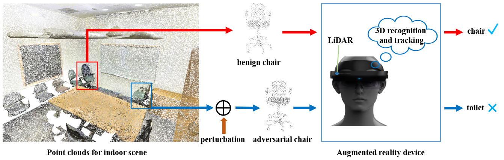
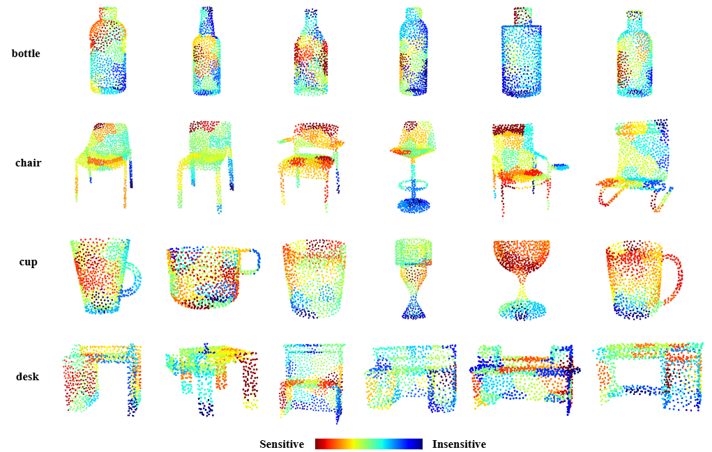
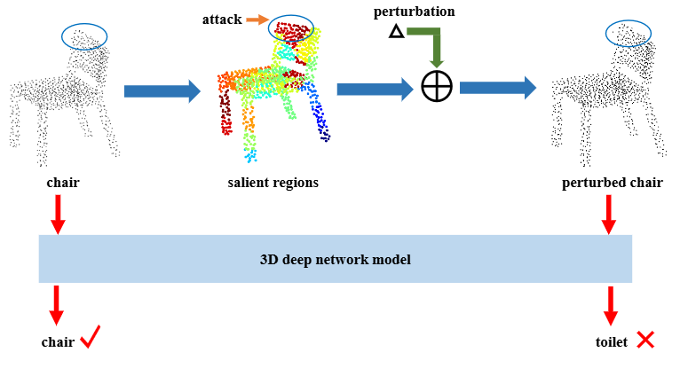
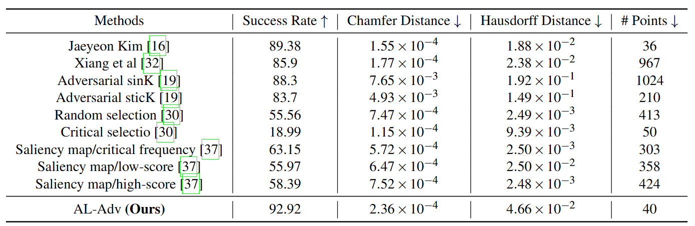
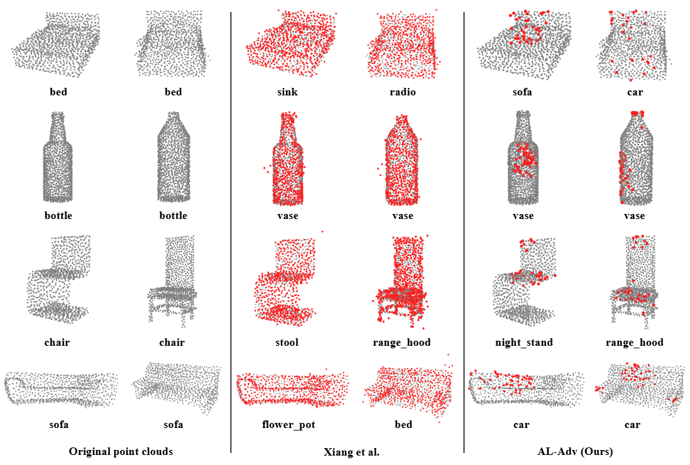

# 翻译：Adaptive Local Adversarial Attacks on 3D Point Clouds for Augmented Reality

> 点云局部攻击二则（其二）

!!! info "文献"

    - [Adaptive Local Adversarial Attacks on 3D Point Clouds for Augmented Reality](https://arxiv.org/abs/2303.06641)

图 1：对抗样本对增强现实系统构成安全风险。在室内场景中，AR设备使用激光雷达感知场景，并应用3D识别和跟踪技术实时识别和跟踪物体。良性物体被AR设备正确检测和识别，例如，一个良性的“椅子”被正确识别。向良性物体添加扰动以生成对抗物体，使AR设备无法正确识别。例如，一个对抗性的“椅子”被AR设备识别为“马桶”。
{ .caption }

## Abstract

三维识别和跟踪作为增强现实（AR）的关键技术，始终容易受到对抗样本的影响，这对 AR 系统造成严重的安全风险。研究对抗样本有助于提高三维神经网络模型的鲁棒性并增强 AR 系统的稳定性。目前，大多数三维对抗攻击方法扰动整个点云以生成对抗样本，这导致扰动成本高，并且在物理世界中重建相应的实际物体困难。在本文中，我们提出了一种自适应局部对抗攻击方法（AL-Adv），用于在三维点云上生成对抗点云。首先，我们分析三维网络模型的脆弱性并提取输入点云的显著区域，即脆弱区域。其次，我们提出了一种针对脆弱区域的自适应梯度攻击算法。所提出的攻击算法自适应地在点云的三维坐标的不同方向上分配不同的扰动。实验结果表明，我们提出的方法 AL-Adv 比全局攻击方法的攻击成功率更高。具体而言，由 AL-Adv 生成的对抗样本表现出良好的不可感知性和较小的生成代码。

**关键词**：增强现实、三维对抗攻击、点云、局部区域攻击；

## Introduction

近年来，随着深度学习技术的发展，AR 技术已与深度学习深度融合，例如二维和三维物体检测、识别等。在增强现实（AR）中，确定真实世界中物体的三维（3D）空间位置是一项重要任务，它直接影响用户的产品体验。为了确保虚拟物体更好地叠加在真实物体上，AR 系统对物体的实时识别和跟踪有更高的要求。基于深度学习方法的 AR 物体识别与跟踪（三维深度网络），作为增强现实的核心技术，已广泛应用于工业领域，为远程指导、维护和培训提供了直观高效的解决方案。然而，基于三维深度网络的 AR 物体识别与跟踪在实际应用过程中仍存在巨大的安全威胁。如果攻击者在现实世界中制造出对抗性物体，将很可能导致AR系统无法正常感知真实场景。

三维点云的识别与跟踪是 AR 应用的重要支撑。AR 通过检测、识别和跟踪真实环境中的物体来实现对场景的感知，这是虚拟物体无缝叠加的基础。然而，之前的研究发现三维深度网络模型容易受到对抗样本的影响，导致模型产生错误的识别结果。对于输入的三维点云，通过对抗性扰动生成对抗样本，会导致三维深度网络模型给出错误的预测。如果三维网络模型受到对抗样本的攻击，AR 系统的三维识别与跟踪功能将无法正常工作，这对 AR 应用来说是一个巨大的风险。在三维点云中，对抗攻击主要分为两类：数字域和物理世界。

在数字域中，对抗样本主要通过添加点或簇、删除点和扰动点来生成。生成的对抗样本需要在尽可能接近原始点云的同时，保持良好的三维特性，如平滑性和公平性。同时，对抗样本应对三维网络模型具有高攻击成功率。

在物理世界中，三维对抗样本需要在真实场景中构建。例如，数字域中生成的对抗样本可以通过 3D 打印技术在现实世界中呈现，并用于攻击基于三维网络模型的人工智能系统。这种在物理世界中重建的对抗样本通常对人工智能系统（包括 AR 系统）构成更大的威胁。因此，本文主要研究如何生成三维点云的对抗样本，这对于三维网络模型的鲁棒性至关重要。三维网络模型的稳定识别与跟踪技术有助于提高 AR 系统的鲁棒性。

在一般的三维网络模型中，训练和测试样本通常是良性的，这也导致模型在识别对抗样本时总是出错。因此，研究人员通常将对抗样本添加到训练集中，模型在训练过程中学习它们。这种方法可以有效地应对对抗样本对三维网络模型的威胁。我们主要关注如何生成高质量的三维点云对抗样本，这有助于提高 AR 系统的安全性。总之，生成的对抗样本的不可感知性越好，人眼就越难察觉。

在本文中，当生成对抗样本时，我们关注三维点云的局部区域而不是整个点云。与攻击整个点云相比，通过攻击点云的局部区域生成的对抗样本在物理世界中具有更好的可操作性。因此，本文提出了一种自适应局部对抗攻击方法（**A**daptive **L**ocal **Adv**ersarial Attack, AL-Adv）来生成高质量的对抗点云。首先，我们引入博弈论的思想来分析三维网络模型。具体来说，使用 Shapley 值来分析三维网络模型的脆弱性并提取显著区域。每个区域使用一个 Shapley 值来表示其对网络模型识别结果的重要性。如果一个区域的显著性更强，三维网络模型在这个区域就更加脆弱。其次，我们设计了一种针对显著区域的自适应梯度攻击算法。攻击算法根据点云的梯度自适应地在三维坐标的每个方向上分配不同的扰动。为了验证生成对抗样本的有效性，我们将 AL-Adv 与几种流行的对抗攻击方法进行了比较。实验结果表明，所提出的 AL-Adv 比其他全局对抗攻击方法的攻击成功率更高。

这项工作的主要贡献可以表述如下：

- 现有的对抗攻击方法主要关注全局点云，而我们提出的 AL-Adv 方法更关注点云的局部区域。
- 为了获得更高质量的三维对抗点云，我们为局部区域设计了一种新颖的自适应梯度攻击算法。
- 与现有的全局对抗攻击方法相比，所提出的方法 AL-Adv 在局部区域实现了更高的攻击成功率。

## Related Work

目前，AR 系统中使用的物体识别与跟踪方法主要分为两类：二维识别和三维识别。本文主要关注三维点云物体识别与跟踪方法对 AR 系统的影响。因此，本节介绍了数字域和物理世界中针对三维点云的对抗攻击相关工作。

### 2.1 Digital adversarial attack

在图像中，通过对输入图像应用对抗性扰动而获得的样本会导致深度网络模型产生错误的预测，此类样本被称为对抗样本。对于图像，已经出现了许多生成对抗样本的方法。在生成对抗样本时，攻击者的目标是在使其对人眼不可感知的同时实现高攻击成功率。在这个过程中通常会使用距离约束来限制对抗样本的生成。在三维点云中，许多对抗攻击方法是从图像扩展而来的。生成三维点云对抗样本最常见的方法是对输入点云进行扰动、删除和添加点。例如，Xiang 等人的研究扰动整个点云，使点云中的点偏离原始位置，以欺骗三维网络模型。此外，向输入点云中添加点簇或具有形状（如平面、球体等）的物体以生成对抗点云。Zheng 等人提出了一种新的对抗攻击方法，通过从输入点云中删除点来生成对抗样本。首先，该方法通过梯度生成输入点云的显著性图，代表每个点对模型预测结果的贡献。因此，为显著性高的点设计了相应的点删除算法，以有效生成对抗样本。随着删除点的数量增加，三维网络模型的识别结果会降低。为了确保三维网络模型正确工作，点删除操作相当于将点移动到点云的中心。为了增强对抗样本的转移性并使其更难以防御，Hamdi 等人提出了一种数据驱动的对抗攻击方法。该方法设计了一个新的损失函数来扰动输入点云。

使用优化方法生成对抗样本是设计对抗攻击目标函数的另一种重要方式。Kim 等人提出了一种统一的三维点云对抗样本生成公式，以获得具有最小操作点的更不可感知的对抗点云。该方法统一了扰动点和添加点的两种对抗点云生成方法，并在生成对抗样本时使用了距离约束和点数约束。为了避免对抗样本中出现明显的离群点并保持三维物体的基本属性，Wen 等人设计了一种新颖的几何感知目标函数来生成对抗点云。然后，基于这个几何感知目标函数，通过正则化对抗损失，实现了一种基于优化的对抗攻击方法。该方法生成的对抗点云对三维网络模型更具危害性，更难以防御。然而，Huang 等人认为三维点云是高度结构化的数据，很难使用简单的约束来限制扰动。因此，他们的方法 SI-Adv 将原始点云转换到新的坐标系中，并约束点在切平面内的移动。此外，该方法使用新坐标系中的梯度来寻找最佳攻击方向，并构建了点云的显著性图。

### 2.2 Physical adversarial attack

目前，对于三维点云，数字对抗攻击是主要的研究方向，而在物理世界中的对抗攻击工作较少。在物理世界中现有的对抗攻击可以分为三类。第一类是通过数字模拟生成具有高攻击成功率的优质对抗样本，然后使用三维打印技术在现实世界中重建对抗物体。例如，Wen 等人首先使用对抗攻击方法生成对抗点云，并将对抗点云转换为网格。然后使用三维打印技术在现实世界中制作重建的对抗网格。最后，将打印出的真实物体重新扫描成点云，以测试三维网络模型的性能。第二类是在真实场景中扫描的点云数据中实施对抗攻击。例如，Tu 等人提出了一种对抗攻击方法，用于生成不同几何形状的对抗物体。将这些对抗物体放置在汽车点云的顶部可以欺骗激光雷达，导致三维物体识别网络无法检测到汽车。第三类是在物理世界中实现对抗攻击，导致激光雷达失效。Zhu 等人提出了一个对抗攻击框架，用于寻找现实世界中的攻击位置。在这些攻击位置放置任何具有反射表面的物体，如商业无人机，都会使目标物体对激光雷达不可见。这种攻击方法对现实世界中的自动驾驶系统构成了非常大的威胁。

## Method

### 3.1 Vulnerability Analysis of 3D Network Models

- **Shapley 值**

    我们更关心点云局部区域对网络模型输出的影响，而不是点云的全局结构。我们介绍了 Shapley 值如何应用于三维网络模型的脆弱性分析。Shapley 值是博弈论中使用的合理方法，用于解决合作收益的分配问题。假设有多个玩家参与游戏，不同的玩家会得到不同的奖励。在整个游戏过程中，多个玩家合作以获得最大奖励，一些玩家对最终奖励的贡献很大，而一些玩家的贡献较小。Shapley 值用于合理地将奖励分配给每个玩家，以确保公平性。

- **3D 深度网络的 Shapley 值**

    对于输入点云 \( x \)，我们将其划分为 \( m \) 个区域，记作 \( x(a_1, a_2, \ldots, a_k, \ldots, a_m) \)，其中 \( a_i \) 表示第 \( i \) 个区域。所有区域的集合表示为 \( M = \{1, 2, \ldots, m\} \)。给定一个训练好的 3D 网络模型，其输出表示为 \( g(\cdot) \)。假设 \( S \subseteq M \) 是某些区域的集合，当参与游戏的区域属于集合 \( S \) 时，它们获得的奖励表示为 \( g(S) \)。那么，输入点云的第 \( i \) 个区域的 Shapley 值表示为 \( \phi(i) \)。

    \[ 
    \phi(i) = \sum_{S \subseteq M \setminus \{i\}} \frac{|S|!(m-|S|-1)!}{m!} \left( g(S \cup \{i\}) - g(S) \right).
    \tag{1}
    \]

    \phi(i) \) 表示输入点云的第 \( i \) 个区域对 3D 网络模型识别结果的重要性。\( \phi(i) \) 的值越高，第 \( i \) 个区域对网络模型识别结果越重要。每个区域都使用 Shapley 值分配了一个显著值，这表明该区域对网络模型输出的重要性。也就是说，区域的显著值越高，其对模型识别结果的影响越大。对于 3D 网络模型，具有更高显著值的区域更容易被攻击影响。

    Shapley 值可用于分析 3D 点云深度网络模型的脆弱性并提取点云的显著区域，如图 2 所示。

    

    图 2：点云的显著区域。在 ModelNet40 上对 PointNet 进行了漏洞分析。
    { .caption }

### 3.2 Generating Adversarial Point Clouds

- **无目标攻击**

    在本文中，我们专注于三维网络模型的无目标攻击。对于一个包含 \( n \) 个点的点云 \( \mathbf{x} \in \mathbb{R}^{n \times 3} \)，其真实标签是 \( y \)。三维神经网络模型 \( f \) 能够正确识别 \( \mathbf{x} \)，即 \( f(\mathbf{x}) = y \)。我们的目标是找到一个点云 \( \mathbf{x}' \)，使得三维神经网络模型 \( f \) 的识别结果错误，也就是说 \( f(\mathbf{x}') \neq y \)。此外，在生成 \( \mathbf{x}' \) 的过程中，必须确保 \( \mathbf{x} \) 和 \( \mathbf{x}' \) 尽可能相似。这样的 \( \mathbf{x}' \) 被称为对抗性示例，可以表示如下：

    \[ 
    \min \text{D}(\mathbf{x}, \mathbf{x}') \quad \text{s.t.} \quad f(\mathbf{x}') \neq y, 
    \tag{2}
    \]

    其中 \( \text{D} \) 代表 \( \mathbf{x} \) 和 \( \mathbf{x}' \) 之间的扰动度量，例如距离度量。生成的对抗性点云通过最小化度量 \( \text{D} \) 来强制接近原始点云。度量 \( \text{D} \) 的较小值表明对抗性点云 \( \mathbf{x}' \) 更接近原始点云 \( \mathbf{x} \)，并且更难以区分。

- **局部区域的对抗性攻击**

    我们已经使用了 Shapley 值对三维网络模型进行了脆弱性分析，并提取了易受攻击的区域。我们的目标不是攻击整个点云，而是仅攻击一定数量的易受攻击区域以生成对抗性示例。基于最显著区域的点云攻击方案如图 3 所示。

    
    图 3：基于显著区域的点云攻击方案。在良性点云“椅子”的显著区域添加扰动以生成对抗性点云“扰动椅子”。良性点云“椅子”被正确识别，而对抗性点云“扰动椅子”被识别为“马桶”。

    大多数对抗性攻击方法的目的是扰动整个点云，然而，我们更关心点云的局部区域。因此，我们将原始点云划分为 \( m \) 个区域，记为 \( x = (a_1, a_2, \cdots, a_m) \)，其中 \( a_i \) 表示第 \( i \) 个区域。假设区域 \( a_i \) 的扰动为 \( e_i \)，则对抗性点云 \( x' \) 可以表示为：

    \[
    x' = \{d_j | d_j = a_i + e_i|a_i \in x\}.
    \tag{3}
    \]

    可以看出，\( x \) 和 \( x' \) 具有相同的结构，即对抗性点云 \( x' = (a'_1, a'_2, \cdots, a'_m) \)，其中 \( a'_i \) 是通过对区域 \( a_i \) 进行扰动得到的。
    因此，根据方程 (2)，三维点云的区域攻击可以表述如下：

    \[
    \min C_{Region} = l(x') + \lambda_1 * D(x, x') + \lambda_2 * P(x, x').
    \tag{4}
    \]

    \( l(x') \) 是对抗损失，\( D(x, x') \) 是原始点云 \( x \) 和对抗性点云 \( x' \) 之间的距离约束，\( \lambda_1 \) 和 \( \lambda_2 \) 是常数。在实际求解过程中，二分搜索法用于自动找到最优参数值 \( \lambda_1 \)。\( P(x, x') \) 表示与原始点云相比，被对抗性点云修改的点数。最后，通过解方程 (4) 生成对抗性示例。

- **感知性**

    当生成对抗性示例时，有必要使用相关约束以确保对抗性示例尽可能接近原始示例。使用距离约束是提高生成对抗性示例不可感知性的有效方法。本文使用 Chamfer 距离和 Hausdorff 距离，这两种距离在 3D 数据中很常见，来约束对抗性点云的生成。这两个距离约束也是衡量对抗性点云质量的重要指标。
    Chamfer 距离用于测量两个点集之间的差异。计算方法如下：

    \[
    D_{\text{Chamfer}}(\mathbf{x}, \mathbf{x}') = \max \left\{ \frac{1}{n} \sum_{a \in \mathbf{x}} \min_{b \in \mathbf{x}'} \| b - a \|_2^2,\ \frac{1}{n'} \sum_{a \in \mathbf{x}'} \min_{b \in \mathbf{x}} \| a - b \|_2^2 \right\},
    \tag{5}
    \]

    其中 \( n \) 代表原始点云 \( \mathbf{x} \) 中的点数，\( n' \) 代表与点云 \( \mathbf{x}' \) 对应的点数。
    Hausdorff 距离是生成 3D 对抗性点云的一个常用约束项，它有效地减少了生成对抗性示例的外部点。通过这个距离约束，生成的对抗性示例可以在一定程度上变得更加不可感知，使它们更难区分。Hausdorff 距离的计算方法如下：

    \[
    D_{\text{Hausdorff}}(\mathbf{x}, \mathbf{x}') = \max \left\{ \max_{a \in \mathbf{x}} \min_{b \in \mathbf{x}'} \| b - a \|_2,\ \max_{a \in \mathbf{x}'} \min_{b \in \mathbf{x}} \| a - b \|_2 \right\}.
    \tag{6}
    \]

    在这篇论文中，使用 Chamfer 距离和 Hausdorff 距离约束的局部对抗性攻击方法可以表达如下：  

    \[
    D\left(\mathbf{x}, \mathbf{x}^{\prime}\right)=D_{\text {Chamfer }}\left(\mathbf{x}, \mathbf{x}^{\prime}\right)+D_{\text {Hausdorff }}\left(\mathbf{x}, \mathbf{x}^{\prime}\right).
    \tag{7}
    \]

- **对抗性损失**

    给定一个三维网络模型 $f$，输入一个标记为 $y$ 的三维点云 $x$，正确的预测结果是 $f(x)=y$。在对输入点云的脆弱区域进行攻击以生成对抗性点云 $x'$ 后，我们的目标是通过以下方式使模型产生错误的输出，即使得 $f\left(x^{\prime}\right) \neq y$。因此，我们使用对抗性损失来使模型无法正确识别对抗性点云。  

    \[
    l\left(\mathbf{x}^{\prime}\right)=\max \left\{f_{y}\left(\mathbf{x}^{\prime}\right)-\max _{j \neq y} f_{j}\left(\mathbf{x}^{\prime}\right), 0\right\}.
    \tag{8}
    \]

    其中 $y$ 是原始点云 $x$ 的类别标签。$f_y(x')$ 表示三维网络模型将输入 $x'$ 识别为类别 $y$。在这里，对抗性损失的实质是一种惩罚项。如果网络模型将对原始点云的真实类别的对抗性点云分类为其他类别，那么 $l\left(x^{\prime}\right)>0$，这需要施加惩罚。否则，$l\left(x^{\prime}\right)=0$，对抗性损失将不起作用。

### 3.3 Adaptive gradient attack algorithm

为了生成更有害的对抗性示例，本文设计了一种针对脆弱区域的适应性梯度攻击算法。

根据对三维网络模型的脆弱性分析，只有在生成对抗性点云时才需要对点云中最脆弱的区域进行扰动。因此，需要对点云的所有区域的显著值进行排序。按降序排列不同区域的显著值，得到 \( x (p_1, p_2,..., p_k, p_m) \)，其中 \( (p_1) > (p_2) > ... > (p_k) > (p_m) \)。然后，对抗性攻击方法只需要扰动前 \( k \) 个区域 \( (p_1, p_2,..., p_k) \) 就能生成对抗性示例。

三维点云的空间位置包括三个方向: \( x \), \( y \) 和 \( z \)。提出的自适应梯度攻击算法在干扰脆弱区域时会自动为每个方向分配干扰大小。首先，自适应梯度攻击算法计算每次迭代中对抗性点云的梯度 \( grad = \nabla_x C_{Region}(x, x') \)。然后，在不同坐标轴方向的扰动大小的计算方法如下。为了避免歧义，我们将 \( x \)、\( y \) 和 \( z \) 三轴分别记为 \( x^\star \)、\( y^\star \) 和 \( z^\star \)。

\[ 
e_{x^\star} = \frac{\left| grad_{x^\star} \right|}{\left| grad_{x^\star} \right| + \left| grad_{y^\star} \right| + \left| grad_{z^\star} \right|}, 
\tag{9}
\]

\[ 
e_{y^\star} = \frac{\left| grad_{y^\star} \right|}{\left| grad_{x^\star} \right| + \left| grad_{y^\star} \right| + \left| grad_{z^\star} \right|}, 
\tag{10}
\]

\[ 
e_{z^\star} = \frac{\left| grad_{z^\star} \right|}{\left| grad_{x^\star} \right| + \left| grad_{y^\star} \right| + \left| grad_{z^\star} \right|}. 
\tag{11}
\]

在上面的等式中，\( grad_{x^\star} \)、\( grad_{y^\star} \) 和 \( grad_z^\star \) 分别表示对抗性点云在 \( x \)、\( y \) 和 \( z \) 三个轴上的梯度大小。我们将三维坐标轴的扰动大小之比记为 \( Ration = [e_{x^\star}, e_{y^\star}, e_{z^\star}] \)。获得三维空间中各坐标轴的扰动大小比例后，在每次迭代的优化过程中会自动将扰动分配到不同的坐标轴上。更新对抗性点云的过程如下所示:

\[ 
x' \leftarrow x + Ration \cdot \epsilon \cdot \text{sign}(grad) \cdot offset \cdot Region_{idx}, 
\tag{12}
\]

其中参数 \(\epsilon\) 是扰动大小，而 \(offset\) 是需要优化的扰动量。\(Region_{idx}\) 代表需要扰动的脆弱区域。\(sign\) 是一个符号函数，具体的计算方法如下：  

\[
\operatorname{sign}(k) = \begin{cases}
1 & k > 0 \\
0 & k = 0 \\
-1 & k < 0
\end{cases}
\tag{13}
\]

### 3.4 Adaptive local adversarial attack method
在本文中，自适应局部对抗性攻击方法（AL-Adv）生成了更具破坏性的对抗性示例。我们提出的 AL-Adv 的具体实施过程如算法 1 所述。整个实施过程可以分为两个方面：首先，使用 Shapley 值对三维网络模型进行脆弱性分析，并从输入点云中提取显著区域。其次，确定输入点云的前 \(k\) 个脆弱区域，并对这些脆弱区域应用自适应梯度攻击算法。最后，在迭代优化过程中找到最优的对抗性点云。

## Experiments

### 4.1 Experimental setup

- **数据集**

    本文评估了各种对抗攻击方法在 ModelNet40 数据集上的效果。ModelNet40 数据集在 3D 网络模型分类中非常流行，并且是主要的评估数据集之一。该数据集包含 40 个类别的 12311 个 CAD 模型。在特定的实验中，使用的数据是从这些 CAD 模型中通过均匀采样获得的点云。本文遵循先前工作中的实验设置，训练数据使用总共 9843 个点云，测试数据包含 2468 个点云。

- **实现细节** 

    在本文中，实验仅在 3D 点云分类模型上进行。我们采用 PointNet  作为被攻击的 3D 网络模型。遵循之前的设置，PointNet 的输入点云为 1024 个点。在实际实验中，我们从 ModelNet40 测试集中为每个类别选择 25 个样本进行实验。在模型漏洞分析期间，我们将输入点云分为 32 个区域，并为每个区域计算显著值。在生成对抗点云的过程中，我们使用 Adam 优化扰动，优化器的学习率设置为 0.01，动量设置为 0.9，扰动大小 \(\epsilon\) 设置为 0.6。参数 \(\lambda_1\) 在优化过程中使用二分法自动调整，\(\lambda_2\) 设置为 0.15。本文提出的方法 AL-Adv 攻击的显著区域数量为五个。

- **评估指标**

    3D 对抗攻击方法的评估指标主要包括攻击成功率、Chamfer 距离、Hausdorff 距离以及在生成对抗样本时操纵的点数。本文采用这四个指标来衡量不同的对抗攻击方法。其中，攻击成功率越高越好，表明生成的对抗样本对网络模型的威胁越大。对于其他三个指标，越小越好。Chamfer 距离和 Hausdorff 距离衡量对抗样本与原始样本的相似度。操纵的点数代表生成对抗样本的成本。

### 4.2 Experimental results

我们在 PointNet 上进行了对比实验。比较的方法包括近年来优秀的 3D 点云对抗攻击方法，分别由 Xiang 等人、Liu 等人、Wicker 等人、Zheng 等人、Kim 等人提出。根据 Kim 等人的设置，Xiang 等人提出的方法被修改为无目标攻击。Liu 等人提出的方法也被重新实现，分别表示为 Adversarial sink和 Adversarial stick。Wicker 等人通过移除点来生成对抗样本，这被修改为扰动，并实现了两种攻击方法 Random selection 和 Critical selection。Kim 等人使用了 Zheng 等人 的关键点选择策略，但将点移除操作修改为扰动操作，并根据点移除的规则实现了三种对抗攻击方法，即 Saliency map/critical frequency、Saliency map/low-score 和 Saliency map/high-score。

表 1：当受害网络为 PointNet 时，不同对抗攻击方法在 ModelNet40 上的性能。注：“成功率”越高越好；“Chamfer 距离”越低越好；“Hausdorff 距离”越低越好。“#Points”代表扰动点的数量，越低越好。
{ .caption_table }

表 1 显示了不同对抗攻击方法的各种指标的对比。从表 1 可以看出，提出的方法 AL-Adv 实现了最高的攻击成功率，表明 AL-Adv 生成了更有害的对抗样本。同时，AL-Adv 方法操作的点数也相对较少，表明生成对抗样本的成本较低。在距离指标方面，Chamfer 距离和 Hausdorff 距离都相对较小，表明 AL-Adv 方法生成的对抗样本具有良好的不可感知性。

在实验中，我们提出的对抗攻击方法（AL-Adv）针对点云的局部区域，并通过攻击显著区域生成对抗点云。所有其他比较方法都是全局对抗攻击方法。实验结果表明，提出的 AL-Adv 在仅操作 40 个点的情况下实现了最高的攻击成功率 92.92%。尽管 Kim 等人提出的方法仅通过操作 36 个点生成对抗样本，但该方法的攻击成功率为 89.38%。此外，“Adversarial sink” 操作了 1024 个点以获得 88.3% 的攻击成功率。尽管 “Critical selection” 方法仅使用 50 个点生成对抗样本，但攻击成功率仅为 18.99%，这表明对抗样本的质量较低。总之，提出的局部攻击方法（AL-Adv）比全局攻击方法实现了更高的攻击成功率，并且 AL-Adv 在整体上表现出色。

图 4：在 ModelNet40 上通过不同的对抗攻击方法生成的对抗性点云。第一列和第二列是原始点云。第三列和第四列是由 Xiang 等人的攻击方法生成的对抗性点云。第五列和第六列是由提出的 AL-Adv 生成的对抗性点云。第三列和第五列中的对抗性点云来自第一列中的点云。第四列和第六列中的对抗性点云来自第二列中的点云。红点表示在生成对抗样本时的扰动点。黑点是没有被扰动的点。
{ .caption }

图 4 展示了由所提出的方法 AL-Adv 和 Xiang 等人提出的方法生成的对抗样本之间的比较。与原始点云相比，Xiang 等人生成的对抗样本需要操纵大量的点，并且容易产生明显的异常值，容易被检测到。然而，所提出的 AL-Adv 在生成对抗样本时操作的点数较少，并且生成的对抗样本具有更好的不可感知性。为了突出对抗点云之间的差异，我们用红色标记扰动点并增大红色点的大小。

在性能评估方面，攻击成功率是一个重要的指标。攻击成功率越高，生成的对抗样本对网络模型造成的威胁就越大。因此，所提出的 AL-Adv 生成的对抗样本往往对网络模型的危害更大。此外，生成对抗样本的成本和不可感知性也是重要的指标。总而言之，所提出的 AL-Adv 以较小的成本生成了具有良好的视觉感知的对抗样本，并且这些对抗样本更有害。

## Discussion

- **增强现实（AR）系统的风险**

    随着增强现实（AR）技术的发展，许多行业已经开始开发和应用 AR 产品。因此，现实生活中使用的 AR 系统的安全问题值得注意。作为 AR 技术的重要支撑，三维识别与跟踪对产品安全有着重要影响。点云由于具有良好的数据特性，在三维物体识别与跟踪中得到了广泛应用。对于 AR 的发展，点云数据的运用也是一个重要的方向。此外，深度网络模型容易受到对抗样本的恶意攻击，导致模型无法正确识别物体。因此，本文聚焦于三维点云上 AR 系统的安全性，并提出了一种更具危害性的对抗点云生成方法 AL-Adv。

- **局部区域攻击的优势**

    目前大多数对抗点云生成方法攻击整个点云，导致生成成本较大。因此，我们更加关注点云的局部区域。分析三维网络模型的脆弱性更有利于实施对抗攻击。理论上，我们只需要攻击网络模型的脆弱部分就可以实现对抗攻击。因此，所提出的方法 AL-Adv 仅攻击三维网络模型对输入点云最脆弱的区域。结果表明，AL-Adv以较小的成本生成对抗点云，并且对抗点云更具危害性。

- **自适应梯度攻击的优势**

    现有的基于梯度的对抗攻击方法在扰动点云时，通常是在梯度方向上实现攻击，这使得一个点的不同维度具有相同大小的扰动。然而，这是不合理的，一个点的不同维度应该有不同的扰动大小。因此，本文设计了一种自适应梯度攻击算法，使得每个点在不同维度上根据梯度自动设置扰动大小。实验表明，自适应梯度攻击算法实现了更高的攻击成功率。

## Conclusion

现实世界中的对抗物体导致增强现实（AR）系统无法感知其周围环境。因此，对抗物体对 AR 技术的发展有重要影响。在本文中，我们提出了一种自适应局部对抗攻击方法（AL-Adv）来生成三维对抗样本。首先，我们对点云的局部区域进行攻击。然后，我们引入沙普利值来分析三维网络模型的脆弱性，并提取输入点云的显著区域。最后，我们设计了一种自适应梯度攻击算法来攻击这些显著区域。自适应梯度攻击算法在不同的坐标轴方向上自适应地分配不同的扰动大小。实验结果表明，所提出的方法 AL-Adv 比全局攻击方法获得了更高的攻击成功率，这表明我们的方法生成的对抗样本对三维网络模型更有害。因此，在模型训练阶段，三维网络模型学习对抗样本以增强模型鲁棒性，这是进一步提高 AR 系统安全性的基础。
