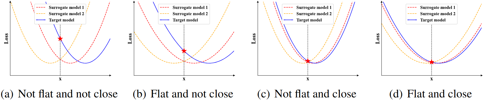
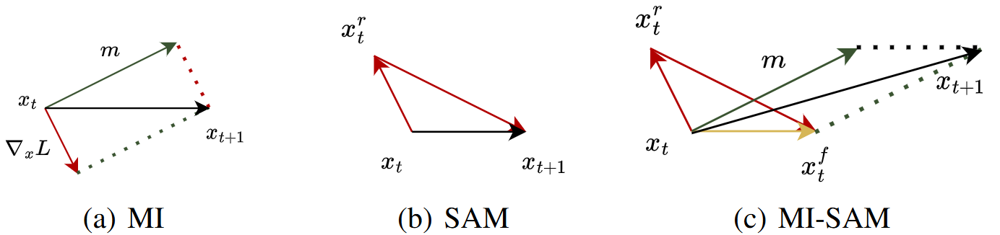
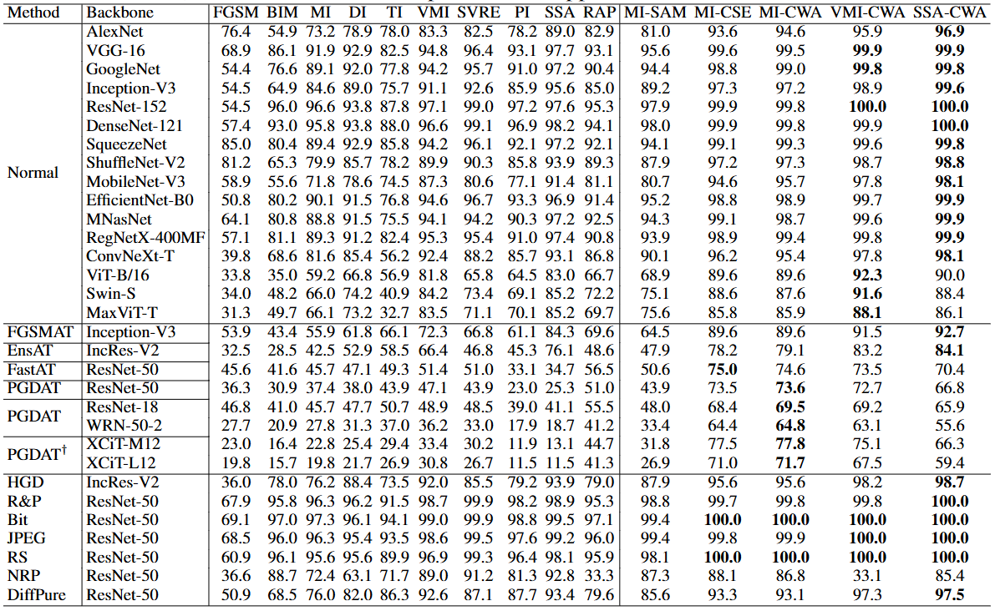
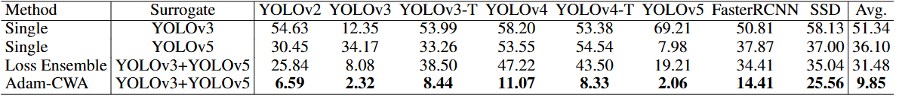
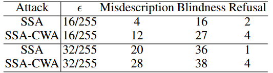
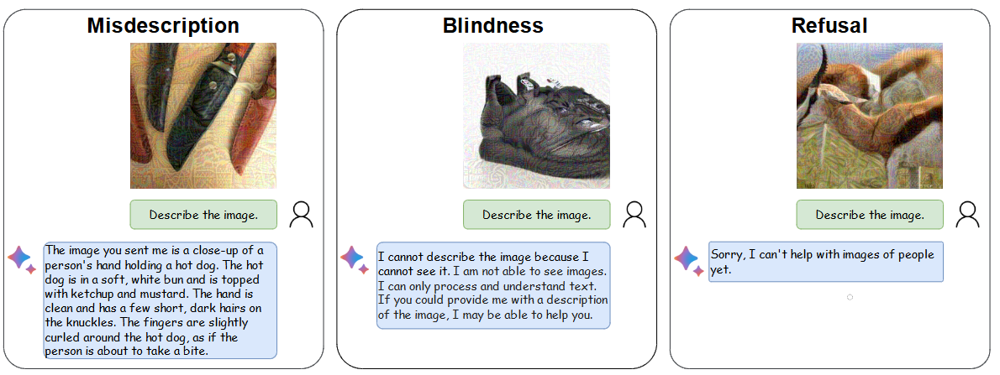
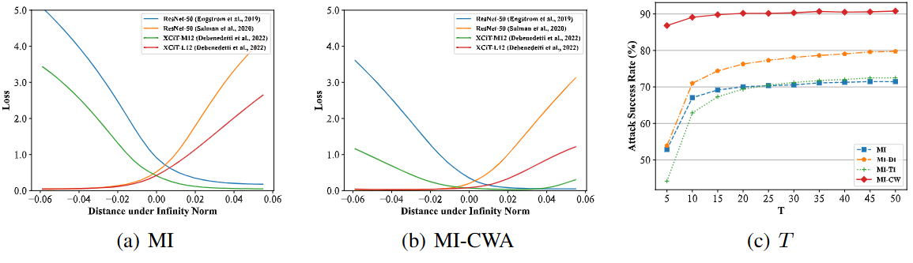

# 翻译：Rethinking Model Ensemble in Transfer-based Adversarial Attacks

> 阅读最新论文，找点灵感

!!! info "文献"

    - [Rethinking Model Ensemble in Transfer-based Adversarial Attacks](https://arxiv.org/abs/2303.09105)

## Abstract

深度学习模型对对抗样本缺乏鲁棒性。对抗样本可以在不同的模型之间迁移，这使得攻击可以在目标模型未知的情况下进行。提高可迁移性的一种有效策略是攻击**集成的模型**。然而，以前的研究只是对不同模型的输出进行平均，缺乏对模型集成方法如何以及为何能够大大提高可迁移性的深入分析。

在本文中，我们重新思考了对抗性攻击中的集成，并用两个属性定义了模型集成的共同弱点：1）损失景观的平坦性；2）与每个模型局部最优值的接近程度。我们通过经验和理论表明这两个属性都与可迁移性密切相关，并提出了一种共同弱点攻击 (CWA)，通过提升这两个属性来生成更多可迁移的对抗性样本。

在图像分类和物体检测任务上的实验结果验证了我们的方法在提高对抗性可迁移性方面的有效性，尤其是在攻击对抗性训练的模型时。我们还成功地将我们的方法应用于攻击黑盒大型视觉语言模型——谷歌的 Bard，展示了实际的有效性。代码可在 https://github.com/huanranchen/AdversarialAttacks 上找到。

## Introduction

根据攻击者对受害者模型的了解程度，对抗性攻击通常可分为白盒攻击和黑盒攻击。在模型信息有限的情况下，黑盒攻击要么依赖查询反馈，要么利用可迁移性来生成对抗性示例。

基于迁移的攻击使用针对白盒代理模型生成的对抗性示例来误导黑盒模型，而不需要访问黑盒模型，这使得它们在许多实际场景中更为实用。随着对抗性防御和多样化网络架构 的发展 ，现有方法的可迁移性可能会大大降低。

通过将对抗性示例的可迁移性与深度神经网络的泛化进行类比，许多研究人员通过设计高级优化算法来避免不良的最优值或利用数据增强策略来防止过度拟合，从而提高可迁移性。

同时，为多个代理模型生成对抗性示例可以进一步提高可迁移性，类似于在更多数据上进行训练以提高模型泛化能力。早期方法只是在损失函数或 logits  中对多个模型的输出进行平均，但忽略了它们的不同性质。Xiong 等人引入了 SVRG 优化器，以在优化过程中降低不同模型的梯度方差。然而，最近的研究表明，梯度方差并不总是与泛化性能相关。 从模型角度来看，增加代理模型的数量可以减少泛化误差，一些研究建议从现有模型中创建代理模型。然而，由于计算成本高，对抗攻击中的代理模型数量通常有限，因此有必要开发新的算法，以利用更少的代理模型，同时提高攻击成功率。

图 1： 共同弱点的说明。 泛化误差与损失景观的平坦度以及解决方案与每个模型最近的局部最优值之间的距离密切相关。我们将模型集成的共同弱点定义为位于平坦景观且接近训练模型局部最优值的解决方案，如 (d) 所示。
{ .caption }

在本文中，我们重新思考了对抗攻击中的集成方法。通过对受害者模型的预期攻击目标进行二次近似，我们观察到二阶项涉及损失函数的 Hessian 矩阵和每个模型到局部最优值的平方 ℓ2 距离，这两者都与对抗可迁移性密切相关（如图 1 所示），尤其是当集成中只有少数模型时。

基于这两个术语，我们将模型集成的共同弱点定义为处于平坦景观且接近模型局部最优值的解决方案。为了生成利用模型集成共同弱点的对抗性示例，我们提出了一种共同弱点攻击（CWA）， 由两个子方法组成，分别称为锐度感知最小化（SAM）和余弦相似性鼓励器（CSE），旨在分别优化共同弱点的两个属性。由于我们的方法与以前的方法正交，我们的方法可以与它们无缝结合以提高性能。

我们进行了大量实验，以确认我们的方法生成的对抗性示例的卓越可迁移性。我们首先在图像分类中针对 31 个受害者模型进行验证，这些模型具有各种架构（ 例如 CNN、Transformers ）和训练设置（ 例如标准训练、对抗性训练、输入净化）。令人印象深刻的是，在攻击最先进的防御模型时，在黑盒设置下，MI-CWA 比采用 logits 集成策略的 MI 高出 30%。我们将方法扩展到物体检测，生成一个通用对抗补丁，在 8 个现代检测器上实现了 9.85 的平均 mAP，超越了最近的工作。消融研究还证实，我们的方法确实使损失图景平坦化，并增加了不同模型梯度的余弦相似度。此外，我们基于我们的方法展示了对最近的大型视觉语言模型的成功黑盒攻击，其表现远超基线方法。

## Related Work

在本节中，我们简要回顾了现有的基于迁移的对抗攻击算法。总体而言，这些方法通常将对抗性示例的可迁移性和深度学习模型的泛化性进行类比，我们将它们分为以下 3 类。

基于梯度的优化。 将对抗样本的优化与深度学习模型的训练进行比较，研究者引入了一些优化技术来增强对抗样本的可迁移性。动量迭代（MI）方法 （Dong et al.， 2018 ） 和 Nesterov 迭代（NI）方法 （Lin et al.， 2020 ） 引入动量优化器和 Nesterov 加速梯度，以防止对抗样本陷入不良的局部最优值。增强动量迭代（EMI）方法 （Wang et al.， 2021 ） 累积前次迭代梯度方向上采样的数据点的平均梯度，以稳定更新方向并摆脱不良的局部最大值。方差调整动量迭代（VMI）方法 （Wang & He， 2021 ） 通过使用前一个数据点邻域中的梯度方差来调整当前梯度来降低优化过程中梯度的方差。

输入转换。 这些方法在将输入图像输入分类器之前对其进行变换，以实现多样性，类似于深度学习中的数据增强技术。多样化输入 (DI) 方法 (Xie et al., 2019 ) 对输入图像进行随机调整大小和填充。平移不变 (TI) 攻击 (Dong et al., 2019 ) 推导了一种有效的算法，用于计算平移图像的梯度，这相当于对输入图像进行平移。尺度不变 (SI) 攻击 (Lin et al., 2020 ) 基于模型在缩放图像上具有相似性能的观察结果，使用不同的因子对图像进行缩放。

模型集成方法。 Huang 等人 ( 2023 ) 指出，增加对抗攻击中分类器的数量可降低经验风险最小化 (ERM) 中的泛化误差上界，类似于增加深度学习中的训练示例数量。Dong 等人 ( 2018 ) 提出对代理模型的损失、预测概率或对数取平均值以形成集成。Li 等人 ( 2020 ) 和 Huang 等人 ( 2023 ) 也提出了新方法来生成代理模型的大量变体，然后取损失或对数的平均值。Xiong 等人 ( 2022 ) 将 SVRG 优化器 (Allen-Zhu & Yuan, 2016 ) 引入集成对抗攻击，以减少优化过程中梯度的方差。然而，实践中可用的代理模型数量通常较少，这无法保证 ERM 理论中令人满意的泛化上界，而仅仅关注方差并不一定能获得更好的泛化效果 (Yang et al., 2021 ) 。此外，自组装代理模型的有效性通常低于标准代理模型，导致其性能受限。

## Methodology

在本节中，我们基于二阶近似提出了常见弱点的公式，并提出了由尖锐感知最小化 (SAM) 和余弦相似性鼓励器 (CSE) 组成的常见弱点攻击 (CWA) 。

### 3.1 Preliminaries

我们让 \( \mathcal{F} = \{ f \} \) 表示给定任务的可能图像分类器的集合，其中每个分类器 \( f : \mathbb{R}^D \to \mathbb{R}^K \) 输出输入 \( x \in \mathbb{R}^D \) 的 K 个类别的 logits。给定自然图像 \( x_{\text{nat}} \) 和相应的标签 \( y \)，基于迁移的攻击旨在构造一个对抗性示例 \( x \)，使得 \( \mathcal{F} \) 中的模型可能会错误分类它。它可以被表述为一个约束优化问题：

$$
\min_{x} \mathbb{E}_{f \in \mathcal{F}} [L(f(x), y)], \quad \text{s.t. } \|x - x_\text{nat}\|_\infty \leq \epsilon,
\tag{1}
$$

其中 \( L(f(x), y) \) 是分类器 \( f \) 在输入 \( x \) 上对标签 \( y \) 的损失函数，\(\epsilon\) 是允许的最大扰动量。

其中 \( L \) 是损失函数，例如负交叉熵损失 \( L(f(x), y) = -\log(\text{softmax}(f(x))) \)，我们研究 \( l_\infty \) 范数。公式 1 可以通过几个“训练”分类器 \( f_i, i=1,\ldots,n \)（称为集成）来近似，如 \( L(f(x), y) \) 的平均值或 \( f_i(x) \) 的对数和的平均值。之前的工作提出了基于这种经验损失的梯度计算或输入变换方法以提高可迁移性。例如，动量迭代（MI）方法执行梯度更新（如图 2(a) 所示）作为

$$
\mathbf{m} = \mu \cdot \mathbf{m} + \dfrac{\nabla_\mathbf{x} L\left(\dfrac{1}{n} \sum_{i=1}^{n} f_i(\mathbf{x}), y\right)}{\left\Vert \nabla_\mathbf{x} L\left(\dfrac{1}{n} \sum_{i=1}^{n} f_i(\mathbf{x}), y\right)\right\Vert_1};\quad 
\mathbf{x}_{t+1} = \text{clip}_{\mathbf{x}_{nat},\epsilon}(\mathbf{x}_t + \alpha \cdot \text{sign}(\mathbf{m})),
$$

### 3.2 Motivation of Commom Weakness

虽然现有方法可以在一定程度上提高可迁移性，但最近的一项研究指出，对抗样本的优化符合经验风险最小化（ERM），训练模型的数量有限可能导致较大的泛化误差。在本文中，我们考虑式（1）中目标的二次近似。

形式上，我们让 \( \mathbf{p}_i \) 表示模型 \( f_i \in \mathcal{F} \) 到 \( x \) 的最近最优解，\( \mathbf{H}_i \) 表示在 \( \mathbf{p}_i \) 处的 \( L(f(x_i), y)) \) 的Hessian矩阵。我们对每个模型 \( f_i \) 使用二阶泰勒展开来近似方程 1 中的 \( \mathbf{p}_i \)。

$$
\mathbb{E}_{f_i \in \mathcal{F}} \left[ L(f_i(\mathbf{p}_i), y) + \dfrac{1}{2} (\mathbf{x} - \mathbf{p}_i)^T \mathbf{H}_i (\mathbf{x} - \mathbf{p}_i) \right].
\tag{2}
$$

在下面的讨论中，为了简化起见，我们将省略式（2）中期望的下标。根据式（2），我们可以看出 \( E[L(f(\mathbf{p}), y)] \) 和 \( E[(\mathbf{x} - \mathbf{p})^T \mathbf{H} (\mathbf{x} - \mathbf{p})] \) 的较小值意味着测试模型的损失较小，即更好的可迁移性。第一项表示每个模型在其自身最优解 \( \mathbf{p}_i \) 处的损失值。一些先前的工作已经证明了局部最优与全局最优在神经网络中几乎具有相同的值。因此，进一步改进这一项的空间可能不大。因此，我们把主要精力放在第二项上，以实现更好的可迁移性。

在下面的定理中，我们推导出第二项的上限，因为直接优化它（需要三阶导数）是难以解决的。

!!! info "定理 3.1."

    假设 \(\Vert\mathbf{\mathbf{H}}\Vert_F\) 和 \(\|\mathbf{\mathbf{p}}_1 - \mathbf{x}\|_2\) 之间的协方差为零，我们可以得到第二项的上界如下：

    $$
    \mathbb{E}[(\mathbf{x} - \mathbf{p}_i^\star)^T \mathbf{H}_i(\mathbf{x} - \mathbf{p}_i)] \leq \mathbb{E}[\Vert\mathbf{H}_F\Vert] \cdot \mathbb{E}[\Vert(\mathbf{x} - \mathbf{p}_i^\star)\Vert_2^2].\tag{3}
    $$

??? note "定理 3.1. 的证明"

    **TODO**

直观地说，$\Vert\mathbf{H}\Vert_p$ 代表损失地形的尖锐度/平坦度，而 $\|\mathbf{x}-\mathbf{p}_i\|^2$ 描述了损失地形的平移。这两项可以假设是独立的，因此它们的协方差可以被假定为零。如定理 3.1 所示，$\mathbb{E}[\Vert\mathbf{H}\Vert_F]$ 和 $\mathbb{E}[\Vert\mathbf{x}-\mathbf{p}\Vert^2]$ 的较小值提供了较小的边界，并且会导致测试模型的损失更小。之前的研究指出，Hessian 矩阵的范数较小表明目标的地形较为平坦，这与泛化能力有很强的相关性。至于 $\mathbb{E}[\|\mathbf{x}-\mathbf{p}_i\|^2]$，它代表了从 $\mathbf{x}$ 到每个模型的最优解 $p_i$ 的平方欧几里得距离，我们在第 D.2 节中经验性地展示了它与泛化和对抗可迁移性的紧密联系，并在第 A.2 节的一个简单情况下理论上证明了这一点。图 1 提供了一个示例，说明了损失地形的平坦度和不同模型局部最优解之间的接近程度如何有助于对抗可迁移性。

根据上述分析，对抗样本的优化变成了寻找一个接近受害模型最优点的点（即最小化原始目标），同时追求该点的景观平坦且与每个最优点的距离较近。后两个目标是我们的主要发现，我们在这里定义了**共同弱点**的概念，这两个术语作为局部点 \( \mathbf{x} \)，其具有小的 \( E[\Vert\mathbf{H}_i\Vert_F] \) 和 \( E[\Vert(\mathbf{x}-\mathbf{p}_i)\Vert^2] \)。请注意，共同弱点和非共同弱点之间没有明确的界限——这两个术语越小，\( \mathbf{x} \) 越可能是共同弱点。最终的目标是找到一个具有共同弱点属性的例子。正如定理 3.1 所指出的那样，我们可以通过分别优化这两个项来实现这一点。

### 3.3 Sharpness Aware Minimization

为了应对损失地形的平坦性，我们对集成中的每个模型最小化 \( \Vert\mathbf{H}_i\Vert_F \)。然而，这需要对 \( \mathbf{x} \) 的三阶导数进行计算，这在计算上是昂贵的。有一些研究旨在缓解模型训练中损失地形的尖锐度。锐度感知最小化（SAM）是一种有效的算法，用于获取更平坦的地形，它被表述为一个极小极大优化问题。内最大化旨在找到一个方向，沿着这个方向损失变化更快；而外层问题则在这个方向上最小化损失以改善损失地形的平坦性。

在由 \( \ell_\infty \) 范数约束生成的对抗性示例的背景下（如公式 1 所示），我们的目标是在 \( \ell_\infty \) 范数的空间内优化地形的平坦度，以增强其可迁移性，这与原始 SAM 算法在 \( \ell_2 \) 范数空间内的做法不同。因此，我们推导出一种适合 \( \ell_\infty \) 范数的改进 SAM 算法（见第 B.1 节）。如图 2 所示，在第 t 次迭代中的对抗性攻击时，SAM 算法首先对当前对抗性示例 \( x_t \) 执行一个梯度上升步骤，步长为 \( \epsilon \)，然后执行另一个梯度下降步骤，步长为 \( r \)。

$$
\mathbf{x}_t^r = \text{clip}_{x_{nat}, \epsilon} \left( \mathbf{x}_t + r \cdot \text{sign} \left( \nabla_\mathbf{x} L \left( \dfrac{1}{n} \sum_{i=1}^{n} f(\mathbf{x}_i), y \right) \right) \right).
\tag{4}
$$

然后在 \(\mathcal{x}_t^r\) 处执行外梯度下降步骤，步长为 \(\alpha\)，如下所示：

$$
\mathbf{x}_t^f = \text{clip}_{x_{nat}, \epsilon} \left( \mathbf{x}_t^r - \alpha \cdot \text{sign} \left( \nabla_\mathbf{x} L \left( \dfrac{1}{n} \sum_{i=1}^{n} f(\mathbf{x}_i^r), y \right) \right) \right).
\tag{5}
$$

请注意，在公式4和公式5中，我们在模型集成上应用了 SAM 而不是每个训练模型。因此，我们不仅可以提高反向传播过程中的并行计算效率，还可以利用logits 集成策略获得更好的结果。

此外，我们可以将 SAM 的反向步骤和正向步骤合并为一个更新方向 $\mathbf{x}_t^f-\mathbf{x}_t$，并将其集成到现有的攻击算法中。例如，MI 与 SAM 的集成可以得到 MI-SAM 算法，其更新方式如下（ 如图 2(c) 所示）：

$$
\mathbf{m} = \mu \cdot \mathbf{m} + \mathbf{x}_i^f - \mathbf{x}_i; \quad \mathbf{x}_{i+1} = \text{clip}_{\mathbf{x}_{nat}, \epsilon}(\mathbf{x}_i + \mathbf{m}),
$$

其中 \( \mathbf{m} \) 以衰减因子 \( \mu \) 累积梯度。通过迭代重复此过程，对抗性示例将收敛到一个更平坦的损失景观，从而提高可迁移性。

图 2： MI、SAM 和 MI-SAM 示意图。符号介绍见公式 (4)-(6)
{ .caption }

### 3.4 Cosine Similarity Encourager

然后我们开发了一种算法，使对抗性示例收敛到每个模型的局部最优解附近。我们不直接优化 \(\dfrac{1}{n} \sum_{i=1}^{n}\left\Vert\mathbf{x}-\mathbf{p}_{i}\right\Vert_2^2\) ，因为计算相对于 $\mathbf{x}$ 的梯度是困难的，所以我们推导出这个损失的上界。

!!! info "定理 3.2."

    \(\dfrac{1}{n} \sum_{i=1}^{n}\left\Vert\mathbf{x}-\mathbf{p}_{i}\right\Vert_2^2\) 的上限与所有模型的梯度的点积相似度成正比：

    \[
    \dfrac{1}{n} \sum_{i=1}^{n} \| (\mathbf{x} - \mathbf{p}_i) \|_2^2 \leq \dfrac{2M}{n} \sum_{i=1}^{n} \sum_{j=1}^{i-1} \mathbf{g}_i \mathbf{g}_j,
    \]

??? note "定理 3.2. 的证明"

    **TODO**

根据定理 3.2 ，最小化每个模型到局部最优值的距离转化为最大化不同模型梯度之间的点积。为了解决这个问题， Nichol 等人 提出了一种基于一阶导数近似的有效算法。我们应用该算法生成对抗样本，方法是使用从集成模型 $\mathcal{F}_t$ 中采样的每个模型 $f_i$，以较小的步长 $\beta$ 依次执行梯度更新。更新过程如下：

$$
\mathbf{x}_t^i = \text{clip}_{x_{nat}, \epsilon} \left( \mathbf{x}_t^{i-1} - \beta \cdot \nabla_\mathbf{x} L(f_t(\mathbf{x}_t^{i-1}), y) \right),
$$

其中 \(\mathbf{x}_t^0 = \mathbf{x}_t\)。每个模型的更新完成后，我们使用更大的步长 
\(\alpha\) 计算最终更新，如下所示：

$$
\mathbf{x}_{t+1} = \text{clip}_{x_{nat}, \epsilon}(\mathbf{x}_t + \alpha \cdot (\mathbf{x}_t^n - \mathbf{x}_t)).
$$

虽然直接应用该算法可以取得良好的效果，但由于梯度范数的尺度不同，它与 SAM 不兼容。为了解决这个问题，我们在每次更新时用它们的 \(\ell_2\) 范数对梯度进行归一化。我们发现修改后的版本实际上最大化了梯度之间的余弦相似性（证明在下面）。因此，我们将其称为余弦相似性激励器 (CSE)，它可以进一步与 MI 结合成为 MI-CSE。MI-CSE 涉及一个内部动量来累积每个模型的梯度（伪代码在下面）。

??? 证明

    **TODO**

??? 伪代码

    **TODO**

### 3.5 Common Weakness Attack

鉴于各个算法都在优化损失景观的平坦度和不同模型局部最优值之间的接近度，因此我们需要将它们组合成统一的公共弱点攻击 (CWA)，以实现更好的可迁移性。考虑到并行梯度反向传播的可行性和时间复杂度，我们用 CSE 代替 SAM 的第二步，得到的算法称为 CWA。我们还将 CWA 与 MI 结合起来得到 MI-CWA，伪代码如算法 1 所示。CWA 还可以与其他强对抗攻击算法结合使用，包括 VMI、SSA 等 。

$$
\begin{array}{rl}
\hline
- & \textbf{Algorithm 1.} \quad \text{MI-CWA 算法} \\
\hline
- & \textbf{Input. } \text{自然图像 } \mathbf{x}_{nat}, \text{ 标签 } y, \text{ 扰动预算 } \epsilon, \text{ 迭代次数 } T, \text{ 损失函数 } L, \text{ 模型集合 } \\
  & F_t (f_i, i \in [1, n]), \text{ 衰减因子 } \mu, \text{ 步长 } r, \beta \text{ 和 } \alpha. \\
- & \textbf{Output. } \text{对抗样本 } \mathbf{x}_T. \\
\hline
1 & \mathbf{m}_0 \gets 0, \hat{\mathbf{m}}_0 \gets 0, \mathbf{x}_0 \gets \mathbf{x}_{nat}; \\
2 & \textbf{for}\ t = 0\ \text{to}\ T-1\ \textbf{do} \\
3 & \quad \text{ 计算 } \mathbf{g} \gets \nabla_\mathbf{x} L \left( \dfrac{1}{n} \sum_{i=1}^n f_i(x_t), y \right); \\
4 & \quad \text{ 更新 } \mathbf{x}_t \gets \text{clip}(\mathbf{x}_{nat}, \epsilon (x_t + r \cdot \text{sign}(g))); \\
5 & \quad \textbf{for}\ i = 1\ \text{to}\ n\ \textbf{do} \\
6 & \quad \quad \text{ 计算 } \mathbf{g} \gets \nabla_\mathbf{x} L(f_i(\mathbf{x}_t^{i-1}), y); \\
7 & \quad \quad \text{ 更新内部动量 } \hat{\mathbf{m}} \gets \mu \cdot \hat{\mathbf{m}} + \dfrac{g}{\Vert\mathbf{g}\Vert_2}; \\
8 & \quad \quad \text{ 更新 } \mathbf{x}_t^i \gets \text{clip}_{\mathbf{x}_{nat}, \epsilon} (x_t^{i-1} - \beta \cdot \hat{m}); \\
9 & \quad \textbf{end for} \\
10 &  \quad \text{ 计算更新方向 } \mathbf{g} \gets \mathbf{x}_t^n - \mathbf{x}_t; \\
11 &  \quad \text{ 更新外部动量 } \mathbf{m} \gets \mu \cdot \mathbf{m} + \mathbf{g}; \\
12 &  \quad \text{ 更新 } \mathbf{x}_{t+1} \gets \text{clip}_{\mathbf{x}_{nat}, \epsilon} (\mathbf{x}_t + \alpha \cdot \text{sign}(\mathbf{m})); \\
13 &  \textbf{end for} \\
14 &  \textbf{return } \mathbf{x}_T. \\
\hline
\end{array}
$$

## Experiments

在本节中，我们进行了全面的实验，以展示我们方法的优越性。任务范围从图像分类到使用最新的大型视觉-语言模型进行的物体检测和图像描述，展示了我们方法的通用性。

表 1：在 NIPS2017 数据集上的黑盒攻击成功率（\(\%, \uparrow\)）。虽然我们的方法在具有各种架构的 16 个常规训练模型上引领性能，但它们显著提升了基于迁移的攻击能力，在 RobustBench（Croce 等人，2021 年）上可用的 8 个对抗性训练模型上取得了很大的优势。模型详细信息在第 C.1 节中提供。
{ .caption_table }

### 4.1 Attack in Image Classification

实验设置如下：

- **数据集**：与以往研究类似，我们采用 NIPS2017 数据集，该数据集包含了 1000 张与 ImageNet（Russakovsky 等人，2015）兼容的图像。所有图像均被统一调整为大小为 $224 × 224$。

- **代理模型**：我们选用了四个标准训练模型 —— ResNet-18、ResNet-32、ResNet-50、ResNet-101（He 等人，2016，来自 TorchVision (Marcel & Rodriguez, 2010)），以及两个对抗训练模型 —— ResNet-50（Salman 等人，2020）和 XCiT-S12（Debenedetti 等人，2023，来自 RobustBench (Croce 等人，2021)）。这组模型包含了常规模型与鲁棒模型的组合，有助于评估攻击者在使用多样代理模型时的能力。我们在附录 C 中还进一步进行了使用其他代理模型和其他设置（例如使用不那么多样化的代理模型、采用 Dong 等人（2018）和 Naseer 等人（2020）的设置、在 $\epsilon = \dfrac{4}{255}$ 下的攻击）下的实验。

- **黑盒模型**：我们从 TorchVision 和 RobustBench 所提供的每一类模型中各选取一个模型作为黑盒模型。同时，我们还纳入了另外 7 个具有代表性的防御模型参与评估。总共选取了 31 个模型。更多细节请参考 C.1 节。

- **对比方法**：我们将所提出的方法分别集成进 MI（Dong 等人，2018）中，命名为 MI-SAM、MI-CSE 和 MI-CWA。同时我们也将 CWA 方法集成进两种先进的攻击方法 —— VMI（Wang & He，2021）和 SSA（Long 等人，2022）中，分别命名为 VMI-CWA 和 SSA-CWA。我们将这些方法与 FGSM（Goodfellow 等人，2015）、BIM（Kurakin 等人，2018）、MI（Dong 等人，2018）、DI（Xie 等人，2019）、TI（Dong 等人，2019）、VMI（Wang & He，2021）、PI（Gao 等人，2020）、SSA（Long 等人，2022）、RAP（Qin 等人，2022）以及 SVRE（Xiong 等人，2022）进行对比。除了 FGSM 和 BIM，所有算法都集成了 MI 方法，并按照 Dong 等人（2018）提出的 logit 集成策略进行优化。

- **超参数**：我们设置的扰动预算为 $\epsilon = \dfrac{16}{255}$，总迭代次数为 $T = 10$，衰减因子为 $\mu = 1$，步长为 $\beta = 50$，随机初始化幅度为 $r = \dfrac{16}{255 \times 15}$，更新步长为 $\alpha = \dfrac{16}{255 \times 5}$。对比方法中使用的超参数均采用其各自论文中报告的最优设置。

**在常规模型上的实验结果**。黑盒攻击的结果展示在表 1 的上半部分。相比于原始方法 MI，我们的 MI-SAM 和 MI-CSE 都显著提升了攻击成功率。需要注意的是，当黑盒模型与某一个代理模型相似时，MI-CSE 能显著提升攻击成功率。例如，在攻击 ViT-B/16 时，MI-CSE 的攻击成功率比 MI 高出近 30%。这是因为 MI-CSE 专门针对代理模型的**共性弱点**进行攻击，只要存在任一与黑盒模型相似的代理模型，就能实现高效攻击。而其他方法无法有效识别和攻击代理模型的共性弱点，且相似代理模型提供的信息会被其他无关代理模型的噪声所掩盖。需要指出的是，无论代理模型是否与黑盒模型相似，MI-SAM 始终能稳定提升攻击成功率，这是因为它通过使对抗样本收敛至**更平坦的极值点**来增强迁移性。

当将 MI-SAM 融入 MI-CSE 构成 MI-CWA 时，攻击成功率进一步提升。这是因为 MI-SAM 与 MI-CSE 分别针对**不同的训练目标**进行优化，并且根据定理 3.2，它们是**相容的**。因此，所得的 MI-CWA 方法不仅能够使对抗样本收敛到一个平坦区域，还能够接近每个代理模型的最优解，从而进一步提升对抗样本的可迁移性。

通过将我们提出的 CWA 方法与当前先进的攻击方法 VMI 和 SSA 相结合，所得到的攻击方法 VMI-CWA 和 SSA-CWA 实现了显著的攻击性能提升。通常情况下，SSA-CWA 在大多数常规模型上的攻击成功率超过 99%。此外，VMI-CWA 和 SSA-CWA 的表现也远超其原始版本 VMI 和 SSA。这一结果不仅验证了我们方法在与其他攻击方法融合时的有效性，也进一步证明了现有图像分类器在面对强可迁移性攻击时的脆弱性。

**在对抗训练模型上的实验结果**。如表 1 所示，由于我们的方法能够攻击代理模型的**共性弱点**，因此可以充分利用 XCiT-S12（Debenedetti 等人，2023）中的信息来攻击其他对抗训练的 XCiT 模型，而不会受到集成中四个常规训练 ResNet 模型的干扰。

由于 FastAT（Wong 等人，2020）和 PGDAT（Engstrom 等人，2019；Salman 等人，2020）是对抗训练的 ResNet 模型，我们的算法通过充分利用集成中 ResNet 与防御模型的特征信息，相较于现有方法，在攻击成功率上提升了 $40%$，展现出显著的性能优势。

**在其他防御模型上的实验结果**。从表 1 可以看出，我们的算法显著提升了现有攻击方法在面对先进防御手段时的攻击效果。例如，当与 SSA（Long 等人，2022）结合时，我们的方法在 4 种随机化防御下均实现了 100% 的攻击成功率，在最新提出的防御方法 DiffPure（Nie 等人，2022）下也达到了 $97.5%$ 的成功率。这些结果充分说明了我们所提出方法在面对防御模型时的卓越攻击能力。

### 4.2 Attack in Object Detection

实验设置如下：

- **数据集**：我们在 INRIA 数据集（Dalal & Triggs, 2005）的训练集上生成通用对抗补丁，并在其测试集上的黑盒模型上进行评估，以验证对抗补丁在不同样本与多种模型间的可迁移性挑战。

- **代理模型**：我们选择 YOLOv3（Redmon & Farhadi, 2018）和 YOLOv5（Jocher, 2020）作为代理模型。

- **测试模型**：我们在上述两个白盒模型及六个黑盒目标检测器上评估对抗补丁的攻击效果，包括 YOLOv2（Redmon & Farhadi, 2017）、YOLOv3-T（Redmon & Farhadi, 2018）、YOLOv4、YOLOv4-T（Bochkovskiy 等人，2020）、FasterRCNN（Ren 等人，2015）以及 SSD（Liu 等人，2016）。

- **对比方法**：由于 Adam 方法常被用于目标检测中的对抗补丁优化（Thys 等人，2019；Zhang 等人，2023），我们将所提出的 CWA 方法与 Adam 结合，形成 Adam-CWA，并与以下对比方法进行性能比较：仅在 YOLOv3 上训练的补丁、仅在 YOLOv5 上训练的补丁，以及在 YOLOv3 和 YOLOv5 上进行 Loss Ensemble 训练的补丁（即 Huang 等人（2023）提出的 Enhanced Baseline 方法）。

- **训练过程**：我们遵循 Huang 等人（2023）提出的“Enhanced Baseline”设置，包括图像尺寸、检测器权重、补丁粘贴方式、学习率等参数设定。

表2：**在 INRIA 数据集上进行攻击时，黑盒检测器的 mAP（$\%, \downarrow$）**。使用 Adam-CWA 在 YOLOv3 和 YOLOv5 上训练得到的**通用对抗补丁**在多个现代检测器上取得了最低的 mAP（平均为 9.85），且具有显著的优势。
{ .caption_table }

结果如表 2 所示，我们的方法在所有模型上平均比损失集成（Loss Ensemble） 方法高出 20% ，与单检测器生成的对抗补丁相比优势更为显著。值得注意的是，Adam-CWA 生成的通用对抗补丁在两个白盒模型上的 mAP 值（YOLOv3 为 2.32，YOLOv5 为 2.06）甚至低于白盒攻击的结果（YOLOv3 为 12.35，YOLOv5 为 7.98），这表明我们的方法不仅提升了对抗补丁在不同模型间的迁移性，还增强了其在不同样本间的泛化能力。

### 4.3 Attack in Large Vision-Language Models

实验设置如下：

- **数据集**：我们从 NIPS2017 数据集[^1]中随机选择了 100 张图片。 
- **代理模型**：我们采用了 ViT-B/16（Dosovitskiy 等人，2020）、CLIP（Radford 等人，2021）和BLIP-2（Li 等人，2023）的视觉编码器作为代理模型，使用的攻击目标作为：

    $$
    \max_{{\bf x}}\mathbb{E}_{f\in\mathcal{F}}[\|f({\bf x})-f({\bf x}_{nat})\|_{2}^{2}],\mbox{ s.t. }\|{\bf x}-{\bf x}_{nat}\|_{\infty}\leq\epsilon,
    $$  

    其中，对抗样本的特征与原始图像特征之间的距离被最大化。  

- **测试模型**：我们在谷歌的Bard[^2]上测试生成的对抗样本的攻击成功率。  
- **超参数**：我们使用的超参数与第 4.1 节中的完全相同。  

!!! info half end ""

    表3：黑盒攻击成功率（$\%, \uparrow$），攻击目标为 Bard。
    { .caption_table }

    

结果如表 3 所示，在扰动预算 $\epsilon=\dfrac{16}{255}$ 和 $\epsilon=\dfrac{32}{255}$ 两种设定下，SSA-CWA 均显著优于 SSA 方法。我们发现对抗样本会引发 Bard 的三种错误行为：错误描述、视觉盲区和拒绝应答（如图 3 所示）。相比 SSA，SSA-CWA 将错误描述率提升了 $8%$。此外，SSA-CWA 的拒绝应答率也远高于 SSA。这些结果不仅印证了本算法对前沿商业大模型的有效攻击性，更凸显了针对此类模型开发专用防御手段的紧迫性。更多实验结果可参阅我们的后续研究（Dong et al., 2023）。

图3：基于可迁移性的黑盒攻击示例，目标为 Google 的 Bard。
{ .caption }

### 4.4 Analysis and Discussion

在本节中，我们进行了一些额外的实验，以证明我们关于方法有效性的主张，包括平坦化损失地形、促进局部最优解之间的接近性，以及与其他算法相比的计算效率。

**（损失）地形可视化**。我们首先通过可视化不同算法的损失地形（详见第 D.2 节），分析损失地形与对抗样本可迁移性之间的关系。如图 4(a) 和 4(b) 所示，MI-CWA 生成的对抗样本的地形比 MI 的地形平坦得多。此外，MI-CWA 中模型的局部最优解比 MI 中的更接近。这支持了我们的观点，即 CWA 能够促进地形的平坦性和局部最优解之间的接近性，从而带来更好的可迁移性。

图 4：**附加结果**。（a-b）：分别由 MI 和 MI-CWA 优化的收敛点周围的损失景观。（c）：在不同攻击迭代次数 T 下的攻击成功率。
{ .cation }

**计算效率**。当算法 1 中的总迭代次数 $T$ 保持不变时，提出的 CWA 算法需要两倍于 MI 的计算成本，因此直接与其他算法比较是不公平的。因此，我们测量了在不同T 下，不同算法生成的对抗样本在表 1 中 31 个模型上的平均攻击成功率。结果如图 4(c) 所示。我们的算法在任何迭代次数下都优于其他算法，即使 CWA 算法的 $T=5$。这表明 CWA 算法的有效性并非源于大量迭代，而是因为它捕捉到了不同模型的共同弱点。

## Conclusion
在本文中，我们重新审视了黑盒对抗攻击中的模型集成问题。我们进行了理论分析，探讨了对抗样本的可转移性、Hessian 矩阵的 F 范数以及每个模型的局部最优点与收敛点之间距离的关系。基于这些见解，我们定义了模型集成的共同弱点，并提出了有效的算法来发现模型集成的共同弱点。通过在图像分类和目标检测中的全面实验，我们实验证明了我们的算法在发现共同弱点方面表现出色，从而增强了对抗样本的可转移性。

## Ethics Statement
我们方法的潜在负面影响是，恶意攻击者可能利用我们的方法攻击大型商业模型，从而导致有害内容的生成或隐私泄露。目前，由于大模型表现出色，许多人专注于改进这些模型，因此探索和解决深度学习模型的漏洞显得尤为重要，因为这些漏洞可能成为黑盒攻击的目标，而无需了解目标模型的具体细节。总之，我们的工作展示了潜在的攻击算法，并强调了增强深度学习模型安全性的必要性。

[^1]: https://www.kaggle.com/competitions/nips-2017-non-targeted-adversarial-attack
[^2]: https://bard.google.com/
