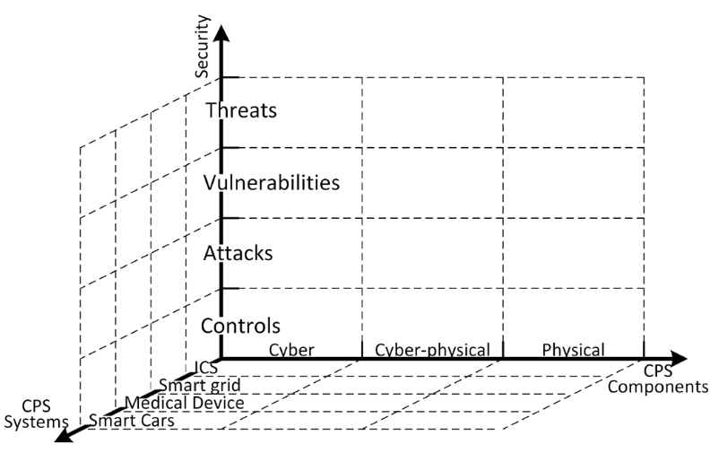
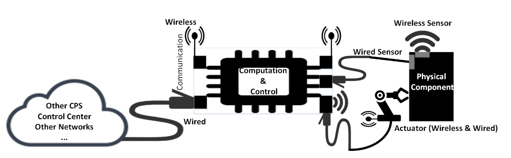
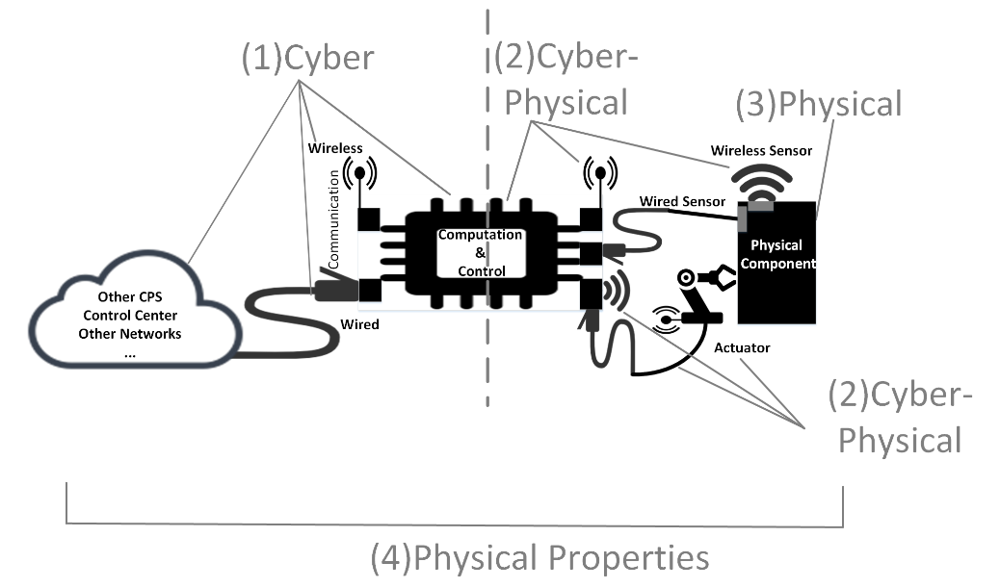
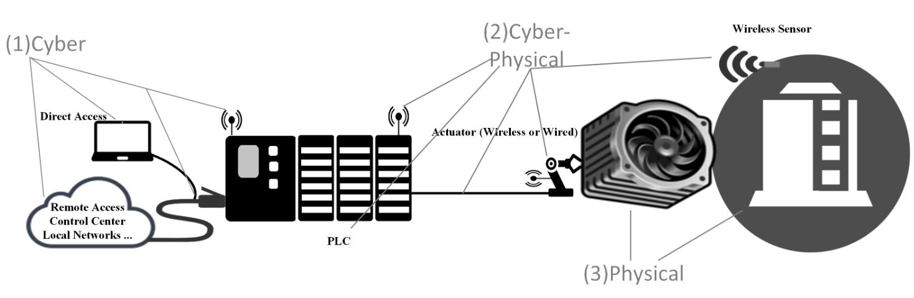
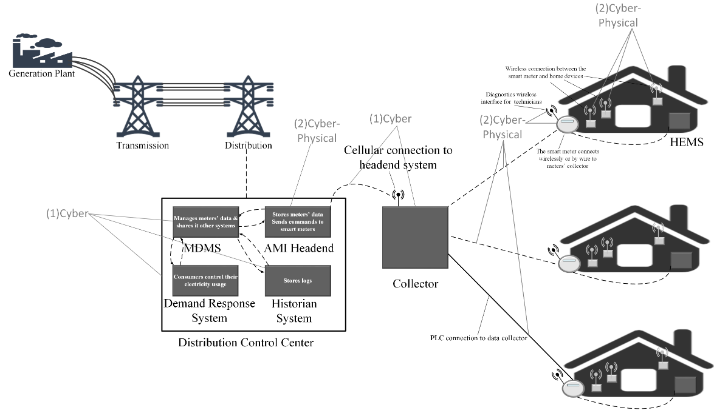
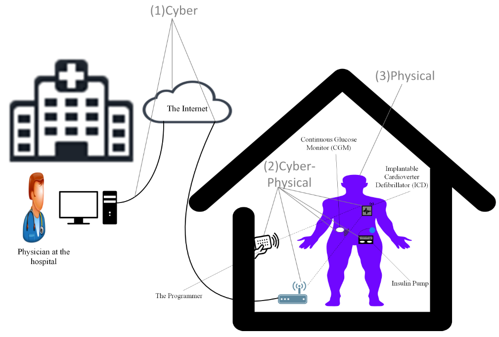
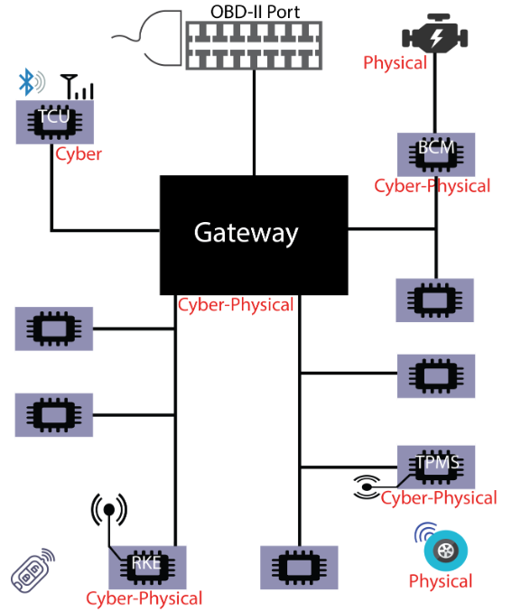

# 翻译：Cyber-Physical Systems Security—A Survey

!!! info "文献"

    - [Cyber-Physical Systems Security -- A Survey](https://arxiv.org/abs/1701.04525)

## Abstract

随着网络物理系统（**C**yber-**P**hysical **S**ystems,CPSs）的指数级增长，新的安全挑战也随之出现。新一代的 CPS 暴露出各种漏洞、威胁，催生出各种攻击方式以及对应的防护手段。然而，目前尚缺乏对 CPS 安全研究文献的系统性综述。特别是，CPS 组件的异构性和系统的多样性，使得很难用一个通用的模型来研究这一问题。

本文旨在填补这一空白，在统一的框架下对现有的 CPS 安全研究进行梳理和系统化。该框架由三个相互正交的维度组成：

1. 从安全角度出发，我们遵循经典的分类方法：威胁、漏洞、攻击和防护；
2. 从 CPS 组件角度来看，我们关注的是网络部分、物理部分以及两者结合的网络-物理组件；
3. 从 CPS 系统层面来看，我们不仅研究 CPS 的一般特性，还分析了典型系统（比如智能电网、医疗 CPS 和智能汽车）中的安全问题。

这个模型既可以抽象地展示CPS应用中各组件之间的通用交互关系，也可以在需要时深入具体细节。我们的目标是建立一个足够抽象、适用于各种异构CPS应用的模型，同时还能以模块化的视角看待高度耦合的CPS组件。

这种抽象的解耦方式，使我们能够系统地理解CPS安全问题，识别潜在的攻击来源和防护手段。通过这次深入的文献回顾，我们希望能够总结CPS安全领域的最新进展，为研究人员提供一份详尽的参考资料清单，同时也鼓励更多人投身到这个快速发展的新兴领域中来。

**关键词**——攻击、防护措施、信息物理系统（CPS）、工业控制系统（ICS）、医疗设备、安全、智能汽车、智能电网、威胁、漏洞。

## Introducstion

近年来，我们见证了各种类型的信息物理系统（CPS）的开发和部署呈现出爆炸式增长。它们几乎影响到了我们日常生活的方方面面，比如电力系统、石油和天然气分配、交通运输系统、医疗设备、家用电器等等。其中许多系统被部署在关键基础设施中，或者用于生命支持设备，甚至是我们日常生活中不可或缺的一部分。因此，人们对这些系统的期望是它们应该没有任何漏洞，能够抵御各种类型的攻击。但遗憾的是，对于所有现实世界中的系统来说，这几乎是不可能实现的。

信息物理系统（CPS）安全的一个根本问题在于其构成部分的异质性。CPS 在很多方面都由各种不同的组件构成。硬件方面包括传感器、执行器、嵌入式系统等；软件方面则涉及各种专有或商业控制与监控软件。因此，每一个组件，甚至它们之间的集成，都可能成为 CPS 攻击的潜在因素。深入了解当前 CPS 中存在的安全漏洞、攻击方式以及防护机制，有助于我们更清晰地掌握 CPS 的整体安全状况。这样一来，我们就能够指出 CPS 中容易受到攻击的薄弱环节，并设计出相应的防御策略来应对这些攻击。

CPS 的复杂性以及其组件的异质性，给系统的安全性和隐私保护带来了极大的挑战。特别是，由于网络与物理部分之间存在复杂的交互，使得威胁与漏洞变得难以评估，新的安全问题也随之出现。攻击往往源头复杂、路径多变，可能从多个组件发起、在各组件间传播，甚至同时瞄准多个目标组件，因此识别、追踪和分析这些攻击都非常困难。要想建立有效的防御机制，深入理解这些漏洞、威胁和攻击方式是至关重要的。同时，对当前 CPS 安全与隐私防护措施的调研，也能帮助我们发现尚未覆盖的部分、安全薄弱环节，以及值得进一步探索的新方向。

在本综述中，我们首先简要介绍了信息物理系统（CPS），特别强调了它们与传统控制系统和传统 IT 系统的区别。认识到这些差异，是理解 CPS 安全问题的关键所在。接着，我们在一个统一的框架下对 CPS 的隐私与安全相关文献进行了综述。该框架由三个互相独立的维度构成，如图 1 所示。

{ width=80% }

图1. 具有三个正交坐标的 CPS 安全框架：安全、CPS 组件和代表性的 CPS 系统。
{ .caption }

首先，从安全角度出发，我们遵循经典的分类体系：威胁（见第三节）、漏洞（第四节）、攻击（第五节）以及防护机制（第六节）。然后，我们从 CPS 组件的角度来探讨每个主要方面：包括网络部分、物理部分以及两者融合的网络-物理部分。例如，在攻击部分的综述中，我们将攻击分为网络攻击、物理攻击以及网络-物理攻击。最后，从 CPS 系统的角度出发，我们探讨了 CPS 的共性特征以及具有代表性的系统，特别是工业控制系统（ICS）、智能电网、医疗类CPS，以及智能汽车。在第六节的最后，我们还对每种典型 CPS 系统中的主要威胁、漏洞、攻击方式和防护手段进行了总结。

在本综述中，我们的贡献如下：

1. 我们提出了一个 CPS 安全框架，旨在区分给定系统中的网络组件、物理组件以及网络-物理组件；
2. 我们调研了潜在的威胁来源及其动机；
3. 我们总结了现有的安全漏洞，并结合实际示例分析其根本原因；
4. 我们回顾了已有的 CPS 攻击案例，并指出了背后利用的漏洞及其影响到的 CPS 组件；
5. 我们还梳理了当前已有的防护机制，并进一步指出在不同 CPS 应用中仍然存在的未解决问题与挑战。

## Background

### A. Cyber-Physical Systems

尽管目前对于信息物理系统（CPS）尚不存在统一公认的权威定义，但我们可以简单将其理解为用于监控物理世界的系统。它们被视为新一代嵌入式控制系统，即网络化的嵌入式系统。此外，嵌入了传感器与执行器网络的系统也被视为 CPS。由于对 IT 系统的依赖性，CPS 也可被定义为融入物理世界应用的 IT 系统。这种融合源于信息与通信技术（ICT）的进步，旨在增强与物理过程的互动。这些定义都突显了网络空间与物理世界之间深层次的交互特性。

在能源、交通、军事、医疗和制造等领域的各类应用中，对 CPS 的依赖正日益加深。根据具体应用场景的差异，CPS可能具有不同的命名体系。例如，监控与数据采集（SCADA）系统作为关键基础设施（如智能电网和工业控制系统）中极具代表性的 CPS 应用；在医疗设备领域则出现了可穿戴医疗设备、植入式医疗设备（IMD）等新型应用；而在现代汽车中，为提高燃油效率、安全性和舒适性，也嵌入了小型控制系统网络。下文将简要介绍本文涉及的四类典型 CPS 应用场景。

- **工业控制系统 （Industrial Control Systems, ICS）**

    ICS 指的是用于提高各类工业中的控制、监测和生产效率的控制系统，例如核电站、水务和污水处理系统，以及灌溉系统。有时，ICS 也被称为**监控与数据采集系统**（**S**upervisory **C**ontrol **A**nd **D**ata **A**cquisition, SCADA）或**分布式控制系统**（**D**istributed **C**ontrol **S**ystems, DCS）。为了统一表述，本文将统一使用 ICS 这一术语。

- **智能电网系统（Smart Grid Systems）**

    智能电网被设想为电力系统的下一代形式，用于替代已经使用数十年的传统电网系统，实现电力的发电、传输和分配。智能电网具备多项优势和先进功能。在国家层面，它能够提升排放控制、实现全球负载平衡、智能发电以及节能减排。而在本地层面，智能电网可以帮助家庭用户更好地管理能源使用，从而在经济和环保方面带来益处。智能电网主要由两个核心组成部分构成：电力应用和支撑基础设施。电力应用部分提供智能电网的核心功能，即电力的发电、传输和分配。而支撑基础设施则是智能组件，主要通过一系列软件、硬件和通信网络，对智能电网的核心运行进行控制和监测。

- **医疗设备（Medical Devices）**

    通过将网络与物理能力相结合，医疗设备得到了显著提升，从而能够提供更优质的医疗服务。我们更关注的是那些具备网络功能、并对患者产生物理影响的医疗设备。这类设备通常分为两种：一种是植入患者体内的植入式医疗设备（Implantable Medical Devices, IMDs），另一种是患者佩戴的可穿戴设备。这类设备通常配备有无线通信功能，以便与其他设备（如用于更新和重新配置设备的编程器）进行通信。可穿戴设备还可以彼此之间通信，或与其他设备（如远程医生的系统或智能手机）进行连接。

- **智能汽车（Smart Cars）**

   智能汽车（又称智能化汽车）是指更加环保、节能、安全，并具备增强型娱乐和便利功能的汽车。这些进步的实现依赖于一系列 50 到 70 台联网的计算机，这些计算机被称为电子控制单元（Electronic Control Units, ECU）。ECU 负责监控和控制各种功能，例如发动机排放控制、制动控制、娱乐（收音机、多媒体播放器）以及舒适功能（巡航控制和车窗开关）。

### B CPS Communications

**TODO: 重要性相对较低，留后**

### C CPS Models and Aspects

图 2. CPS 抽象模型
{ .caption }

图 2 展示了一个典型信息物理系统（CPS）的高级抽象结构，它主要由三类组件组成：（1）通信，（2）计算与控制，以及（3）监测与操控。具体来说：

- **通信组件**可以是无线的，也可以是有线的，它既可以将 CPS 连接到更高层级的系统（例如控制中心），也可以连接到物理世界中的底层组件。
- **计算与控制组件**是系统智能的核心，负责接收传感器采集的数据并发送控制指令。
- **监测与操控组件**通过传感器与物理世界连接，用于监控物理组件的状态，同时通过执行器对其进行操控。

一个信息物理系统（CPS）组件可能具备与控制中心或其他 CPS 组件进行通信的能力。同一个组件还可能包含传感器、执行器，或同时具备两者，用以连接物理世界。这些功能中的每一种都可能因组件内部各部分及其功能之间的交互而带来不同的安全影响。例如，CPS 组件的通信与计算功能通常不被认为会直接影响物理世界，但攻击者可能利用这些功能发起具有物理后果的意外攻击。同样地，该组件本身的物理特性，加上 CPS 所监测和控制的物理对象的特性，也可能被利用来实施非物理攻击，比如向 CPS 发送误导性信息。

这种信息物理系统（CPS）的异质性，无论是组件之间的，还是组件内部的，都导致了人们对可能会利用这种异质性的新型安全威胁缺乏了解。因此，有必要清晰地区分这些方面，以便进行安全分析和工程设计。于是，我们提出从三个层面来审视任何信息物理系统：网络（cyber）、网络-物理（cyber-physical）和物理（physical）。具体来说：

- **网络层面**考虑的是那些不影响物理世界的计算、通信和交互操作；
- **网络-物理层面**考虑的是所有与物理世界的交互；网络-物理层面是网络世界和物理世界能够连接的地方；
- **物理层面**包括所有可能因其特性而存在安全漏洞的物理组件。

{ width=80% }

图 3. CPS 的各个层面
{ .caption }

在图 3 中，我们将前文提到的 CPS 视图融入到图 2 所示的标注图中。在图 3 中，(1) 表示我们认为属于“网络（Cyber）”范畴的部分，而 (2) 表示“信息-物理（Cyber-Physical）”相关的部分。请注意，(1) 和 (2) 之间的虚线表示同一个组件在是否与物理世界发生交互的情况下，可以被视为仅是网络组件，也可以被视为信息-物理组件。此外，(4) 表示 CPS 系统中任何部分的物理特性都可能在安全问题中发挥作用。因此，我们需要将这些物理特性纳入对物理层面的考量。

在接下来的段落中，我们将介绍我们的抽象模型如何能够捕捉到典型应用中的信息物理系统（CPS）的各个层面。对于每个应用，我们都会展示一幅标注了 CPS 各个方面的示意图，这些层面包括：（1）网络，（2）网络-物理，以及（3）物理。

- **工业控制系统（ICS）**

    

    图 4. 工业控制系统中 CPS 的各个层面
    { .caption }

    图 4 展示了可编程逻辑控制器（PLC）场景中的过程控制系统（CPS）方面，该系统用于控制化工厂的温度。其目标是将温度维持在一定范围内。如果温度超过指定的阈值，附在罐体上的无线传感器会通知可编程逻辑控制器，进而向控制中心报告温度异常变化。另外，在闭环设置中，可编程逻辑控制器可以启动冷却系统，将罐体温度控制在所需范围内。

    在此图中，**网络方面（1）**代表与可编程逻辑控制器（PLC）进行的信息交互，这种交互不直接涉及物理组件（如冷却风扇或罐体）。具体包括：可通过笔记本电脑直接连接PLC、与控制中心等上层环境进行通信、与其他远程实体交互，以及通过基于长距离或短距离频率的无线接口实现连接。此外，**信息物理方面（2）**是指连接网络与物理世界的组成部分。由于可编程逻辑控制器（PLC）、执行器（如冷却系统）和传感器（如温度监测装置）均直接与物理世界交互，因此这些组件及其无线功能均属于信息物理范畴。最后，**物理方面（3）**指需要监控和控制的物理对象，即冷却风扇和罐体温度本身。

- **智能电网（Smart Grid）**

    { width=80% }

    图 5. 智能电网中 CPS 的各个层面
    { .caption }

    图 5 展示了智能电网中的一个典型场景。每户家庭都安装了智能电表，一方面为公用事业公司提供更精确的用电量数据，另一方面让客户能够方便地追踪其用电信息。智能电表的一端连接着家用电器和家庭能源管理系统（HEMS），另一端则与数据采集器相连。虽然也可采用电力线通信（PLC）等有线通信方式，但无线通信是与数据采集器通信的最常见手段。

    电表配备有基于短距离无线接口的诊断端口，便于数字抄表器和诊断工具进行访问。智能电表将测量数据发送到数据集中器，该集中器会汇总指定区域内所有电表的数据。集中器再将聚合后的数据发送至由公用事业公司管理的配电控制中心，特别是发送至存储电表数据的先进计量基础设施（AMI）前端服务器。该服务器通过电表数据管理系统（MDMS）与其他系统（如需求响应系统、历史数据库和计费系统）共享存储数据。前端服务器可通过远程向电表发送指令来实现服务的接通/断开。这项功能具有双刃剑效应：虽然能够高效地控制服务，但也可能被利用来通过远程操控大量智能电表引发大规模停电。

    在图 5 中，我们重点展示了与智能电表存在交互的组件中所涉及的信息物理系统层面。**网络层面（1）**体现在控制中心，这里存储、共享和分析智能电表的数据，并基于这些分析结果做出决策。当先进计量基础设施（AMI）前端服务器向智能电表发送接通/断开指令时，控制中心也体现出**信息物理层面（2）**的特性。此外，智能电表本身也具备明显的**信息物理层面（2）**特性，因为它既能执行网络操作（如向公用事业公司发送测量数据），也能执行物理操作（如接通/断开电力服务）。发电、输电自动化和配电厂中的其他现场设备，由于与智能电网的物理层面存在密切交互，因此也高度体现了信息物理层面的特性。与智能电表相连的家用电器，由于与智能电表存在直接交互，因此也被视为信息物理层面的组成部分。公用事业公司可以在需要时利用智能电表控制特定家用电器的能耗，这是一种**信息物理层面（2）**的操作。

- **医疗设备（Medical Devices）**

    { width=80% }

    图 6. 医疗设备中 CPS 的各个层面
    { .caption }

    图 6 概述了两种最主流的植入式医疗设备（IMD）：胰岛素泵和植入式心脏复律除颤器（ICD）。胰岛素泵用于根据需要自动或手动为糖尿病患者注射胰岛素，而ICD则通过释放电击来检测快速心跳并作出响应，以维持正常心率。胰岛素泵通常需要配合持续葡萄糖监测仪（CGM）使用，以接收血糖测量数据。胰岛素泵和CGM这两种设备都需要通过微型注射器植入患者体内。胰岛素泵接收来自CGM的血糖水平测量数据，并根据测量结果决定患者是否需要注射胰岛素剂量。CGM通过无线信号将测量数据发送至胰岛素泵或其他设备，如遥控器或计算机。此外，部分胰岛素泵可通过患者或医生持有的遥控器进行操控。

    在此图中，**网络层面（1）**体现在医院的监控计算机以及与互联网的通信连接。而**信息物理层面（2）**则体现在直接与患者体内植入设备交互的装置中。在医疗设备场景下，患者代表着**物理层面（3）**。植入式医疗设备通过家用路由器发送监测数据与医院建立连接。若要重新配置植入式心脏复律除颤器（ICD），需使用专用编程器与设备保持近距离物理接触方可实现。

- **智能汽车（Smart Cars）**

    { width=50% }

    图 7. 智能汽车中 CPS 的各个层面
    { .caption }

    图 7 展示了车载网络的典型架构。根据各个电子控制单元（ECU）所承担任务的不同特性，ECU 被分配到相应的子网络中。不同子网的 ECU 可通过网关进行互联互通。本文重点关注控制器局域网总线（CAN 总线），主要原因有二：1）多数安全问题源于基于 CAN 的网络；2）自 2008 年起，美国要求所有汽车必须配备 CAN 总线，因此该技术已广泛应用于各类车型。

    在图 7 中，我们将不与汽车物理组件发生任何交互的 ECU 标注为**网络层面（1）**，例如远程信息处理控制单元（TCU）和媒体播放器。TCU 具备无线接口，可实现汽车制造商的远程软件更新、手机配对和免提通话等高级功能。标注为**信息物理层面（2）**的ECU则具备与物理组件合法交互并实施操控的能力，例如停车辅助系统和遥控无钥匙进入（RKE）系统。以 RKE 为例，其通过接收信号对车门实施上锁/解锁等物理操作。最终，发动机和轮胎等物理组件则属于**物理层面（3）**。

### D. Security in CPS
 
本节通过四个具体案例阐述信息物理系统（CPS）安全性的重要性。安全控制通常与密码学、访问控制、入侵检测等信息技术系统中常用的安全机制相关联。这些机制在保障信息通信技术基础设施安全方面发挥着至关重要的作用。然而，如第五节所述，针对 CPS 应用的诸多攻击案例表明，单纯依赖这些机制是远远不够的。因此，需要结合信息物理系统特性的安全解决方案，并与传统信息技术安全方案形成互补。

- **工业控制系统（ICS）安全**

    ICS 的安全缺陷或不足可能导致灾难性后果，具体取决于应用场景。例如，如果核电站使用的信息物理系统安全性遭到破坏，可能引发全球性威胁。此外，智能电网的安全漏洞可能导致消费者服务中断和公用事业公司的经济损失。鉴于信息物理系统的普及性，特别是在关键基础设施中的广泛应用，其安全性至关重要。事实上，有观点认为，工业控制系统尚未做好接入互联网的准备。这主要是由于传统控制系统及其通信方式固有的安全漏洞所致。

- **智能电网安全**

    智能电网若缺乏足够的安全防护，将面临远程攻击的威胁，这种攻击可能导致大规模停电。停电可能带来一系列安全隐患，如医疗设备故障、数据中心数据丢失，甚至犯罪率上升。此外，安全漏洞还可能导致隐私泄露，例如攻击者可能获取客户的个人信息。 

- **医疗设备安全**

    可穿戴设备和植入式医疗设备（IMD）的安全性至关重要，它们需要能够抵御可能危及患者安全和隐私的攻击。鉴于医疗设备所处环境的特殊性，明确合适的安全目标显得尤为重要。Halperin 等人通过扩展标准安全目标（保密性、完整性和可用性），率先探讨了医疗设备的安全目标。这些安全目标包括：授权实体应能够访问准确的数据、识别和配置设备、更新软件以及维护设备的可用性；而隐私目标则包括保护设备存在性、类型、唯一标识符以及患者身份等私人信息。

- 汽车安全

    汽车制造商致力于研发各种创新技术，通过提供更多功能和舒适性来满足客户需求。通常，汽车在设计上是安全的，但安全性在设计阶段通常并不是首要考虑的因素。安全确保汽车在非恶意事件中的正常功能，而安全性则并非设计问题，而是附加功能。汽车的新功能需要无线通信和具有物理影响的组件，这两个特性就导致了智能汽车中的大多数安全漏洞和攻击。

## CPS SECURITY THREATS

保障信息物理系统（CPS）的安全面临着诸多挑战，其中之一就是理解潜在威胁。我们的目标是通过识别信息物理系统的潜在威胁，并从不同角度揭示这些威胁，从而应对这一挑战。首先，我们讨论几乎任何信息物理系统应用都可能面临的通用威胁。然后，我们深入探讨更具体针对每种信息物理系统应用的各种威胁。传统上，为了确保系统安全，需要满足三个安全要求：保密性、完整性和可用性。由于信息物理系统的本质及其与物理世界的直接交互，安全要求同样至关重要。在此，我们将讨论信息物理系统在安全和保障方面所面临的威胁。

### A. General CPS Threat Model

了解我们需要保护信息物理系统（CPS）免受谁或什么威胁，与了解现有漏洞和攻击机制同样重要。首先需明确“威胁”的定义：安全威胁是指“可能造成损失或伤害的一系列情况”。此处的“可能性”是核心概念，因为我们讨论的是尚未实际发生但可能发生的潜在威胁。损失可能涉及安全措施失效、保密性破坏、完整性受损或资源不可用，而危害则可能针对人员、环境或系统本身。值得注意的是，由于信息物理系统应用的广泛渗透，除了安全文献中常见的信息与通信资产外，人类正日益成为需要重点保护的关键资产。

我们确定了每个威胁的五个要素：来源、目标、动机、攻击路径和潜在后果。随后，我们将通过展示适用于每个要素的可能类型，对每个要素进行详细阐述。

1. **来源**。威胁的来源是攻击的发起者。威胁来源可分为三类：

    - **对抗性威胁**：由具有恶意意图的个人、团体、组织或国家/地区发起；
    - **意外威胁**：由操作失误或合法 CPS 组件的异常行为引发；
    - **环境威胁**：包括自然灾害（如洪水、地震）、人为灾害（如火灾、爆炸）以及支撑基础设施故障（如停电或通信中断）。

2. **目标**。目标是 CPS 应用及其组件或用户。不同应用场景下的具体目标将在后续案例中展开。

3. **动机**。CPS 攻击者发起攻击的常见动机包括：犯罪活动、间谍行为、恐怖主义、政治目的或网络战争。

4. **攻击路径**。威胁可能通过以下一种或多种机制实现攻击：

    - **截获（Interception）**：非法获取数据或通信内容；
    - **中断（Interruption）**：破坏系统服务可用性；
    - **修改（Modification）**：篡改数据或系统状态；
    - **伪造（Fabrication）**：伪造虚假信息或指令。

5. **后果**。攻击可能导致 CPS 的保密性、完整性、可用性、隐私或安全性受损。

### B. CPS Security Threats

我们利用所提出的威胁模型，探讨四个信息物理系统（CPS）应用可能面临的潜在威胁。尤其需要强调的是，针对每个应用，我们都会重点分析与其密切相关的特定威胁，这些威胁涉及五个关键因素：来源、目标、动机、攻击路径以及后果。

- **针对工业控制系统（ICS）的威胁**

    - 犯罪型攻击者（动机）：熟悉系统运作的攻击者（来源）可能利用无线通信功能（攻击路径）远程操控工业控制系统（ICS）应用（目标），最终导致系统运行中断（后果）。

    - 经济利益驱动的用户（动机）：具备技术能力的用户（来源）为减少电费支出，可能篡改物理设备或注入虚假数据（攻击路径），误导公用事业机构（目标）造成经济损失（后果）。

    - 政治目的间谍活动（动机）：情报机构（来源）可能对国家关键基础设施（目标）实施侦察行动，通过传播恶意软件（攻击路径）窃取敏感数据（后果）。

    - 政治动机网络战（动机）：敌对国家（来源）可能对另一国（目标）发起网络战，通过远程攻击核电站或天然气管道等关键设施，利用恶意软件感染或现场设备入侵（攻击路径）导致设施停运、设备损毁或环境污染（后果）。

    - 物理层威胁（动机）：攻击者（来源）可能通过加热/冷却手段（攻击路径）伪造环境温度传感器数据（目标），使控制中心接收错误测量值（后果）。

- **针对智能电网的威胁**

    - **经济利益驱动的威胁（动机）**：试图欺骗电力公司计费系统的用户（来源）可能篡改智能电表（攻击路径）以减少电费支出（后果）。另一种类似威胁是，公用事业公司（来源）可能通过分析用户用电习惯和家电类型（攻击路径）收集用户隐私信息（目标），用于商业广告用途并造成隐私泄露（后果）。此外还存在一种犯罪场景：攻击者（来源）以破坏智能电表（目标）相威胁索要赎金（攻击路径），否则将导致区域性停电（后果）。

    - **犯罪或经济利益驱动的威胁（动机）**：意图入室盗窃的窃贼（来源）可能通过分析智能电表与电力公司间的通信数据（攻击路径），获取屋主是否在家的信息（目标），从而实施成功盗窃（后果）。

    - **政治动机威胁（动机）**：敌对国家（来源）可能对另一国家的国家电力系统（目标）发起网络战，通过远程入侵智能电网基础设施（攻击路径）制造大规模停电、设备故障或经济损失（后果）。

- **针对医疗设备的威胁**

    - **犯罪型威胁（动机）**：犯罪黑客（来源）可能通过无线工具注入或重传此前截获的合法指令（攻击路径），篡改医疗设备状态及预期功能（目标），导致患者健康状况异常（后果）。  攻击者（来源）还可以通过干扰医疗设备间的无线通信信号（攻击路径）破坏设备稳定性（目标），造成设备功能失效或治疗中断（后果）。  

    - **间谍型威胁（动机）**：黑客（来源）可能利用无线破解工具截获患者医疗设备通信数据（攻击路径），窃取疾病信息、设备使用记录等隐私内容（目标），造成隐私泄露（后果）。 鉴于医疗设备需与医院等机构联网，大量患者数据分散存储于多处。具有间谍意图的攻击者（来源）可能通过渗透合法机构间的通信网络（攻击路径），非法获取敏感医疗数据（目标），导致隐私侵犯（后果）。  

    - **政治动机威胁（动机）**：敌对国家（来源）可能将网络战目标对准政要人物（目标），通过攻击其医疗设备的无线通信模块（攻击路径），制造健康危机甚至致死后果（后果）。  事实上，美国前副总统迪克·切尼曾主动关闭心脏起搏器的无线功能，因为其意识到该技术可能被用于现实刺杀场景。

- **针对智能汽车的威胁**

    - **犯罪型威胁（动机）**：黑客（来源）可能利用车载无线接口漏洞（攻击路径）攻击汽车电子控制单元（ECU，目标），导致车辆碰撞或失控（后果）。  

    - **隐私威胁（动机）**：黑客（来源）可能通过车载通信单元（TCU）漏洞（攻击路径）窃听车内私人对话（目标），造成隐私泄露（后果）。  

    - **追踪型威胁（动机）**：黑客或执法人员（来源）可能利用主要用于导航的 GPS 系统（攻击路径）追踪车辆位置（目标），侵犯用户隐私（后果）。  

    - **画像型威胁（动机）**：汽车制造商（来源）可能未经驾驶者同意，秘密收集 ECU 存储的行车日志（攻击路径），分析驾驶习惯或交通违规行为（目标），构成隐私侵犯（后果）。另一种威胁是，制造商（来源）可能将收集的驾驶习惯数据（目标）提供给保险公司，用于定制保险方案或事故调查（后果）。  

    - **政治动机威胁（动机）**：敌对国家（来源）可能对智能汽车（支持远程操控的弱点目标）发起网络战（攻击路径），通过制造大规模碰撞事故（后果）瘫痪国家交通系统并造成严重伤亡。

