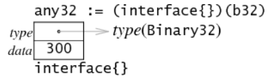

# 翻译：Go Data Structures: Interfaces

!!! info "文献"

    - [Go Data Structures: Interfaces](https://research.swtch.com/interfaces)


Go 的接口——既能在编译期做静态检查，又能需要时表现出动态行为——在我看来是整个语言设计里最激动人心的部分。如果能把 Go 的某一个特性移植到其他语言，我会毫不犹豫地选择接口。

本文将谈谈我对 “gc” 系列编译器（6g、8g、5g）中接口值实现的理解。在 Airs 上，Ian Lance Taylor 曾写过两篇关于 gccgo 中接口值实现的文章。两种实现大同小异，最大的区别大概就是本文配了图。

在深入实现细节之前，先让我们回顾一下它必须满足的需求。

## Usage

Go 的接口让你像在纯动态语言（如 Python）中一样使用鸭子类型，但仍然能够让编译器捕捉到一些明显的错误，比如在预期传入具有 `Read` 方法的对象的地方传入了一个 `int`，或者调用 `Read` 方法时传入了错误数量的参数。要使用接口，首先要定义接口类型（比如 `ReadCloser`）：

```go
type ReadCloser interface {
    Read(b []byte) (n int, err os.Error)
    Close()
}
```

然后把你自己的函数声明为接收一个 `ReadCloser`。例如，下面的函数会循环调用 `Read` 直到读取完所有请求的数据，再调用 `Close`：

```go
func ReadAndClose(r ReadCloser, buf []byte) (n int, err os.Error) {
    for len(buf) > 0 && err == nil {
        var nr int
        nr, err = r.Read(buf)
        n += nr
        buf = buf[nr:]
    }
    r.Close()
    return
}
```

调用 `ReadAndClose` 的代码可以传入任何类型，只要该类型具有正确签名的 `Read` 和 `Close` 方法。而且，与像 Python 这样的语言不同，如果你传入了类型不匹配的值，错误会在**编译期**而非运行期就被发现。

不过，接口并不仅限于静态检查。你还可以在运行时动态地检查某个接口值是否拥有额外的方法。例如：

```go
type Stringer interface {
    String() string
}

func ToString(any interface{}) string {
    if v, ok := any.(Stringer); ok {
        return v.String()
    }
    switch v := any.(type) {
    case int:
        return strconv.Itoa(v)
    case float:
        return strconv.Ftoa(v, 'g', -1)
    }
    return "???"
}
```

变量 `any` 的静态类型是 `interface{}`，这意味着编译器对其内部具体类型不做任何方法保证——它可以存储任何类型。  
`if` 语句中的“逗号 ok”赋值形式询问：能否将 `any` 转换为一个 `Stringer` 接口值（该接口是否带有 `String` 方法）？如果可以，就调用该方法获取字符串并返回；否则，通过 `switch` 处理几个基本类型，再返回默认字符串。这实际上就是 `fmt` 包所做工作的简化版。（当然，也可以把 `if` 换成在 `switch` 最前面增加 `case Stringer:` 来实现，不过为了突出类型检查，我把它单独写成了 `if`。）

举个简单例子：我们定义一个 64 位无符号整数类型 `Binary`，并实现一个 `String` 方法把它以二进制形式打印，再加一个简单的 `Get` 方法：

```go
type Binary uint64

func (i Binary) String() string {
    return strconv.FormatUint(i.Get(), 2)
}

func (i Binary) Get() uint64 {
    return uint64(i)
}
```

类型为 `Binary` 的值可以传给前面定义的 `ToString` 函数，该函数会利用 `String` 方法进行格式化，即使程序里从没声明过 `Binary` 有意实现 `Stringer`。这完全没有必要：运行时只要发现 `Binary` 有 `String` 方法，就认为它实现了 `Stringer`，哪怕 `Binary` 的作者根本没听说过 `Stringer` 接口。

这些例子表明，尽管所有隐式转换都在编译期检查完毕，（通过）显式的接口到接口转换依然可以在运行时检查方法集合(1)。《Effective Go》中有更多细节和示例，展示了接口值的更多玩法。
{ .annotate }

1. 呼应开头提到的：既能在编译期做静态检查，又能在运行时表现出多态。通过显示的接口到接口的转换可以在运行时检查是否存在相同签名的方法，从而实现多态。

## Interface Values

具有方法的语言通常可以分为两类：一种是在编译时为所有方法调用准备方法表（如 C++ 和 Java），另一种是在每次调用时进行方法查找（如 Smalltalk 及其许多模仿者，包括 JavaScript 和 Python），并通过添加精巧的缓存使得调用变得高效。Go 处于两者之间：它有方法表，但是在运行时计算的。我不确定 Go 是否是第一个使用这种技术的语言，但这肯定不是一种常见的做法(1)。（如果你知道更早的例子，我很感兴趣；请在下面留言。）
{ .annotate }

1. 摘自原文评论区：Emerald 动态计算查找表；我们称它们为“AbCon 向量”，因为它们将抽象类型（也就是接口）从编译时已知的类型转换为对象的具体类型（也就是类），而具体类型有时只有在运行时才能知道。我们还缓存了这些 AbCon。

作为热身示例，`Binary` 类型的值只是一个由两个 32 位字组成的 64 位整数（就像上一篇文章中提到的，我们假设使用的是 32 位机器；这次内存是向下增长的，而不是向右增长）：


接口值在底层被表示为一个“两字”结构：第一个字（word）保存指向**接口内存储的类型的元信息**的指针；第二个字保存指向**实际数据**的指针。当把变量 `b` 赋给一个 `Stringer` 接口值时，这两个字都会被同时设置好。


（接口值中的指针用灰色表示，以强调它们是隐式的，不会直接暴露给 Go 程序。）

接口值的第一个字指向我称之为“接口表”或 itable（发音为 “i-table”；在运行时源码中，C 实现的名字是 Itab）。itable 的开头包含一些与类型相关的元数据，随后是一组函数指针。请注意，itable 对应的是**接口类型**，而不是动态实现的类型。以我们的例子来说，`Stringer` 接口中存放 `Binary` 类型时的 itable 只列出用于满足 `Stringer` 的方法——也就是 `String` 一个方法；`Binary` 的其他方法（如 `Get`）不会出现在这个 itable 中。

接口值中的第二个字指向实际的数据，在本例中它保存的是 `b` 的一份**拷贝**。之所以 `var s Stringer = b` 会复制 `b` 的值，而不是直接指向 `b`，原因和 `var c uint64 = b` 时发生拷贝一样：如果之后 `b` 的值发生改变，`s` 和 `c` 仍应保持最初赋给它们的那份值。

接口里存放的值可能非常大，但接口结构体中只为数据预留了一个字的空间。因此，赋值时会在堆上分配一块内存，将数据拷贝进去，并把指向这块内存的指针写入那个单字槽位。（如果值本身就能塞进这一个字，显然可以做优化；这一点我们稍后再谈。）

要检查某个接口值是否保存了特定类型——就像前面 type switch 所做的那样——Go 编译器会生成等价于 C 表达式 `s.tab->type` 的代码，取出类型指针并与目标类型进行比较。如果匹配，就可以通过解引用 `s.data` 来复制出实际值。

要调用 `s.String()`，Go 编译器会生成与 C 表达式 `s.tab->fun[0](s.data)` 等价的代码：它从 itable 中取出对应的函数指针并调用，把接口值的数据字（data word）作为该函数的第一个（本例中也是唯一一个）实参传进去。你可以用 `8g -S x.go` 看到这段生成的汇编（详见文末）。  

注意，itable 中的函数收到的是接口值第二个字里的 **32 位指针**，而不是该指针指向的 **64 位数值**(1)。  
一般来说，接口调用点并不知道这个字的具体含义，也不知道它指向的数据有多大。接口机制会保证 itable 中的函数指针期望的正是接口值里保存的这种 32 位表示。因此，本例中的函数指针其实是 `(*Binary).String`，而不是 `Binary.String`。  
{ .annotate }

1. 这个示例中 Binary 占 64 位

我们当前举的接口只有一个方法；如果接口包含更多方法，itable 底部的 `fun` 列表就会有相应更多的条目。

## Computing the Itable

现在我们知道了 `itable` 的结构，但它们是从哪里来的呢？Go 的动态类型转换意味着编译器或链接器不能预先计算出所有可能的 `itable`：因为有太多的（接口类型，具体类型）组合，而且大部分是不会被需要的。因此，编译器会为每个具体类型（例如 `Binary` 或 `int` 或 `func(map[int]string)`）生成一个类型描述结构。除了其他元数据外，类型描述结构还包含该类型实现的所有方法列表。同样，编译器为每个接口类型（例如 `Stringer`）生成一个（不同的）类型描述结构；它也包含一个方法列表。接口的运行时通过在具体类型的方法表中查找接口类型方法表中列出的每个方法来计算 `itable`。运行时在生成 `itable` 后会缓存它，这样这种对应关系只需要计算一次。

在我们简单的例子中，`Stringer` 的方法表只有一个方法，而 `Binary` 的方法表有两个方法。通常，接口类型可能有 $n_i$ 个方法，而具体类型可能有 $n_t$ 个方法。显然，寻找接口方法与具体方法之间映射的最直接方法将需要 $O(n_i \times n_t)$ 时间，但我们可以做得更好。通过同时排序这两个方法表并同时遍历它们，我们可以在 $O(n_i + n_t)$ 的时间内构建映射。

## Memory Optimizations

上述实现所使用的空间可以通过两种互补的方式进行优化。

首先，如果接口类型是空的——即没有方法——那么 `itable` 除了持有指向原始类型的指针外，并没有其他作用。在这种情况下，可以去掉 `itable`，直接让值指向类型：


接口类型是否为空是一个静态属性——源代码中的类型要么是 `interface{}`，要么是 `interface{ methods... }`——因此编译器可以知道程序中每个接口使用的是哪种表示方式。

其次，如果与接口值关联的值可以适应一个机器字，就不需要引入间接寻址或堆分配。如果我们定义 `Binary32` 类似于 `Binary`，但实现为一个 `uint32`，它可以通过将实际值保存在接口值的第二个字中来存储：


实际值是指针指向还是内联存储取决于该类型的大小。编译器会安排类型方法表中的函数（这些函数会被复制到 `itable` 中）正确的处理传入的那个字：如果接收者类型可以适应一个字，它会直接使用；如果不能，它会进行解引用(1)。图示说明了这一点：在上面的 `Binary` 版本中，`itable` 中的方法是 `(*Binary).String`，而在 `Binary32` 示例中，`itable` 中的方法是 `Binary32.String`，而不是 `(*Binary32).String`。

当然，持有字大小（或更小）值的空接口可以同时利用这两种优化：



## Method Lookup Performance

Smalltalk 以及后续众多动态系统每次调用方法时都要做一次方法查找。为了加快速度，许多实现在每个调用点使用一条单入口缓存，通常直接嵌入指令流中。在多线程程序里，这些缓存必须小心翼翼地维护，因为多个线程可能同时执行到同一个调用点。即便排除了竞态条件，这些缓存最终也会成为内存争用的源头。

由于 Go 兼具静态类型的提示和动态方法查找，它可以把查找工作从调用点提前到值被存入接口的那一刻。例如，看下面这段代码：

```go linenums="1"
var any interface{}  // 已在别处初始化  
s := any.(Stringer)  // 动态转换  
for i := 0; i < 100; i++ {  
    fmt.Println(s.String())  
}  
```

在 Go 中，itable 在第 2 行的赋值时就已经计算出来（或从缓存中找到）；第 4 行执行 `s.String()` 时，调度只需两次内存读取和一次间接调用指令即可。

相比之下，如果用 Smalltalk（或 JavaScript、Python 等）这类动态语言来实现同一程序，方法查找会在第 4 行进行，循环里每次都重复这项无用功。前面提到的缓存让开销不至于太大，但仍比一次间接调用指令更昂贵。

当然，这只是篇博文，我并没有数据来支撑上述讨论，但在高度并行的程序里，避免内存争用显然是大优势；同时，把方法查找移出紧凑循环也大有裨益。此外，我谈的是整体架构，而非实现细节：后者大概还有若干常数级优化空间。

## More Information

接口的运行时支持位于 `$GOROOT/src/pkg/runtime/iface.c`。关于接口还有很多内容需要讨论（我们甚至还没有看到指针接收者的例子），以及类型描述符（它们不仅支持接口运行时，还支持反射），但这些内容将留待未来的文章中讨论。

## Code

支撑（本文的）代码（x.go）：

```go
package main

import (
	"fmt"
	"strconv"
)

type Stringer interface {
	String() string
}

type Binary uint64

func (i Binary) String() string {
	return strconv.Uitob64(i.Get(), 2)
}

func (i Binary) Get() uint64 {
	return uint64(i)
}

func main() {
	b := Binary(200)
	s := Stringer(b)
	fmt.Println(s.String())
}
```

`8g -S x.go` 的部分输出：

```
0045 (x.go:25) LEAL    s+-24(SP),BX
0046 (x.go:25) MOVL    4(BX),BP
0047 (x.go:25) MOVL    BP,(SP)
0048 (x.go:25) MOVL    (BX),BX
0049 (x.go:25) MOVL    20(BX),BX
0050 (x.go:25) CALL    ,BX
```

LEAL 将 `s` 的地址加载到寄存器 BX 中。（符号 `n(SP)` 描述的是内存中位于 `SP + n` 的字。`0(SP)` 可以简写为 `(SP)`。）接下来的两个 `MOVL` 指令从接口的第二个字中取出值，并将其存储为第一个函数调用参数 `0(SP)`。最后两个 `MOVL` 指令分别从 `itable` 中取出它表，然后从中取出函数指针，为调用该函数做准备。
