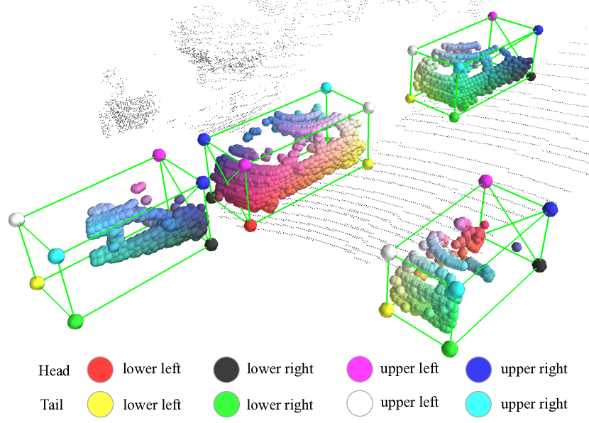
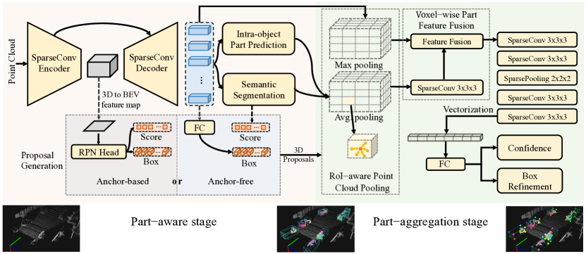

# 翻译：From Points to Parts: 3D Object Detection from Point Cloud with Part-aware and Part-aggregation Network

!!! info "文献"

    - [From Points to Parts: 3D Object Detection from Point Cloud with Part-aware and Part-aggregation Network](https://arxiv.org/abs/1907.03670)

> **在自定义数据集上测试时，Part-A2 的结果很奇怪。排除代码问题，希望能从论文中找到原因。**

## Abstract

从 LiDAR 点云进行 3D 物体检测是 3D 场景理解中的一个具有挑战性的问题，并且具有许多实际应用。 在本文中，我们将前期工作 PointRCNN 扩展为一个新颖且强大的基于点云的 3D 物体检测框架，即部件感知和聚合神经网络 (Part-A2 net)。整个框架包括部件(part)感知阶段和部件聚合阶段。首先，部件感知阶段首次充分利用来自 3D groud truth 框的免费部件监督来同时预测高质量的 3D 提案和准确的物体内部件位置。我们新设计的 RoI 感知点云池化模块对同一提案内预测的物体内部件位置进行分组，从而产生有效的表示来编码每个 3D 提案的几何特定特征。然后，部件聚合阶段学习重新评分框并通过探索池化物体内部件位置的空间关系来细化框位置。我们进行了大量实验来证明我们提出的框架的每个组件的性能改进。我们的 Part-A2 网络优于所有现有的 3D 检测方法，并且仅利用 LiDAR 点云数据就在 KITTI 3D 物体检测数据集上取得了新的最高水平。代码可在 https://github.com/sshaoshuai/PointCloudDet3D 上找到。

## Introduction

随着自动驾驶和机器人技术需求的激增，人们越来越关注 3D 物体检测 。尽管在图像中的二维物体检测方面已经取得了重大成果，但将这些二维检测方法直接扩展到三维检测可能会导致性能下降，因为三维场景的点云数据具有不规则的数据格式，而基于点云的三维检测面临着来自三维物体的不规则数据格式和 6 个自由度（DoF）的大搜索空间的巨大挑战。

现有的 3D 物体检测方法已探索了多种方法来应对这些挑战。一些研究利用 2D 检测器从图像中检测 2D 框，然后对裁剪后的点云采用 PointNet 直接从原始点云中回归 3D 框的参数。然而，这些方法严重依赖于 2D 物体检测器的性能，不能利用 3D 信息来生成鲁棒的边界框提议。

其他一些研究投影鸟瞰图的点云以创建 2D 鸟瞰点密度图，并将 2D 卷积神经网络 (CNN) 应用于这些特征图进行 3D 物体检测，但手工制作的特征不能充分利用原始点云的 3D 信息，并且可能不是最佳的。

还有一些单阶段 3D 物体检测器，它们将 3D 空间划分为规则的 3D 体素，并应用 3D CNN 或 3D 稀疏卷积提取 3D 特征并最终压缩为鸟瞰特征图以进行 3D 物体检测。 这些工作没有充分利用 3D 框注释中的所有可用信息来提高 3D 检测的性能。例如，3D 框注释还暗示了每个 3D 对象内的点分布，这有利于学习更具判别性的特征，从而提高 3D 对象检测的性能。 此外，这些工作都是单阶段检测框架，不能利用 RoI-pooling 方案将每个提案的特定特征汇集在一起，以便在第二阶段进行预测框细化。

相比之下，我们提出了一种新颖的两阶段 3D 物体检测框架，即部分感知和聚合神经网络（ 即 Part-A2 网络），它直接对 3D 点云进行操作，并通过充分探索训练数据中的信息丰富的 3D 框注释来实现最先进的 3D 检测性能。

我们的主要观察是，与从 2D 图像中进行物体检测不同，自动驾驶场景中的 3D 物体通过带注释的 3D 边界框自然且很好地分离，这意味着带有 3D 框注释的训练数据会自动提供免费的语义掩码，甚至每个前景点在 3D 地面真实边界框内的相对位置（参见图 1 说明）。

图 1： 我们提出的部件感知和聚合网络即使在物体被部分遮挡时也能准确预测物体内部部件的位置。这样的部件位置有助于准确的 3D 物体检测。我们提出的方法预测的物体内部部件位置通过八个角的插值颜色可视化。最好以彩色显示。
{ .caption }

在本文的其余部分，每个前景点相对于其所属对象框的相对位置表示为**对象内部部件位置**。这与 2D 图像中的框注释完全不同，因为 2D 图像中物体的某些部分可能会被遮挡。使用真实 2D 边界框会为物体内的每个像素生成不准确且嘈杂的物体内部分位置。这些 3D 物体内部分位置暗示了 3D 物体的 3D 点分布。此类 3D 物体内部分位置信息量大，可以免费获得，但在 3D 物体检测中从未被探索过 。

受此观察的启发，我们提出的 Part-A2 网络被设计为一种新颖的两阶段 3D 检测框架，它由用于预测准确的对象内部分位置和学习逐点特征的部分感知阶段 (Stage-I) 和用于聚合部分信息以提高预测框质量的部分聚合阶段 (Stage-II) 组成。 我们的方法生成用 $(x,y,z,h,w,l,\theta)$ 参数化的 3D 边界框，其中 $(x,y,z)$ 是框中心坐标，$(h,w,l)$ 分别是每个框的高度、宽度和长度，$\theta$ 是从鸟瞰图看每个框的方向角。

具体来说，在部件感知阶段 I，网络学习分割前景点并估计所有前景点的物体内部件位置（见图 1 ），其中分割蒙版和真实部件位置注释直接从真实 3D 框注释生成。此外，它还从原始点云生成 3D 提案，同时进行前景分割和部件估计。

我们研究了两种 3D 提案生成策略，即 anchor-free 策略与 anchor-based 策略，以处理不同的场景。anchor-free 策略相对较轻且内存效率更高，而 anchor-based 策略以更多的内存和计算成本实现了更高的召回率。

对于 anchor-free 策略，我们建议通过分割前景点并同时从预测的前景点生成 3D 提案，以自下而上的方案直接生成 3D 边界框提案。由于它避免了像以前的方法那样在整个 3D 空间中使用大量 3D 锚框，因此节省了大量内存。

对于 anchor-based 策略，它从下采样的鸟瞰特征图中生成 3D 提案，每个空间位置都有预定义的 3D 锚框。由于它需要在每个位置放置具有不同方向和类别的多个 3D 锚框，因此需要更多内存，但可以实现更高的对象召回率。

在现有两阶段检测方法的第二阶段，需要通过某些池化操作聚合 3D 提案中的信息，以便接下来进行框重新评分和位置细化。 然而，之前的点云池化策略（如我们的初步工作 PointRCNN 中所用）会导致表示不明确，因为不同的提案最终可能会池化同一组点，从而失去编码提案几何信息的能力。 为了解决这个问题，我们提出了一种新颖的可区分的 RoI 感知点云池化操作，它保留提案内非空和空体素的所有信息，以消除以前点云池化策略的歧义。 这对于获得框评分和位置细化的有效表示至关重要，因为空体素也编码了框的几何信息。

第二阶段旨在通过所提出的 RoI 感知池化来聚合第一阶段的池化部分特征，以提高提案的质量。我们的第二阶段网络采用稀疏卷积和稀疏池化操作来逐步聚合每个 3D 提案的池化部分特征，以实现准确的置信度预测和框细化。实验表明，聚合部分特征可以显著提高提案的质量，我们的整体框架在 KITTI 3D 检测基准上实现了最先进的性能。

我们的主要贡献可以概括为四点。 

- 我们提出了用于从点云进行 3D 物体检测的 Part-A2 网络框架，该框架利用免费的物体内部部分信息来学习判别性 3D 特征，并通过 RoI 感知池化和稀疏卷积有效地聚合部分特征，从而提高 3D 检测性能。

- 我们提出了两种 3D 提案生成策略来处理不同的场景。anchor-free 策略更节省内存，而 anchor-based 策略可提高物体召回率。

- 我们提出了一种可区分的 RoI 感知点云区域池化操作，以消除现有点云区域池化操作中的歧义。实验表明，池化特征表示对框细化阶段有显著的好处。

- 截至 2019 年 8 月 15 日，我们提出的 Part-A2 网络在具有挑战性的 KITTI 3D 检测基准上以显著的优势超越了所有已发表的方法，并以 14 FPS 的推理速度排名第一，证明了我们方法的有效性。

## Part-A2 Net: 3D Part-Aware and Aggregation for 3D Detection from Point Cloud

这项工作的初步版本已在之前提出，我们提出了 PointRCNN 用于从原始点云中进行 3D 物体检测。为了使框架更加通用和有效，在本文中，我们将 PointRCNN 扩展为一个新的端到端 3D 检测框架，即部分感知和聚合神经网络， 即 Part-A2 net，以进一步提升从点云进行 3D 物体检测的性能。

关键的观察是，3D 物体检测的地面实况框不仅由于 3D 物体在 3D 场景中自然分离的事实而自动提供准确的分割掩码，而且还暗示了地面实况框内每个前景 3D 点的相对位置。这与 2D 物体检测非常不同，在 2D 物体检测中，2D 物体框可能由于遮挡而仅包含物体的一部分，因此无法为每个 2D 像素提供准确的相对位置。这些前景点的相对位置编码了前景 3D 点的宝贵信息，并且有利于 3D 物体检测。这是因为同一类（如汽车类）的前景物体通常具有相似的 3D 形状和点分布。前景点的相对位置为框评分和定位提供了强有力的线索。我们将 3D 前景点相对于其对应框的相对位置命名为物体内部分位置 。

这些物体内部部分的位置为从点云中学习判别性 3D 特征提供了丰富的信息，但在以前的 3D 物体检测方法中从未被探索过。 有了如此丰富的监督，我们提出了一种新颖的部分感知和聚合 3D 对象检测器 Part-A2 net，用于从点云中检测 3D 对象。具体来说，我们建议使用免费的 3D 对象内部分位置标签和分割标签作为额外的监督，以在第一阶段学习更好的 3D 特征。然后，在第二阶段聚合每个 3D 提案中预测的 3D 对象内部分位置和逐点 3D 特征，以对框进行评分并细化其位置。整体框架如图 2 所示。

图 2： 用于 3D 物体检测的部件感知和聚合神经网络的总体框架。它由两个阶段组成：（a）部件感知阶段 I 首次预测物体内部部件位置，并通过将点云输入到我们的编码器-解码器网络来生成 3D 提案。（b）部件聚合阶段 II 执行所提出的 RoI 感知点云池化操作以聚合来自每个 3D 提案的部件信息，然后利用部件聚合网络根据部件特征和来自阶段 I 的信息对框进行评分并细化位置。
{ .caption }

### Stage-I: Part-aware 3D proposal generation

部件感知网络旨在通过学习估计前景点在对象内的部分位置来从点云中提取判别性特征，因为这些部分位置通过指示 3D 对象表面点的相对位置来隐式编码 3D 对象的形状。此外，部分感知阶段还学习估计前景点在对象内的部分位置并同时生成 3D 提案。针对不同的场景，提出了两种从点云生成 3D 提案的策略，即无锚方案和基于锚方案。

图 3： 自动驾驶场景中体素化点云与原始点云的比较。每个非空体素的中心被视为一个点，以形成体素化点云。体素化点云大致相当于原始点云，并且 3D 对象的 3D 形状得到很好的保留，可用于 3D 对象检测。
{ .caption }

#### Point-wise feature learning via sparse convolution

为了分割前景点并估计它们在物体内部分的位置，我们首先需要学习有判别力的逐点特征来描述原始点云。如图 2 左侧所示，我们不再使用基于点的方法从点云中提取逐点特征，而是建议利用具有稀疏卷积和反卷积的编码器-解码器网络来学习有判别力的逐点特征，以进行前景点分割和物体内部分位置估计，这比我们前期工作中使用的 PointNet++ 主干更高效、更有效。

具体来说，我们将 3D 空间体素化为规则体素，并通过堆叠稀疏卷积和稀疏反卷积提取每个非空体素的体素特征，其中每个体素的初始特征简单地计算为 LiDAR 坐标系中每个体素内的点坐标的平均值。 每个非空体素的中心被视为一个点，以形成具有点状特征（ 即体素特征）的新点云，该点云近似等同于图 3 所示的原始点云，因为与整个 3D 空间（∼
 70m × 80m × 4m）相比，体素尺寸要小得多（例如，我们的方法中为 5cm × 5cm × 10cm）。对于 KITTI 数据集中的每个 3D 场景，3D 空间中通常有大约 16,000 个非空体素。体素化的点云不仅可以由更高效的基于稀疏卷积的主干处理，而且对于 3D 物体检测而言，它与原始点云大致相当。

我们的基于稀疏卷积的主干网络是基于编码器-解码器架构设计的。输入特征体的空间分辨率通过一系列步幅为 2 的稀疏卷积层进行 8 倍下采样，然后通过稀疏反卷积逐渐上采样到原始分辨率，以进行逐体素特征学习。详细的网络结构在第 3.5 节和图 7 中说明。我们新设计的基于 3D 稀疏卷积的主干网络比我们初步的 PointRCNN 框架中基于 PointNet++ 的主干网络具有更好的 3D 框召回率（如表 I 中的实验结果所示），这证明了这种新主干网络对于逐点特征学习的有效性。

