# 翻译：SR-Adv: Salient Region Adversarial Attacks on 3D Point Clouds for Autonomous Driving

> 点云局部攻击二则（其一）

!!! info "文献"

    - [SR-Adv: Salient Region Adversarial Attacks on 3D Point Clouds for Autonomous Driving](https://ieeexplore.ieee.org/document/10552176)

## Abstract 

基于激光雷达感知的自动驾驶安全问题日益成为研究热点。3D 对抗样本常常使深度神经网络模型的预测结果变得不可预测，这给自动驾驶系统带来了重大安全风险。然而，3D 神经网络模型对对抗样本的脆弱性研究较少。目前，现有的对抗攻击方法通常通过扰动整个点云来获取 3D 对抗样本，这需要大量的扰动点，即需要较大的扰动预算。在本文中，我们提出了一种显著区域对抗攻击方法（SR-Adv），通过扰动更少的区域和更少的点来生成对抗性点云。据我们所知，我们是首次针对 3D 点云提出基于区域的攻击方法。首先，所提出的 SR-Adv 采用博弈论来提取点云的显著区域。该机制为每个区域赋予一个值，以衡量其对 3D 神经网络模型预测结果的重要性，并实现对 3D 模型的脆弱性分析。其次，我们提出了一种基于优化的新型梯度攻击算法，以实现对显著区域的对抗攻击。我们在合成数据集 ModelNet40 和 ShapeNetPart 以及真实世界数据集 KITTI 和 NuScenes 上对所提出的 SR-Adv 攻击方法进行了评估。实验结果表明，所提出的 SR-Adv 通过在 3D 点云上扰动更少的点，实现了当前最优的攻击成功率和更好的不可感知性。

**关键词 — 点云、显著区域、对抗攻击、自动驾驶**

## Introduction

在自动驾驶系统中，激光雷达（LiDAR）的目标识别能力对于实现安全驾驶至关重要。激光雷达能够高精度、高分辨率地准确捕获环境的三维点云数据。通过对三维点云进行处理和分析，它能够准确识别并定位道路上的车辆、行人、障碍物及其他物体。

然而，基于激光雷达的目标识别也面临着一些挑战，其中之一是对抗攻击对自动驾驶可能造成的危害。攻击者可能会引入虚假的目标信息，或操控障碍物的形状和位置，从而误导自动驾驶系统做出错误的判断和决策。这种对抗攻击可能会产生严重后果，包括误识别道路上的物体、无法及时避开障碍物，甚至引发事故。因此，研究自动驾驶中针对三维点云的对抗攻击，对于确保自动驾驶系统的安全性至关重要。

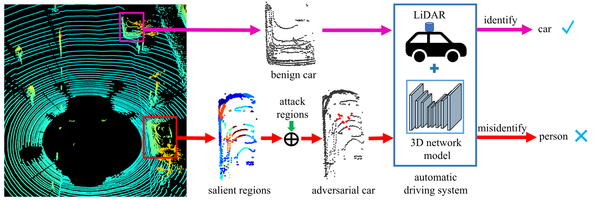

图1. 自动驾驶系统中对抗性示例的危害。良性车辆被成功识别，而通过攻击显著区域的对抗性车辆被误识别为行人。对抗性车辆中的扰动点用红色标记。
{ .caption }

深度神经网络在各种学习任务中总是表现出卓越的性能，例如分类任务，语义分割，目标检测与识别。随着深度神经网络模型性能的提升，模型的安全性也受到了更多关注。深度学习系统容易受到恶意攻击，从而输出错误结果。例如，对抗性点云物体很容易误导自动驾驶系统，如图 1 所示。然而，对抗样本有利于提高神经网络模型的鲁棒性，增强自动驾驶系统的安全性。因此，更多的研究人员专注于对抗样本的生成以及在物理世界中对其进行重构。

在图像中，通过对输入数据进行轻微扰动所生成的数据，即对抗样本，可以轻易地使深度神经网络模型输出错误的预测结果。生成对抗样本过程中添加的扰动通常很小，人类视觉难以察觉，使得对抗样本不易被感知。以往研究表明，对抗样本很容易对深度神经网络进行恶意攻击。此外，现实世界中也能构造出真实的对抗样本，这给深度学习系统带来了重大安全风险。目前，对抗样本主要集中在二维图像上，尤其是针对图像分类任务。

随着获取三维数据的方式更加便捷以及点云的广泛应用，三维模型的鲁棒性受到了更多关注。受图像对抗攻击思想的启发，三维对抗学习领域涌现出许多研究成果，主要应用于点云分类任务，如 PointNet、PointNet++ 和 DGCNN。Xiang 等人通过扰动点云实现了攻击，并对三维模型进行了鲁棒性分析。为了获得更难以察觉的对抗性点云，通常使用 $\mathcal{L}_p$ 范数或诸如 Chamfer 距离和 Hausdorff 距离等距离度量作为损失约束。此外，生成的对抗性点云的攻击性能可以使用可迁移性度量来衡量。

对于三维点云，攻击成功率和不可感知性是生成对抗性点云的主要目标。现有的三维对抗攻击方法通常能实现较高的攻击成功率，但由于三维点云的结构复杂性，对抗样本中总会存在一些离群点，这不仅会产生明显的视觉差异，还很容易被统计方法防御。此外，我们还应考虑生成对抗性点云的扰动预算。使用较小的扰动预算来实现更高的成功率和更好的不可感知性，是衡量对抗性点云生成方法优越性的更好指标。然而，现有方法通常通过对整个点云进行扰动来生成对抗样本，这往往需要更高的扰动预算。在生成对抗样本时，攻击对三维网络模型预测结果影响最大的点或局部区域似乎更为合理。因此，攻击点云的局部显著区域往往可以降低生成对抗性点云的扰动预算。

在本文中，我们提出了一种基于显著区域的对抗攻击方法，称为 SR-Adv。与大多数对整个点云进行扰动的3D对抗攻击方法不同，所提出的 SR-Adv 仅通过扰动一定数量的局部区域来生成对抗性点云。首先，我们对 3D 网络模型进行漏洞分析。所提出的 SR-Adv 方法采用博弈论来提取点云的显著区域，并为每个区域分配一个显著值，以表示其对 3D 网络模型预测的重要性。其次，我们提出了一种基于优化的梯度攻击算法来攻击显著区域。为了生成更好的不可察觉的对抗性点云，我们使用倒角距离和豪斯多夫距离来约束整个点云，并使用 $\mathcal{L}_2$ 范数来约束被攻击区域。我们在合成数据集 ModelNet40 和 ShapeNetPart 以及真实世界数据集 KITTI 上评估了所提出的 SR-Adv 攻击方法。实验结果表明，我们的方法在攻击区域时具有更小的扰动预算、更高的攻击成功率和更好的不可察觉性。

总的来说，本文的贡献如下：

- 据我们所知，我们是首个提出针对三维点云的基于区域攻击的研究团队。
- 我们提出了一种基于优化的新型梯度攻击算法，该算法在攻击三维点云上的区域时达到了当前最优的成功率。
- 所提出的 SR-Adv 攻击的区域更少，操作的点也更少，在三维点云上实现了更高的攻击成功率和更好的不可感知性。

## Related Work

### A. Deep Learning on 3D Point Clouds

作为三维数据最重要的表示形式，点云在分类、目标检测、语义分割等场景中得到了广泛应用。随着深度学习技术的发展，出现了许多用于处理点云的三维深度神经网络模型。PointNet 直接在原始点云上提取点集的特征，用于分类和语义分割任务，并取得了良好的性能。尽管 PointNet 网络解决了点云的无序性问题，但它没有考虑点云的局部特征。为此，PointNet++ 将点集划分为不同的区域，然后使用特征提取器提取不同区域的局部特征，使模型具有更强的特征提取能力和泛化能力。DGCNN 是一种可以使用卷积网络的三维模型，它有效地提取点云的局部邻域特征，建立点之间的拓扑关系，并实现动态更新的图模型。

近年来，深度学习在 3D 点云领域取得了多项进展，涵盖了多种学习范式，包括引入了顺序点云处理方法、点云处理网络结构搜索方法以及点云数据处理不足的应对方法。具体而言，图神经网络与时空 Transformer 注意力机制相结合，使得从点云序列中进行最先进的检测成为可能，有效地编码了时间线索。专为点云语义分割量身定制的架构搜索方法，如 PCSS-NAS，通过自动设计侧输出分支和跳跃连接，优化了特征利用。引入了一种新颖的弱监督框架，减轻了 3D 检测任务的标注负担，在有限的精确标注下实现了与全监督方法相当的性能。像 ProposalContrast 这样的无监督预训练策略，利用目标提案进行有效的对比学习，在多个检测器和数据集上展现出通用性。具有熟练教师的半监督方法，利用了高质量伪标签的力量，进一步提升了检测性能。

### B. Adversarial Attacks on Images

在图像方面，研究人员对如何寻找对抗样本进行了深入探索，并取得了丰硕成果。塞格迪（Szegedy）等人发现，对抗样本会误导图像分类模型的预测结果，并提出了一种基于 $\mathcal{L}_P$ 范数优化的对抗样本生成方法。随后，研究人员开发了许多经典的对抗攻击方法，主要分为两类：白盒攻击和黑盒攻击。快速梯度符号法（FGSM）是一种经典的梯度攻击方法，它沿着对抗损失函数的梯度方向生成对抗样本。Kurakin 等人对 FGSM 方法进行迭代，并对每次迭代生成的对抗样本进行裁剪，使其保持在有效范围内。Dong 等人在迭代 FGSM 方法的过程中引入动量来更新对抗样本，生成的对抗样本具有更强的可迁移性。

此外，使用优化方法寻找对抗样本是另一种主流方法，这类方法通常能实现更高的攻击成功率。C&W 方法通过LP范数约束和自定义的对抗损失设计了一个优化目标函数，以限制扰动大小。

在防御方面，有一种具有代表性的方法，该方法引入了一种独特的防御机制。通过限制每个类别的特征位于不同的凸多面体内，这种方法不仅保留了干净图像上的分类性能，还显著提高了模型对白盒攻击的抵御能力。

### C. Adversarial Attacks on 3D Point Clouds

与针对 2D 图像的对抗性学习研究相比，针对 3D 点云的深度神经网络模型的鲁棒性和可靠性仍然研究不足。目前，关于 3D 对抗样本的研究主要集中在点云分类模型上，如 PointNet、PointNet++ 和 DGCNN。Xiang 等人在他们的工作中提出了两种生成对抗性点云的方法，一种是对点进行扰动，另一种是添加点。这项工作是3D点云中第一个对抗攻击方法，将图像对抗攻击方法C&W扩展到点云，并取得了令人满意的结果。Zheng 等人使用将点移动到点云质心的操作代替点删除，并构建了一个点云显著性图。显著性图可以解释哪些点在模型的预测结果中起关键作用，并提出了一种迭代删除显著点的对抗攻击方法。为了增强对抗样本的可迁移性，Hamdi 等人在中提出了一种数据驱动的对抗攻击方法，生成了更难防御的对抗样本。

然而，DUP-Net 指出这些攻击产生了太多的离群点。通过从输入点云中移除统计异常点，DUP-Net 成功防御了 C&W 攻击。因此，为了使生成的对抗样本具有更平滑的 3D 对象特征，Wen 等人在中设计了一个几何感知的目标函数。该目标函数使用 Chamfer 距离和 Hausdorff 距离来防止在几何或拓扑上全局过度变形。此外，它还约束对抗性点云和原始点云的局部曲率保持一致。Kim 等人设计了一个统一的公式，可以包含点添加和点扰动攻击。该方法攻击点云分类网络以生成对抗样本，同时确保操纵点的数量最小化。Huang 等人认为点云是高度结构化的数据，很难约束扰动。因此，提出了一个点云敏感性图来找到最佳攻击方向。Sun 等人使用梯度选择点云的显著点，即点云的高分小子集，进行扰动。同时，提出了一种相应的优化策略来提高对抗样本的不可感知性。

目前，现有的方法直接扰动整个点云，这通常会导致生成对抗性点云时需要较大的扰动预算。在本文中，我们首先分析3D网络模型的脆弱性，然后提取点云的显著区域，最后使用梯度攻击方法仅攻击这些显著区域以生成对抗性点云。

## Method
本节详细描述了所提出的显著区域对抗攻击方法（SR-Adv），如图 2 所示。

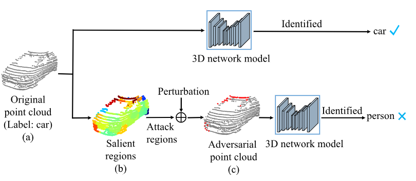

图2. 所提出的 SR-Adv 方案，通过攻击较少区域和较少点对 3D 点云进行对抗性攻击。(a) 是原始 3D 点云，被 3D 网络模型正确识别为“汽车”。(b) 是原始 3D 点云的显著区域图。(c) 是通过攻击原始点云显著区域生成的对抗性点云，被 3D 网络模型误识别为“行人”。(c) 中的对抗性点云的扰动点用红色标记。
{ .caption }

### A. Formulation

给定一个原始的3D点云 \( P = \{p_1, \cdots, p_i, \cdots, p_n\} \)，其中 \( n \) 表示点的数量，\( p_i = [p_{i,x}, p_{i,y}, p_{i,z}] \in R^3 \) 表示第 \( i \) 个点的三维坐标系统。假设点云被划分为 \( m \) 个区域，每个区域都有一个显著值 \( V(a_i) \)，\( a_i \) 表示第 \( i \) 个区域。这些区域的显著值按降序排列，假设排序结果为 \( V(a_1) > V(a_2) > \cdots > V(a_m) \)。因此，点云 \( P \) 记录为：

\[ 
P = a_1 \cup a_2 \cup \cdots \cup a_k \cdots \cup a_m = \bigcup_{i=1}^{m} a_i.
\tag{1}
\]

具体来说，攻击点云 \( P \) 的前 \( k \) (\( k \leq m \)) 个区域以生成对抗性点云 \( P' \)，则 \( P' \) 可以表示如下：

\[ 
P' = F(a_1) \cup F(a_2) \cup \cdots \cup F(a_k) \cdots \cup a_m,
\tag{2}
\]

其中 \( F \) 是三维网络模型，\( F(a_i) \) 是对抗攻击后区域 \( a_i \) 的结果。

### B. Salient Regions of Point Cloud 

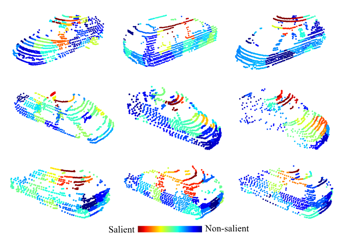{ width=66% }

图 3. 来自 KITTI 数据集的汽车在 DGCNN 上的显著区域。红点构成显著区域，蓝点构成非显著区域。
{ .caption }

在博弈论中，多个玩家参与游戏，每个玩家的贡献对最终总奖励的影响不同。Shapley 值可以根据玩家在游戏过程中的贡献公平地分配相应的奖励。最近，这种方法也被应用于网络模型的解释性研究。

受 Shapley 值的启发，它被应用于 3D 网络模型的脆弱性分析，以确定对模型预测结果做出重要贡献的区域。具体来说，给定一个网络模型 \( F \) 和一个点云 \( P = [a_1, a_2, \ldots, a_m] \) 分为 \( M = [1, \ldots, m] \) 区域。我们的目标是确定每个区域对模型识别结果的重要性。然后，模型 \( F \) 的识别过程可以看作是一场游戏，其输出记录为 \( g(\cdot) \)。点云 \( P \) 的 \( m \) 个区域被认为是 \( m \) 个玩家，那么所有玩家组合的总数是 \( S = 2^m \)。假设 \( x \subseteq S \) 表示一个子集，则 \( S \setminus x \) 表示除了子集 \( x \) 之外的所有子集。特别是，当使用Shapley值来确定子集 \( x \) 对网络模型 \( F \) 的贡献时，集合 \( S \setminus x \) 中的所有区域的点都被移动到点云的中心来代表删除这些点。因此，根据集合 \( S \) 中不同子集的组合，计算每个区域 \( i \) 对模型 \( F \) 的重要性如下：

\[ 
\phi_i = \sum_{x \subseteq S \setminus i} \frac{|x|!(m - |x| - 1)!}{m!} (g(x \cup \{i\}) - g(x)) \quad 
\tag{3} 
\]

其中，\( \phi_i \) 表示区域 \( i \) 对模型预测的贡献，即突出值。突出的价值越大，该地区对模型预测的影响就越大。算法 1 描述了提取显著值的具体过程。我们从 KITTI 数据集中去除汽车并在 DGCNN 上可视化它们的显著区域，如图 3 所示。

\[
\begin{array}{rl}
\hline
- & \textbf{Algorithm 1.}\quad \text{提取点云的显著区域} \\
\hline
- & \textbf{输入:} \quad \text{点云} \ P，\text{模型} \ g，\text{区域的数量} \ m. \\
- & \textbf{输出:} \quad \text{点云} \ P \ \text{的显著区域:} \ \phi(i). \\
\hline
1 & \text{使用最远点采样提取}\ m \ \text{个点作为} \ m \ \text{个区域的中心点} \\
2 & \text{计算点云} \ P \ \text{中每个点到中心点的距离，选择距离点最近的那个中心点，将点加入} \\
  & \text{该中心点所代表的区域，得到}\ m \ \text{个区域} \\
3 & \textbf{for} \ i = 1, 2, ..., m \ \textbf{do} \\
4 & \quad \text{生成集合}\ M \ \text{的子集} \ x，\text{其中} \ M = \{1, 2, ..., m\} \\
5 & \quad \text{将未被} \ x \ \text{选中的所有区域的点移动到点云} \ P \ \text{的中心} \ P_{\text{center}} \\
6 & \quad \text{计算模型的输出} \ g(x) \\
7 & \quad \text{计算区域} \ i \ \text{的边际贡献:}\ v(i) \leftarrow g(x \cup \{i\}) - g(x) \\
8 & \textbf{end for} \\
9 & \text{计算区域} \ i \ \text{的边际贡献总和:}\ V_i \leftarrow \sum_{t=0}^{n} v(i) \\
10 & \textbf{return}\ \phi(i) \leftarrow \frac{V_i}{n} \\
\hline
\end{array}
\]

### C. General Adversarial Point Clouds

对于真实标签为 \( y \) 的点云 \( P \)，给定一个 3D 神经网络模型 \( F \)，正确的预测是 \( F(P) = y \)。基于 Shapley 值的点云显著区域已经被提出。我们的目标是保持点云 \( P \) 不变的同时，仅改变这些区域的坐标，也就是说，生成对抗样本 \( P' \)，使得 \( F(P') \neq y \)。具体来说，假设要攻击的点云区域是 \( a_k \)，生成的对抗点云 \( P' \) 表达式如下：

\[ 
P' = a_1 \cup a_2 \cup ... \cup a_k e_k \cup ... \cup a_m = \bigcup_{i=1, i\neq k}^m a_i \cup a_k e_k,
\tag{4}
\]

其中 \( e_k \) 表示对应于区域 \( a_k \) 的扰动。
我们的方法在生成对抗点云 \( P' \) 时只对指定区域进行扰动。生成 \( P' \) 的方式可以表达如下：

\[
\min D(P, P') \quad s.t. \; F(P') \neq y,
\tag{5}
\]

其中 \( D(P, P') \) 表示原始点云 \( P \) 和对抗点云 \( P' \) 之间的距离约束。
为了解决这个方程，它总是被转换为基于梯度的优化问题，如下所示：

\[
\min C_{region}(P, P') = f(P') + \lambda_1 D_g(P, P') + \lambda_2 D_l(P, P'),
\tag{6}
\]

其中 \( \lambda_1 \) 和 \( \lambda_2 \) 是惩罚系数，\( \lambda_1 \) 在攻击过程中自动调整使用二分搜索 。提出的 SR-Adv 解决了优化问题以找到具有最小扰动预算的对抗点云。

1）*对抗损失* \( f(P') \)：它确保模型 \( F \) 输出错误的结果，即 \( F(P') \neq y \)。受对抗攻击目标函数设计的启发。对于对抗点云 \( P' \)，\( F_y(P') \) 表示 \( P' \) 被分类为第 \( i \) 类的概率。那么，对抗损失 \( f(P') \) 表达如下：

\[ 
f(P') = \max \left\{ F_y(P') - \max_{y \neq Y} F_y(P'), 0 \right\}.
\tag{7}
\]

2）*全局距离约束* \( D_g(P, P') \)：对于点云 \( P \) 和对抗点云 \( P' \)，整个点云使用 Chamfer 距离和 Hausdorff 距离进行约束。这两种距离是目前主流的 3D 点云对抗攻击指标。Chamfer 距离测量两组点之间的平均距离，计算如下：

\[ 
D_{\text{Chamfer}}(P, P') = \frac{1}{n} \sum_{p \in P} \min_{p' \in P'} \| p - p' \|_2^2 + \frac{1}{n'} \sum_{p' \in P'} \min_{p \in P} \| p' - p \|_2^2,
\tag{8}
\]

其中 \( n \) 和 \( n' \) 分别表示点云 \( P \) 和 \( P' \) 的点的数量。

Hausdorff 距离计算从对抗点云 $P'$ 到 $P$ 的最小距离的最大值，以及从 $P$ 到 $P'$ 的最小距离的最大值。因此，距离约束可以更好地减少异常值的产生，其计算方法如下：

\[
D_{\text {Hausdorff }}\left(P, P^{\prime}\right)=\max \left\{\max _{p_{i} \in P}\left\{\min _{p_{j}^{\prime} \in P^{\prime}}\left\|p_{i}-p_{j}^{\prime}\right\|_{2}\right\},\quad \max _{p_{j}^{\prime} \in P^{\prime}}\left\{\min _{p_{i} \in P}\left\|p_{j}^{\prime}-p_{i}\right\|_{2}\right\}\right\}.
\tag{9}
\]

因此，针对点云 $P$ 和对抗点云 $P^{\prime}$ 的全局约束表达式为:

\[
D_g\left(P, P^{\prime}\right)=D_{\text {Chamfer }}\left(P, P^{\prime}\right)+D_{\text {Hausdorff }}\left(P, P^{\prime}\right).
\tag{10}
\]

3) *局部距离约束* $D_l(P,P^{\prime})$: 攻击期间，距离约束适用于显著区域内的点云 $P$ 和对抗点云 $P^{\prime}$，采用 $L_2$ 范数约束，其表达式如下:

\[
D_{l}\left(P, P^{\prime}\right)=\left\|P^{\prime}-P\right\|_{2}.
\tag{11}
\]

### D. Optimization-Based Gradient Attack Algorithm

在这篇论文中，提出的 SR-Adv 属于白盒攻击类型，这是一种无目标攻击方法。给定输入点云 \(P\)，使用对抗性攻击方法生成一个使 3D 模型错误分类的对抗点云。SR-Adv 的整体实现过程如下所述。

首先，使用基于 Shapley 值的方法提取点云 \(P\) 的显著区域，并将每个区域的显著值按降序排序，记为 \(P = [a_1, a_2, \cdots, a_m]\)。

其次，应用我们提出的基于优化的梯度攻击算法到显著区域，如算法 2 所示。已经在图像上的对抗性攻击中证明，沿着梯度方向，可以进入示例的对抗子空间并找到对抗示例。

\[
\begin{array}{rl}
\hline
- & \textbf{Algorithm 2.}\quad \text{基于显著区域的对抗攻击} \\
\hline
- & \textbf{输入:} \quad \text{点云输入}\ P, \text{标签}\ y. \\
- & \textbf{参数:} \quad \text{损失函数}\ C_{\text{region}}(P, P'); \text{模型} g; \text{超参数} \lambda_1, \lambda_2; \text{迭代次数} T. \\
- & \textbf{输出:} \quad \text{对抗点云} P' \\
\hline
1 & \text{初始化对抗点云 }\ P' \leftarrow P \\
2 & \text{初始化扰动 }\ offset \leftarrow 0 \\
3 & \text{提取显著区域 }\ P \leftarrow [a_1, a_2, \cdots, a_m] \\
4 & \text{选择前}\ K\ {个区域进行扰动 }\ R \leftarrow [a_1, \cdots, a_K] \\
5 & \text{计算前}\ K\ \text{个区域的索引}\ R_{\text{index}} \\
6 & \textbf{for} \ t = 0\ \text{ to } \ T \ \textbf{do} \\
7 & \quad \text{计算}\ P'\ \text{的梯度}\ grad\ \leftarrow \nabla_P C_{\text{region}}(P, P') \\
8 & \quad \text{获得梯度的符号}\ sign(grad) \\
9 & \quad \text{攻击显著区域}\ R\ \leftarrow [a_1, \cdots, a_K] \\
10 & \quad \text{更新}\ P'\ \leftarrow P + \varepsilon \cdot sign(grad) \cdot offset \cdot R_{\text{index}} \\
11 & \textbf{end for} \\
12 & \textbf{return} \ P' \\
\hline
\end{array}
\]

因此，我们不断在梯度方向上更新对抗样本，一次更新的方式表达如下：

\[
P^{\prime} \leftarrow P+\epsilon \cdot \operatorname{sign}\left(\nabla_{p} C_{\text {region }}\left(P, P^{\prime}\right)\right)
\tag{12}
\]

其中 $\epsilon$ 是扰动大小，$\operatorname{sign}$ 表示符号函数。
受 C&W 方法的启发，SR-Adv 在解决方程（6）时限制在梯度方向上更新对抗样本。对于对抗样本，SR-Adv 完成一次更新的过程可以简单地描述为：

\[
P^{\prime} \leftarrow P+\epsilon \cdot \operatorname{sign}\left(\nabla_{p} C_{\text {region }}\left(P, P^{\prime}\right)\right) \cdot \text { offset } \cdot R_{\text {index }}
\tag{13}
\]

其中 offset 表示需要优化的干扰。$R_{\text {index }}$ 表示被攻击区域的点的索引。算法 2 描述了所提出的显著区域攻击算法（SR-Adv）的整体过程。

## Experiments

### A. Experiment Setup
1) *数据集*：我们使用合成的数据集 ModelNet40 和 ShapeNetPart 以及真实世界的数据集 KITTI 和 NuScenes 来评估无目标对抗攻击实验。ModelNet40 包含 40 个类别中的 12311 个 CAD 模型。训练数据包含总共 9843 个点云，测试数据包含总共 2468 个点云。ShapeNetPart 包含 16 个类别的 16881 个点云，训练数据和测试数据分别为 12137 和 2874 个。KITTI 目标检测数据集提供了 7481 帧点云用于训练和 7518 帧点云用于测试。NuScenes 将驾驶数据分为 1000 个场景：700 个用于训练，150 个用于验证，150 个用于测试。
2) *实现细节*：在实验中，我们在提取显著区域时将点云分为 32 个区域。显著区域攻击算法中的扰动大小 \(\epsilon = 0.3\) 和 \(\lambda_2 = 1\)。对于 Adam 优化器，学习率设置为 0.01，动量设置为 0.9。
3) *评估指标*：为了验证对抗攻击方法的表现，我们使用攻击成功率、Chamfer 距离和 Hausdorff 距离指标。我们使用扰动点的数量来衡量对抗攻击方法的扰动预算。表现优异的对抗攻击方法应该具有更小的扰动预算。为了进行公平的比较，在所有对抗攻击方法中，上述评估指标都是在攻击相同区域的条件下进行比较的。

### B. Experimental Results
1) *在 ModelNet40 和 ShapeNetPart 上的实验结果*：我们使用训练集中的所有点云数据来训练受害者模型。根据之前的工作，我们遵循相同的设置，并从训练数据中采样 1024 个点来训练网络模型。我们从 ModelNet40 的测试集中选择每类的 25 个样本，并使用 ShapeNetPart 的测试集来评估对抗攻击方法。

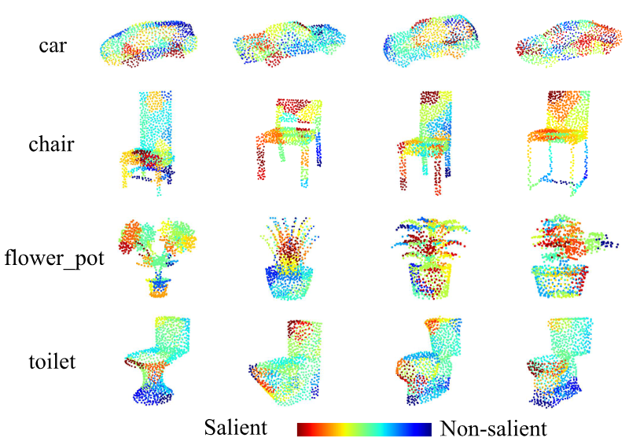{ width=66% }
图 4. 基于 PointNet 的 ModelNet40 点云显著区域。红点构成显著区域，蓝点构成非显著区域。
{ .caption }

首先，我们使用 Shapley 值从 modelnet40 中提取点云的显著区域，如图 4 所示。从图 4 中，每一行代表同一类的不同样本的显著区域。然后，我们比较在不同方法攻击受害者模型 PointNet 上的区域时的性能。比较的方法包括经典的梯度攻击方法 FGSM 和 I-FGSM，基于优化的点云攻击方法 L3A，以及形状不变的攻击方法 SI-Adv。在实验中，使用局部距离约束（公式 (9)）的方法被称为 SR-Adv(\(L_2\))，而没有局部距离约束的方法被称为 SR-Adv。表 I 和表 II 分别报告了不同方法在 ModelNet40 和 ShapeNetPart 数据集上攻击显著区域的性能。在表中，“# Regions” 表示攻击的区域数量。“# Points” 表示扰动点的数量，越低越好。“Success Rate” 越高越好，“Chamfer Distance” 越低越好，“Hausdorff Distance” 越低越好。

从表 I 和表 II 中可以看出，我们的对抗攻击方法 SR-Adv 和 SR-Adv(\(L_2\)) 在获得最高攻击成功率的同时，操作的点数最少，并保持 Chamfer 距离和 Hausdorff 距离较小。此外，随着攻击区域数量的增加，我们的对抗攻击方法始终保持着最高的攻击成功率、最小的距离指标和最少的扰动点数。具体来说，从表 I 中可以看出，当攻击一个区域时，提出的 SR-Adv(\(L_2\)) 仅需要操作 9 个点就能实现 \(74.29\%\) 的攻击成功率，并在两个距离指标上获得最小值。然而，SI-Adv 在攻击两个区域时扰动 70 个点才获得 \(69.89\%\) 的攻击成功率。

表 I. 当受害者网络是 PointNet 时，不同对抗攻击方法在 ModelNet40 上的性能表现。
{ .caption_table }

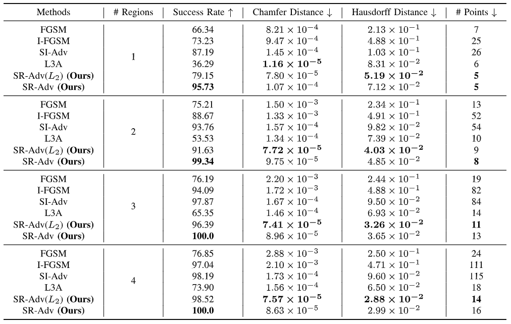{ width=80% }

表 II. 当受害者网络是 PointNet 时，不同对抗攻击方法在 ShapeNetPart 上的性能表现。
{ .caption_table }

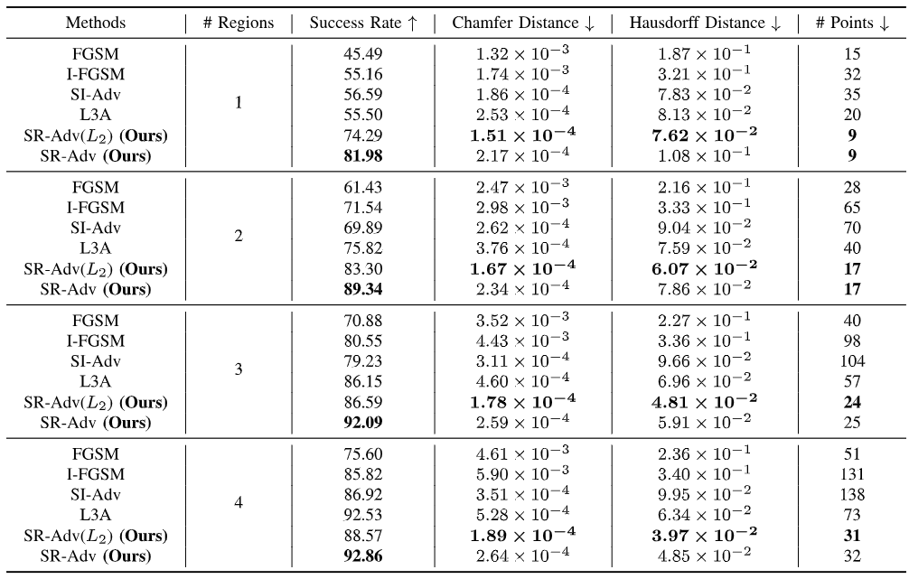{ width=80% }

此外，当使用 \(L_2\) 范数约束时，虽然 SR-Adv(\(L_2\)) 降低了攻击成功率，但两个距离指标，即 Chamfer 距离和 Hausdorff 距离，进一步减少，表明生成的对抗样本具有更好的不可感知性。在 ModelNet40 上，当攻击区域数量为五个时，不同方法生成的对抗点云可视化如图 5 所示。对抗点云中的扰动点用红色标记。

从图 5 中可以看出，我们提出的 SR-Adv 生成的对抗点云能够更好地近似原始点云。显然，这些对抗样本也具有相对较少的离群点，使得更难观察到异常。此外，使用 \(L_2\) 范数约束（SR-Adv(\(L_2\))）时，生成的对抗点云具有略好的可视化结果。相反，I-FGSM 生成的对抗点云包含明显的离群点。虽然 SI-Adv 可以生成较少的离群点，但这些离群点仍然比 SR-Adv 更明显。

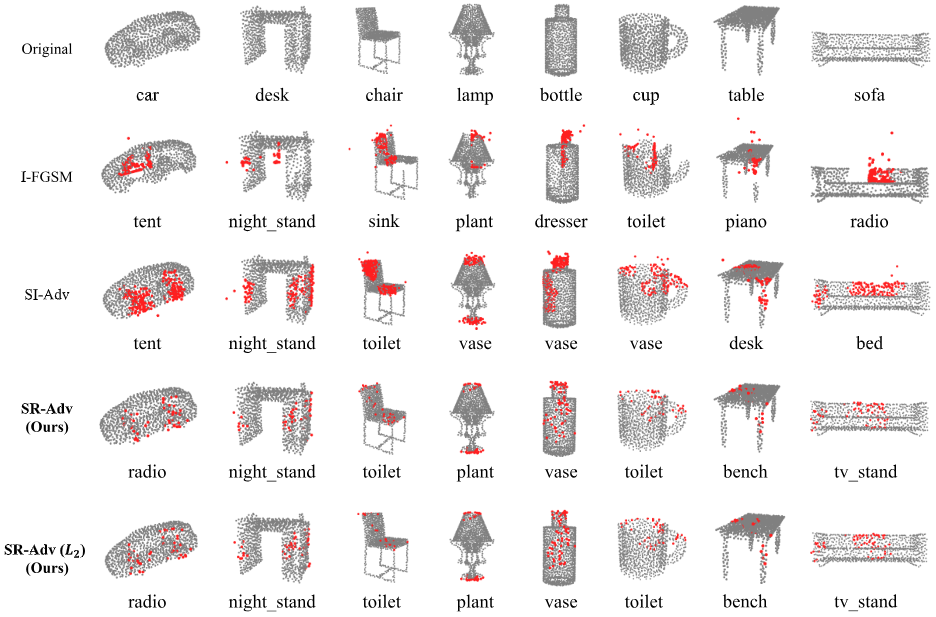{ width=80% }

图5：不同对抗攻击方法以及我们提出的 SR-Adv 和 SR-Adv(\(L_2\)) 所生成的对抗点云的可视化效果。
第一行表示原始点云。从第二行到第五行，每一行表示对应的对抗攻击方法生成的对抗点云。对抗点云中被扰动的点用红色标记。
{ .caption }

除了 PointNet 网络结构外，我们还在其他不同的 3D 网络结构上进行了实验，包括 CurveNet 和 DGCNN。表 III 和表 IV 分别显示了提出的 SR-Adv 在 ModelNet40 和 ShapeNetPart 数据集上攻击不同网络结构的性能。从表 III 和表 IV 可以看出，提出的方法 SR-Adv 可以在操作更少的点的情况下，在不同的网络模型上实现高攻击成功率。在表 III 和表 IV 中，我们提供了攻击区域数量为 1 和 2 时不同网络结构的攻击性能。例如，当受害者网络是 DGCNN 时，提出的 SR-Adv 仅需要操作 36 个点就能在 ModelNet40 上实现 \(98\%\) 的攻击成功率。

表 III. 在 ModelNet40 数据集上针对不同网络架构的攻击性能，攻击方法为我们提出的 SR-Adv。
{ .caption_table }

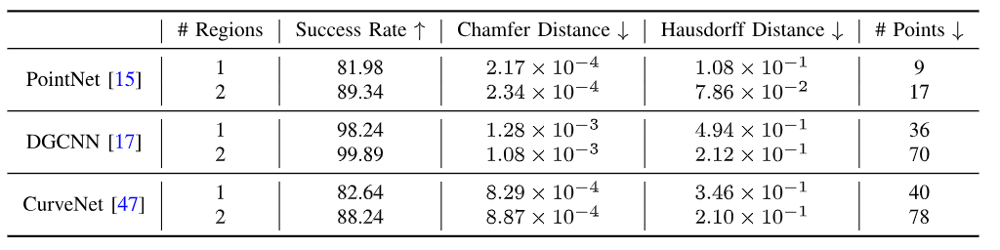

表 IV. 在 ShapeNetPart 数据集上针对不同网络架构的攻击性能，攻击方法为我们提出的 SR-Adv。
{ .caption_table }

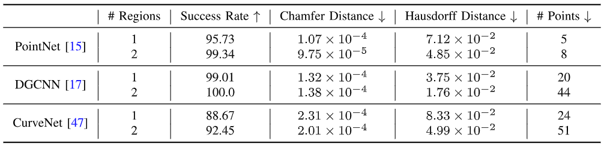

!!! info half end ""

    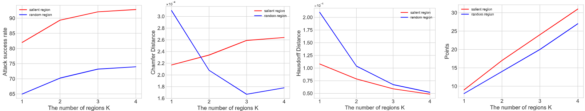

    图 6. 在攻击 PointNet 时，SR-Adv 方法在不同显著区域数量 \(K\) 下的攻击性能变化（在 ModelNet40 数据集上）。  
    （注：点击图片可放大）
    { .caption }

2) *消融研究*：我们验证了不同区域选择策略对攻击性能的影响，反映了显著区域提取方法的可行性。我们实验了两种区域选择策略：显著区域和随机区域。当在 ModelNet40 上攻击 PointNet 时，不同区域选择策略对攻击性能的影响如表 V 和图 6 所示。结果表明，显著区域选择策略可以在确保较小距离指标的同时获得更高的攻击成功率。

表 V. 不同的区域数量（\(K\)）选择策略。
{ .caption_table }

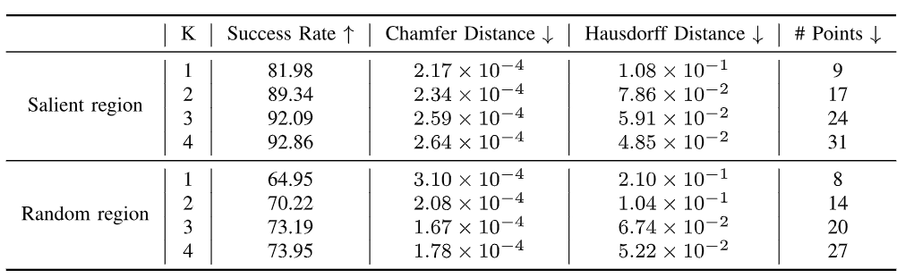

表 VI. 当受害者网络是 DGCNN 时，不同对抗攻击方法在 KITTI 和 NuScenes 上的性能
{ .caption_table }

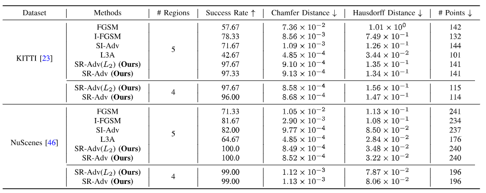

3) 在 KITTI 和 NuScenes 上的实验结果：我们根据标签从 KITTI 和 NuScenes 中提取相应的物体。然后，将这些物体分为训练集和测试集，用于训练 DGCNN。我们从测试集中随机选择 300 个汽车点云来评估攻击性能。提出的 SR-Adv 方法在 DGCNN 上的性能如表 VI 所示。从表 VI 可以看出，提出的方法可以用更少的点实现更高的攻击成功率。例如，在 NuScenes 上，SR-Adv 攻击了 196 个点，实现了 \(99\%\) 的攻击成功率，而 SI-Adv 攻击了 237 个点，实现了 \(82\%\) 的攻击成功率。同时，SR-Adv 保持较低的距离指标值，这表明 SR-Adv 生成的对抗样本具有良好的不可感知性。我们在图 7 中可视化原始样本和 SR-Adv 方法生成的对抗样本，扰动点用红色标记。

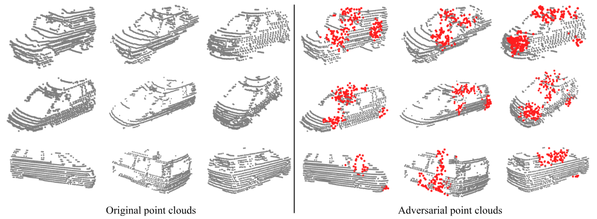

图 7. 在 KITTI 数据集上，使用所提出的 SR-Adv 方法生成的对抗性点云的可视化。原始点云和对抗性点云在同一列中对应。对抗性点云中被扰动点用红色标记。
{ .caption }

## Conclusion
本文提出了一种针对 3D 点云显著区域的对抗攻击方法，称为 SR-Adv。与之前的工作不同，SR-Adv 专注于攻击局部区域，而不是扰动整个 3D 点云。据我们所知，我们是第一个提出基于区域的 3D 点云攻击方法。受博弈论的启发，我们使用 Shapley 值来提取点云的显著区域，并为每个区域分配一个显著值，以表示该区域对模型预测结果的重要性。将这些显著值按降序排序，以确定需要攻击的区域数量。为此，本文设计了一种新颖的基于优化的梯度攻击算法，该算法使用局部距离约束和全局距离约束来促使生成的对抗点云更接近原始点云。实验结果表明，与其他攻击方法相比，SR-Adv 在较小的扰动预算下实现了最先进的攻击成功率。此外，SR-Adv 生成的对抗点云也具有更好的不可感知性。通过对对抗样本的探索，有助于提高神经网络模型的鲁棒性并增强自动驾驶系统的安全性。

