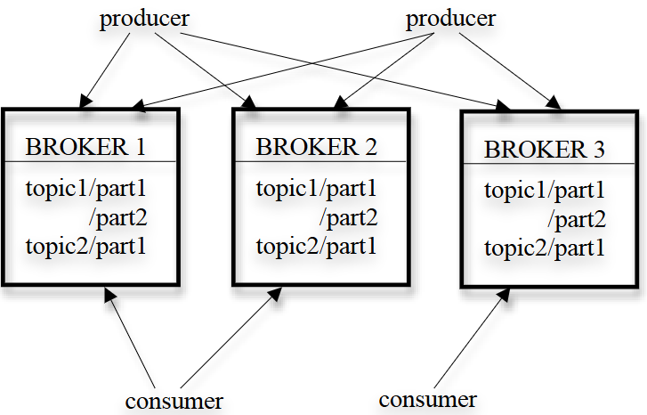
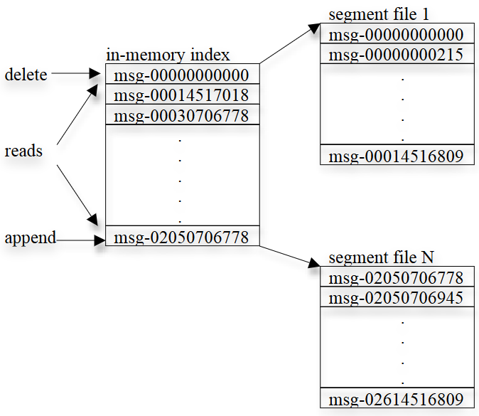

# 翻译：Kafka: a Distributed Messaging System for Log Processing

> 通过这篇论文了解 Kafka 最初的设计，顺便了解一下消息队列的应用场景

## 摘要 

日志处理已成为消费者互联网公司数据管道的关键组成部分。我们介绍了 Kafka，这是一个分布式消息系统，我们开发它用于以低延迟收集和传输大量日志数据。我们的系统结合了现有日志聚合器和消息系统的想法，并适用于在线和离线消息消费。为了使系统高效且可扩展，我们在 Kafka 中做出了许多非常规但实用的设计选择。我们的实验结果表明，Kafka 的性能优于两种流行的消息系统。我们已经将 Kafka 应用于生产环境一段时间，并且它每天处理数百 GB 的新数据。

!!! info "通用术语" 

    管理，性能，设计，实验。

!!! info "关键词" 

    消息传递，分布式，日志处理，吞吐量，在线。

## 1. Introduction

任何一家大型互联网公司都会产生大量的“日志”数据。这些数据通常包括：

- 用户活动事件，如登录、页面浏览、点击、“点赞”、分享、评论和搜索查询；
- 操作指标，如服务调用堆栈、调用延迟、错误，以及系统指标，如每台机器上的CPU、内存、网络或磁盘利用率。

长期以来，日志数据一直是分析用户参与度、系统利用率和其他指标的组成部分。然而，近年来互联网应用的趋势使得活动数据成为生产数据管道的一部分，直接用于网站功能。这些用途包括：

- 搜索相关性；
- 推荐内容，可能由活动流中的项目流行度或共现性驱动；
- 广告定位和报告；
- 安全应用，防止垃圾邮件或未经授权的数据抓取等滥用行为；
- 新闻提要功能，为用户的“朋友”或“联系人”汇总用户状态更新或操作，供他们阅读。

这种实时使用日志数据的生产方式为数据系统带来了新的挑战，因为其数据量比“真实”数据大几个数量级。例如，搜索、推荐和广告通常需要计算细粒度的点击率，这不仅要为每个用户点击生成日志记录，还要为每个页面上未被点击的数十个项目生成日志记录。每天，中国移动收集 5-8TB 的电话呼叫记录，而 Facebook 则收集近 6TB 的各种用户活动事件。

许多早期处理这类数据的系统依赖于从生产服务器上物理刮取日志文件进行分析。近年来，已经构建了几个专门的分布式日志聚合器，包括 Facebook 的 Scribe 、雅虎的 Data Highway 和 Cloudera 的 Flume。这些系统主要用于收集和加载数据仓库或 Hadoop 中的日志数据，以供离线使用。在 LinkedIn（一个社交网站）上，我们发现**除了传统的离线分析外，我们还需要支持上述大多数实时应用，延迟不超过几秒钟**。

我们构建了一个名为 Kafka 的新型日志处理消息系统，它结合了传统日志聚合器和消息系统的优点。一方面，Kafka 是分布式和可扩展的，并且提供高吞吐量。另一方面，Kafka 提供了一个类似于消息系统的 API，并允许应用程序实时消费日志事件。Kafka 已经开源，并且在 LinkedIn 的生产环境中成功使用了 6 个多月。它极大地简化了我们的基础设施，因为我们可以在单个软件上处理所有类型的日志数据的在线和离线消费。本文的其余部分组织如下。在第 2 节中，我们重新审视了传统的消息系统和日志聚合器。在第 3 节中，我们描述了 Kafka 的架构及其关键设计原则。在第 4 节中，我们描述了在 LinkedIn 部署 Kafka 的情况，并在第 5 节中描述了 Kafka 的性能结果。我们在第 6 节中讨论了未来的工作并得出结论。

## 2. Related Work
传统的企业消息系统已经存在很长时间，并且通常在处理异步数据流的事件总线上扮演着关键角色。然而，有几个原因使它们往往不适合日志处理。首先，企业系统提供的功能不匹配。这些系统通常专注于提供丰富的传递保证。例如，IBM Websphere MQ 具有事务支持，允许应用程序原子性地将消息插入多个队列。JMS 规范允许在消费后逐个确认每条消息，甚至可能不按顺序处理。**对于收集日志数据来说，这些传递保证通常是多余的**。例如，偶尔丢失一些页面浏览事件当然不是世界末日。这些不必要的功能往往会增加这些系统的 API 和底层实现的复杂性。其次，许多系统并不像它们的主要设计约束那样专注于吞吐量。例如，JMS 没有 API 允许生产者显式地将多条消息批处理为单个请求。这意味着每条消息都需要一个完整的 TCP/IP 往返行程，这对于我们领域的吞吐量要求来说是不可行的。第三，这些系统在分布式支持方面较弱。无法轻松地在多台机器上分区和存储消息。最后，许多消息系统假设消息会被近乎即时地消费，因此未消费消息的队列通常很小。如果允许消息积累（比如离线消费者场景——数据仓库应用会定期执行大批量加载而非持续消费），它们的性能会显著下降。

过去几年间，业界已开发出多种专用日志聚合系统。Facebook 采用名为 Scribe 的系统：每台前端机器通过套接字将日志数据发送至一组 Scribe 服务器，这些服务器会聚合日志条目并定期转储到 HDFS 或 NFS 存储设备。雅虎的数据高速公路项目（Data Highway）采用类似数据流架构：一组机器聚合客户端事件后生成"分钟文件"，再将其导入 HDFS。Flume 是 Cloudera 开发的新型日志聚合器，支持可扩展的"管道"与"接收器"，能灵活处理流式日志数据，并具备更完善的分布式支持。  然而，这些系统大多专为离线日志消费设计，常向消费者暴露不必要的实现细节（如"分钟文件"）。此外，它们多采用"推送"模型——由代理服务器主动向消费者转发数据。在 LinkedIn 实践中，我们发现"拉取"模型更符合需求：每个消费者可按自身最大承受速率获取消息，避免因推送速率超过处理能力而导致消息积压。拉取模型还支持消费者回溯消费，我们将在 3.2 节末尾详述这一优势。  

近期，雅虎研究院（Yahoo! Research）开发了一款名为 HedWig 的新型分布式发布/订阅系统。该系统具备高度可扩展性和可用性，并提供强持久性保证。不过，其设计初衷主要是用于存储数据存储系统的提交日志。

## 3. Kafka Architecture and Design Principles

由于现有系统存在诸多限制，我们开发了一款基于消息传递的新型日志聚合系统——Kafka。我们首先介绍 Kafka 的基本概念：  

!!! note "Kafka"

    每个特定类型的消息流通过主题（topic）进行定义。生产者（producer）可将消息发布到指定主题，这些消息会被存储在一组称为代理（broker）的服务器上。消费者（consumer）则可从代理服务器订阅一个或多个主题，并通过主动拉取（pull）的方式消费订阅的消息。  

从概念上讲，消息传递非常简单，我们也努力使 Kafka API 保持同样的简洁性来体现这一点。我们不会展示具体的 API，而是通过示例代码来演示 API 的使用方式。以下是生产者的示例代码：一条消息仅被定义为包含字节负载（payload），用户可以选择自己喜欢的序列化方法来编码消息。为了提高效率，生产者可以在单个发布请求中发送一组消息。  

```java title="生成者代码示例"
Producer producer = new Producer(...); 
Message message = new Message("test message str".getBytes()); 
MessageSet set = new MessageSet(message); 
producer.send("topic1", set); 
```

消费者订阅主题时，首先需要为该主题创建一个或多个消息流。发布到该主题的消息将被均匀分配到这些子流中，具体分配机制将在第 3.2 节详细说明。每个消息流都提供了一个迭代器接口，用于持续遍历不断产生的消息流。消费者通过该迭代器逐个处理消息流中的消息及其负载内容。

与传统迭代器不同，消息流迭代器永远不会终止。当没有新消息可供消费时，迭代器会保持阻塞状态，直到主题有新消息发布。Kafka 同时支持两种消费模式：点对点模式（多个消费者共同消费主题消息的单一副本）和发布/订阅模式（每个消费者获取主题消息的独立副本）。


```java title="消费者代码示例"
streams[] = Consumer.createMessageStreams(“topic1”, 1)
for (message : streams[0]) {
    bytes = message.payload();
    // do something with the bytes
}
```
Kafka 的整体架构如图 1 所示。作为一个分布式系统，Kafka 集群通常由多个代理（broker）组成。为实现负载均衡，每个主题会被划分为多个分区（partition），每个代理负责存储一个或多个分区。系统支持多生产者和消费者同时进行消息发布与获取。

在 3.1 节中，我们将阐述单个分区在代理节点上的存储布局，以及为实现高效分区访问所做的设计决策。3.2 节将说明生产者和消费者在分布式环境下如何与多个代理节点交互。最后，3.3 节将讨论 Kafka 提供的消息交付保证机制。

{ width=50% }

Kafka 架构
{ .caption }

### 3.1 Efficiency on a Single Partition

在 Kafka 的设计中，我们做出了一些关键决策以确保系统高效运行。

**简洁的存储架构**：
Kafka  采用极简的存储布局设计。==每个主题分区对应一个逻辑日志（log），在物理实现上，该日志由一组大小相近的段文件组成（例如每个文件 1GB）。== 当生产者向分区发布消息时，代理节点只需将消息追加到最后一个段文件末尾。为了优化性能，我们仅在达到可配置的消息数量或时间阈值后，才将段文件刷写到磁盘。值得注意的是，消息只有在完成刷盘操作后才会对消费者可见。

与典型消息系统不同，Kafka 中的存储消息并不包含显式的消息 ID。取而代之的是，每条消息通过其在日志中的逻辑偏移量（offset）进行定位。这种设计避免了维护辅助索引结构的开销——这类随机访问索引需要频繁执行查找操作，用于映射消息 ID 与实际存储位置。

消费者总是按顺序消费特定分区中的消息。当消费者确认（acknowledge）某个特定消息偏移量（offset）时，即表示该分区中该偏移量之前的所有消息都已被成功接收。在底层实现上，消费者会向代理（broker）发起异步拉取（pull）请求，预先缓冲数据供应用程序消费。  

每个拉取请求包含两个关键参数：  

- **起始消费偏移量**：指定从哪个消息开始消费  
- **最大获取字节数**：限制单次请求的数据量  

代理节点在内存中维护了一个有序的偏移量列表，其中包含每个段文件（segment file）中第一条消息的偏移量。通过搜索这个偏移量列表，代理可以快速定位目标消息所在的段文件，并将对应数据返回给消费者。  

消费者在收到消息后，会计算出下一条待消费消息的偏移量，并将其用于下一次拉取请求。图 2 展示了 Kafka 日志及其内存索引的布局结构，其中每个方框代表一条消息及其对应的偏移量。  

{ width=66% }

Kafka 日志
{ .caption }

**高效传输**：我们在将数据传出和传出 Kafka 时非常谨慎。我们在 Kafka 的数据传输设计上格外谨慎。前文已说明，前文已经提到，生产者可以在一次发送请求中提交一组消息。尽管最终的消费者 API 是一次处理一条消息，但在底层，每次消费者的拉取请求都会检索多条消息，直到达到某个大小限制，通常为几百 KB。

我们还做出了一个非常规的设计选择，即避免在 Kafka 层显式地将消息缓存在内存中。相反，我们依赖底层文件系统的页面缓存。这种做法的主要优点是避免了**双重缓冲**——消息只被缓存于页面缓存中。另一个好处是，即使代理进程（broker）重启，缓存依然可以保持“热态”(1)。
{ .annotate }

1. 即使代理进程重启，页缓存仍能保持热数据，无需重新预热。

由于 Kafka 完全不在进程中缓存消息，因此内存垃圾回收的开销极小，从而使得在基于虚拟机的语言中实现高效的系统成为可能。

最后，由于生产者和消费者都是顺序访问段文件（segment files）(1)，而消费者通常仅略微滞后于生产者，操作系统的常规缓存策略（尤其是写通缓存和预读(2)）非常有效。我们发现，不论是生产过程还是消费过程，其性能都能稳定地随着数据量线性增长，即便是处理数 TB 的数据也表现良好。
{ .annotate }

1. :nerd::point_up:: Kafka 中的消息是保存在磁盘上的日志文件里的，这些文件被称为 段文件（segment files）。生产者写入消息时，是按顺序一条一条追加到这些日志文件的末尾。消费者读取消息时，也是按顺序从日志文件头部往后读。  所以，无论是写入还是读取，都是顺序访问磁盘文件，这比随机访问效率要高很多。

2. :nerd::point_up:: 生产者写入了数据之后，消费者马上就会开始读，但读的速度一般比写略慢一点，所以消费者“稍微落后”于生产者，那么如果操作系统采用这两种缓存策略的话，消费者读取的数据大多数就都还在操作系统缓存里（因为刚刚才被写入）。  
    - **写通缓存（write-through cache）**：数据写入磁盘时也保存在内存的缓存区，这样如果马上要读取这些数据，就不需要再次访问磁盘。
    - **预读（read-ahead）**：系统会“猜测”你会继续往后读，于是提前把后面一段数据加载进内存，加快读取速度。  

此外，我们还对消费者的网络访问进行了优化。Kafka 是一个多订阅者系统，一条消息可能会被多个消费者应用程序多次读取。

在传统方式中，从本地文件向远程套接字发送字节通常包括以下步骤：

1. 从存储介质读取数据到操作系统的页面缓存（page cache），  
2. 将页面缓存中的数据复制到应用层缓冲区，  
3. 再将应用层缓冲区的数据复制到另一个内核缓冲区，  
4. 最后通过套接字发送内核缓冲区中的数据。

这个过程涉及 **4 次数据复制** 和 **2 次系统调用**，效率较低。

但在 Linux 和其他 Unix 系统中，有一个叫做 `sendfile` 的 API，它可以**直接将文件通道中的字节传输到套接字通道中**。  
使用 `sendfile` 通常可以省去第 2 步和第 3 步所带来的 **两次数据复制和一次系统调用**。

Kafka 利用 `sendfile` API，可以将日志段文件中的字节**高效地从代理（broker）直接发送到消费者**，显著提升数据传输效率。

**无状态的代理（Stateless broker）**：与大多数消息系统不同，Kafka 中每个消费者消费了多少消息的信息不是由代理（broker）维护的，而是由消费者自己维护。  这种设计大大简化了代理端的复杂度，也减少了开销。但这也带来了一个问题：如何删除消息变得棘手，因为代理并不知道所有订阅者是否已经消费了某条消息。

Kafka 采用了一种简单的解决方案：基于时间的保留策略（SLA）。如果一条消息在代理中保留的时间超过了设定的期限（通常是 7 天），就会被自动删除。  这种做法在实际中效果很好。因为大多数消费者（包括离线的消费者）都是按天、按小时，或实时地完成消费。而前面提到的 Kafka  面对数据量增大，性能也不会下降的事实，使得较长时间的消息保留策略变得可行。

这种设计还有一个重要的附带好处：消费者可以主动**回退**到某个较早的偏移量（offset）重新消费数据。

这虽然违反了传统队列“消息只能消费一次”的常规契约，但对许多消费者来说却是一个非常关键的功能。

例如，当消费者应用程序的逻辑出错时，修复错误后，可以重放（re-play）之前的消息，避免数据丢失或处理不当。这在进行 ETL 数据加载（如导入数据到数据仓库或 Hadoop 系统）时尤其重要。又比如，在某些应用中（如全文索引器），消费的数据只是周期性地刷新到持久化存储中，如果消费者在刷新前崩溃了，未写入的数据就会丢失。在这种情况下，此时消费者可以记录下未刷新的最小偏移量，在重启后从该偏移量重新开始消费。

我们还要注意到，在拉取（pull）模式下，支持“回退消费”要比推送（push）模式容易得多。

### 3.2 Distributed Coordination

我们现在描述在分布式环境中生产者和消费者的行为。每个生产者可以将消息发布到一个随机选择的分区，或者根据分区键和分区函数语义确定的分区。接下来我们将重点介绍消费者如何与代理（broker）进行交互。

Kafka 引入了消费者组（consumer group）的概念。每个消费者组由一个或多个消费者组成，这些消费者共同消费一组订阅的主题，也就是说，每条消息只会被该组中的一个消费者接收。不同的消费者组则各自独立地消费其订阅的全部消息，无需跨组协调。属于同一消费者组的消费者可以位于不同的进程中，或者在不同的机器上。我们的目标是将代理（broker）中存储的消息尽可能平均地分配给各个消费者，同时避免引入过多的协调开销。

我们的第一个决策是将一个主题中的分区作为并行处理的最小单位。这意味着在任意时刻，每个消费者组中，一个分区的所有消息只能由其中一个消费者来消费。如果允许多个消费者同时消费同一个分区，就需要它们相互协调各自消费哪些消息，从而引入锁机制和状态维护等额外开销。相比之下，在我们的设计中，消费者进程仅在重新平衡负载时才需要进行协调，而这是一种较少发生的操作。为了实现真正的负载均衡，我们要求一个主题中包含的分区数量远多于每个消费者组中的消费者数量。我们可以通过对主题进行过度分区来轻松实现这一点。

我们所做的第二个决策是，不设置一个中央的“主节点”，而是让消费者之间以去中心化的方式自行协调。引入一个主节点会使系统变得更加复杂，因为我们还需要考虑主节点故障的问题。为了实现这种协调机制，我们采用了高可用的一致性服务 Zookeeper。

Zookeeper 提供了一个非常简单的、类似文件系统的 API。用户可以创建路径、设置路径的值、读取路径的值、删除路径，以及列出某个路径下的子节点。此外，它还具备一些更有趣的功能：（a）可以在某个路径上注册监听器，在该路径的值或子节点发生变化时获得通知；（b）路径可以被创建为“临时节点”（与持久节点相对），这意味着如果创建该路径的客户端宕机，Zookeeper 服务器会自动删除该路径；（c）Zookeeper 会将其数据复制到多个服务器，从而保证数据的高度可靠性与可用性。

Kafka 使用 Zookeeper 执行以下任务：（1）检测代理（broker）和消费者的添加与移除，（2）在上述事件发生时触发每个消费者的再平衡过程，（3）维护消费关系并跟踪每个分区的消费偏移量。

具体来说，当每个代理或消费者启动时，它会将其信息存储在 Zookeeper 中的代理或消费者注册表中。代理注册表包含代理的主机名和端口，以及其上存储的主题和分区集合。消费者注册表包含消费者所属的消费组及其订阅的主题集合。每个消费者组都与 Zookeeper 中的所有权注册表和偏移量注册表关联。所有权注册表为每个订阅的分区设置一个路径，该路径的值是当前从该分区消费的消费者的 ID（我们使用“消费者拥有该分区”这一术语）。偏移量注册表为每个订阅的分区存储该分区最后消费的消息的偏移量。

在消费者初始启动时，或当消费者通过监视器（watcher）获知代理/消费者发生变更时，该消费者会触发再平衡流程以确定其应当消费的新分区子集。该流程如算法 1 所述：消费者首先从 Zookeeper 读取代理和消费者注册表，计算出每个订阅主题 T 对应的可用分区集合\(P_T\)以及订阅该主题的消费者集合 \(C_T\)；接着将 \(P_T\) 按照范围划分为 \(|C_T|\) 个区块，并确定性地选择其中一个区块作为自身消费范围；对于选中的（区块中的）每个分区，消费者会在所有权注册表中将自己标记为该分区的新所有者；最后，消费者启动线程从每个所属分区在偏移量注册表中记录的起始位置开始拉取数据。在从分区拉取消息的过程中，消费者会定期将最新消费的偏移量更新至偏移量注册表。

$$
\begin{array}{ll}
& \textbf{Algorithm 1.} \quad \text{消费者组 } G \text{ 中消费者 } C_i \text{ 的再平衡流程} \\
& 1 \quad \text{对 } C_i \text{ 订阅的每个主题 } T \ \{ \\
& 2 \quad \qquad \text{从所有权注册表中移除 } C_i \text{ 当前持有的所有分区} \\
& 3 \quad \qquad \text{从 Zookeeper 读取代理注册表和消费者注册表} \\
& 4 \quad \qquad \text{计算 } P_T = { 所有代理中主题 }\ T\ { 的可用分区} \\
& 4 \quad \qquad \text{计算 } C_T = { 消费者组\ G\ 中所有订阅了主题 }\ T\ \text{ 的消费者} \\
& 5 \quad \qquad \text{对 } P_T \text{ 和 } C_T \text{ 进行排序（实现确定性分配）} \\
& 6 \quad \qquad \text{设 } j \text{ 为 } C_i \text{ 在 } C_T \text{ 中的索引位置，令 } N = \dfrac{|P_T|}{|C_T|} \text{ } \\
& 7 \quad \qquad \text{将 } P_T \text{ 中第 } j\cdot N \text{ 至 } (j+1) \cdot N-1 \text{ 号分区分配给 } C_i \\
& 8 \quad \qquad \text{对于每个被分配的分区 }\ p\ \{ \\
& 9 \quad \qquad \qquad \text{在所有权注册表中将 } p \text{ 的所有者标记为 } C_i \\
& 10 \quad \qquad \qquad \text{从偏移量注册表中读取分区 } p \text{ 的起始偏移量 } O_p \\
& 11 \quad \qquad \qquad \text{创建线程从偏移量 } O_p \text{ 开始消费分区 } p \\
& 12 \quad \qquad \} \\
& 13 \quad \} \\
\end{array}
$$

当一个消费组中有多个消费者时，每个消费者都会得到代理（broker）或消费者的变动的通知。然而，这些通知在不同消费者处的到达时间可能略有不同。因此，有可能出现某个消费者尝试接管一个仍被其他消费者占有的分区的情况。当这种情况发生时，前者会主动释放它当前拥有的所有分区，稍作等待后重新尝试执行再平衡过程(1)。实际中，再平衡过程通常只需重试几次就能稳定下来。
{ .annotate }

1. 不成功就重试。另外，所有消费者在执行算法 1. 时， 第一步都是先放弃当前拥有的所有分区，等待一定时间后分区总会被释放。这就像重新洗牌，所有人先把手牌丢弃，然后才能抢牌。

当一个新的消费组被创建时，偏移量注册表中尚未存在任何偏移量。在这种情况下，消费者将会从每个已订阅分区中可用的最小偏移量或最大偏移量开始消费（取决于配置），这一行为是通过我们在代理端提供的 API 实现的。

### 3.3 Delivery Guarantees

一般来说，Kafka 只保证“至少一次”投递（at-least-once delivery）。而“恰好一次”投递（exactly-once delivery）(1)通常需要使用两阶段提交机制，但这对我们的应用并不是必须的。大多数情况下，每条消息会被恰好投递一次到每个消费组。然而，如果某个消费者进程在没有正常关闭的情况下崩溃，那么接管该消费者所拥有分区的新进程，可能会接收到一些重复消息，这些消息是在上一个成功提交到 Zookeeper 的偏移量之后的。如果应用程序对消息重复较为敏感，就必须自行实现去重逻辑，可以利用我们返回给消费者的偏移量，或者消息中包含的某个唯一键来实现。这通常比采用两阶段提交机制更具成本效益。
{ .annotate }

1. 指的是消息的投递，“至少一次”投递说明消息总会被消费，但可能被多次消费。

Kafka 保证来自同一个分区的消息会按顺序投递给消费者。然而，对于来自不同分区的消息，则不保证投递顺序。

为了避免日志损坏，Kafka 会为每条消息在日志中存储一个 CRC 校验码。如果代理（broker）上发生任何 I/O 错误，Kafka 会启动恢复流程，移除那些 CRC 不一致的消息。在消息级别设置 CRC 还能帮助我们在消息被生产或消费后检查是否存在网络传输错误。

如果某个代理（broker）宕机，那么存储在该 broker 上但尚未被消费的消息将变得不可用。如果该 broker 的存储系统发生永久性损坏，那么任何尚未被消费的消息都将永久丢失。未来，我们计划在 Kafka 中加入内置的副本机制，将每条消息冗余地存储在多个 broker 上，以提高可靠性。

## 4. Kafka Usage at LinkedIn

**TODO**

