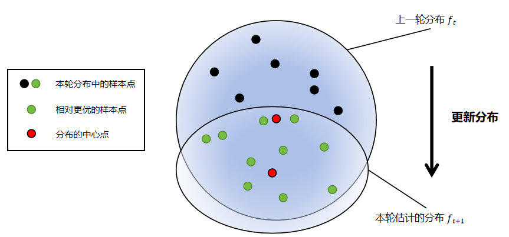

# 翻译：Learning Tetris Using the Noisy Cross-Entropy Method

!!! info "文献"

    - [Learning Tetris Using the Noisy Cross-Entropy Method](https://www.researchgate.net/publication/6743957_Learning_Tetris_Using_the_Noisy_Cross-Entropy_Method)

**交叉熵方法（CE Method, Cross-Entropy Method）是一种高效且通用的优化算法。然而，它在强化学习（RL）中的应用似乎受到限制，因为它经常收敛到次优策略。在本文中，我们通过使用噪声来防止交叉熵方法过早收敛，并使用俄罗斯方块这款电脑游戏来进行演示。最终得到的策略比以前的 RL 算法性能高出近两个数量级。**

## 1. Introduction

俄罗斯方块是最受欢迎的电脑游戏之一（例如，参见 Fahey，2003）。尽管规则简单，但要玩好这个游戏，需要制定复杂的策略并进行大量的练习。此外，Demaine、Hohenberger 和 Liben-Nowell（2003）已经证明，从数学角度看，俄罗斯方块是一个难题: **即使提前知道方块序列，找到最优策略仍然是一个 NP-hard 问题**。这些特性使得俄罗斯方块成为测试强化学习（和其他机器学习）算法的理想基准问题。

强化学习（RL）算法在解决各种复杂的顺序决策问题上表现出色。然而，迄今为止在俄罗斯方块上尝试的 RL 方法却显示出令人惊讶的糟糕性能。
本笔记旨在展示如何改进 RL 以解决这个困难的组合问题。在本文中，我们提出了一种修改版的交叉熵（CE）方法（de Boer、Kroese、Mannor和Rubinstein，2004 年）。

## 2. Applying the Cross-Entropy Method to Tetris

### 2.1. Value Function and Action Selection. 

根据 Bertsekas 和 Tsitsiklis（1996）的方法，我们将学习**状态值函数（state-value functions）**，这些函数是多个基函数的线性组合。我们使用 22 个这样的基函数：最大列高、各个列高、列高的差异以及空洞的数量。更正式地说，如果 $s$ 表示一个俄罗斯方块的状态，$\phi_i(s)$ 是在这个状态下第 $i$ 个基函数的值，那么根据权重向量 $w$，状态 $s$ 的值为:

$$
V_w(s) = \sum_{i=1}^{22} w_i \cdot \phi_i(s).
\tag{2.1}
$$

> 为了便于理解，下面这段略有修改

在游戏的每一轮中，首先尝试把方块放置在一个合法的位置上，然后执行清除满行逻辑之后，根据函数 \( V_w \) 计算出结果状态的价值。依次尝试所有可能的放置方式，最后选择具有最高价值的列和方向。

### 2.2 The Cross-Entropy Method.  

交叉熵方法（CE Method）是一种用于（近似）解决全局优化任务的通用算法，其形式为

$$
w^* = \arg\max_w S(w),
\tag{2.2}
$$

其中 \( S \) 是一个通用的实值目标函数，其最优值为 \( S(w) \)。CE 的主要思想是维持一个可能解的分布，并在每一步更新这个分布（de Boer 等人，2004 年）。这里提供了一个非常简要的概述。

???+ tip "CE 方法概述"

    不想看下面的一大段的公式的话，只需要理解一点：交叉熵方法的思路是依据采样中的较优样本估计更优的分布，然后继续采样，执行相同的更新。可以参考下面的这个图:

    === "原理示意图"

        

        交叉熵方法原理图。
        { .caption }

    === "运行示意图"

        { width=66% }

        交叉熵方法运行过程展示，其中黑色点为采样点，红色点为较优的样本。
        { .caption }

CE 方法从一个概率分布的参数族 \( F \) 和一个初始分布 \( f_0 \in F \) 开始。在这种分布下，抽取高值样本（具有接近 \( S(w) \) 的值）的概率假定非常低；因此，通过简单的采样找到这样的样本是不可行的。对于任何 \( R \)，让 \( g \) 成为集合 \( \{ w : S(w) \geq \gamma \} \) 上的均匀分布。如果找到与 \( g \) 最近的分布 \( f_1 \in F \)，那么 \( f_0 \) 可以被 \( f_1 \) 替换，而 \( \gamma \)-值样本将有更大的概率。对于许多分布族，可以从 \( f_0 \) 的样本中估计 \( f_1 \) 的参数。如果 \( \gamma \)-水平集的概率相对于 \( f_0 \) 不是非常低，这种估计是可行的。我们可以迭代进行，而不是直接计算与 \( g \) 最接近的 \( F \)-分布。我们选择一个适合 \( f_0 \) 的 \( \gamma_0 \)，更新分布参数以获得 \( f_1 \)，选择 \( \gamma_1 \)，依此类推，直到我们达到一个足够大的 \( k \)。下面我们概述了 \( w \) 从高斯分布族的一个成员中抽取的特殊情况。

!!! example "CE 方法（高斯分布的情况）"

    设第 \(t\) 次迭代中参数向量的分布 \(f_t\) 服从正态分布 \(\mathcal{N}(\mu_t, \sigma_t^2) \)。首先，从分布 \(f_t\) 中采样 \(n\) 个权重向量样本 \( w_1, ..., w_n \) 分别计算它们的值 \( S(w_1), ..., S(w_n) \) 。然后，选择最好的 \( \lfloor \rho \cdot n \rfloor \) 个样本，其中 \(\rho\) 是选择比率，满足 \( 0 < \rho < 1 \) 。这相当于设置 \( \gamma_t = S(w_{\lfloor \rho \cdot n \rfloor}) \)。用 \(I\) 表示所选样本索引的集合，\(I\) 是 \(\{1, 2, ..., n\}\) 的子集，使用 \(I\) 更新分布的均值和方差。

    均值的更新公式：

    $$
    \mu_{t+1} := \frac{\sum_{i \in I} w_i}{|I|}
    \tag{2.3}
    $$

    方差的更新公式：

    $$
    \sigma_{t+1}^2 := \frac{\sum_{i \in I} (w_i - \mu_{t+1})^T (w_i - \mu_{t+1})}{|I|}
    \tag{2.4}
    $$

### 2.3 The Cross-Entropy Method and Reinforcement Learning.

将交叉熵方法应用于强化学习的尝试包括径向基函数的参数调整（Menache, Mannor, & Shimkin, 2005）和参数化策略的适应（Mannor, Rubinstein, & Gat, 2003）。在这里我们应用交叉熵方法来学习基函数的权重，每个权重从独立的正态分布中抽取。

### 2.4 Preventing Early Convergence.

先前的研究表明，交叉熵方法在强化学习中的应用严重受到**分布过快集中于单个点的现象**的限制。为了防止这种情况，我们采用了一个在粒子滤波中经常使用的技巧：**在每次迭代中，向分布中添加一些额外的噪声**。因此，我们将将公式2.4，替换为如所示的公式:

$$
\sigma_{t+1}^2 := \frac{\sum_{i \in I} (w_i - \mu_{t+1})^T (w_i - \mu_{t+1})}{|I|} + Z_{t+1},
\tag{2.5}
$$

其中 \(Z_{t+1}\) 是一个常数向量，其值仅取决于 \(t\) 。

## 3. Experiments

在我们的实验中，我们使用了 Bertsekas 和 Tsitsiklis (1996) 描述的标准俄罗斯方块游戏，每消除一行得 1 分。每个参数的初始分布为 \(N(0, 100)\)。我们设定 \(n = 100\) 和 \(\rho = 0.1\)。每个抽取的样本通过使用相应的值函数进行一局游戏来评估。每次迭代后，我们使用公式 \(2.3\) 和 \(2.5\) 更新分布参数，并评估学习参数的平均性能。这是通过使用 \(V_t\) 进行 30 局游戏并取平均值来完成的。（需要大量评估游戏的原因是俄罗斯方块策略的性能偏差很大；Fahey, 2003。）

图 1：对数尺度下的俄罗斯方块得分情况。30 次评估的平均性能与迭代次数的关系。一条曲线上的误差条表示 95% 的置信区间。
{ .caption }

在实验 1 中，我们测试了原始的交叉熵方法（对应于 \( Z_t = 0 \)）。正如预期的那样，偏差过快地收敛到 0，因此平均性能稳定在大约 20,000 分。在实验 2 中，我们使用了恒定的噪声率 \( Z_t = 4 \)，将平均性能提高到 70,000 分的水平。我们的分析表明，进一步的提升被过高的噪声量所抵消，高噪声阻止了分布的收敛。因此，在实验 3 中，我们应用了递减的噪声量，\( Z_t = \max(5 - \frac{t}{10}, 0) \)。在这种设置下，平均得分在 50 次试验结束时超过了 300,000 分，最高得分超过了 800,000 分。在实验 2 和 3 中，噪声参数是临时选择的，没有进行优化。结果总结在图 1 和表 1 中。

表 1：各种算法的平均俄罗斯方块得分。
{ .caption }

假设评分服从指数分布（Fahey, 2003），我们计算了均值的 $95%$ 置信区间。为了便于观察，仅对实验3绘制了置信区间。

在一台1 GHz的机器上使用 Matlab 进行学习，耗费了超过一个月的 CPU 时间。学习时间较长的主要原因在于：对于俄罗斯方块问题，价值函数的评估时间与得分线性相关，而得分本身又具有较大的噪声[^1]。在这种情况下，交叉熵（CE）方法本身带来的计算开销可以忽略不计。

由于运行时间较长，每个实验仅进行了单次训练。然而，在简化的俄罗斯方块问题上的初步实验结果表明，该方法在多次试验中能够稳定地收敛到相同的区域。

### 3.1 Comparison to Previous Work.

许多研究人员选择俄罗斯方块作为基准问题来测试他们的强化学习（RL）算法。表 1 总结了我们所知的各种结果，并将它们与我们的算法以及两种最先进的非强化学习算法进行了比较。

比较结果显示，我们的方法在性能上比最佳的强化学习算法提高了近两个数量级，并且接近于最佳的非强化学习算法（Fahey, 2003; Böhme, Kókai, & Mandl, 2004）。我们认为，通过应用Böhme等人（2004年）中的性能增强技术——更多的基函数和指数值函数——可以实现进一步的性能提升。

## References

1. Bertsekas, D. P., & Tsitsiklis, J. N. (1996). *Neuro-Dynamic Programming*. Nashua, NH: Athena Scientific.
2. Böhme, N., Kókai, G., & Mandl, S. (2004). Evolving a heuristic function for the game of Tetris. In T. Scheffer (Ed.), *Proc. Lernen, Wissensentdeckung und Adaptivität LWA—2004* (pp. 118–122). Berlin.
3. de Boer, P., Kroese, D., Mannor, S., & Rubinstein, R. (2004). A tutorial on the cross-entropy method. *Annals of Operations Research, 134*(1), 19–67.
4. Demaine, E. D., Hohenberger, S., & Liben-Nowell, D. (2003). Tetris is hard, even to approximate. In *Proc. 9th International Computing and Combinatorics Conference (COCOON 2003)* (pp. 351–363). Berlin: Springer.
5. Fahey, C. P. (2003). *Tetris AI*. Available online at http://www.colinfahey.com
6. Farias, V. F., & van Roy, B. (2006). Tetris: A study of randomized constraint sampling. In G. Calafiore & F. Dabbene (Eds.), *Probabilistic and randomized methods for design under uncertainty*. Berlin: Springer-Verlag.
7. Kakade, S. (2001). A natural policy gradient. In T. G. Dietterich, S. Becker, & Z. Ghahramani (Eds.), *Advances in neural information processing systems, 14* (pp. 1531–1538). Cambridge, MA: MIT Press.
8. Lagoudakis, M. G., Parr, R., & Littman, M. L. (2002). Least-squares methods in reinforcement learning for control. In SETN ’02: *Proceedings of the Second Hellenic Conference on AI* (pp. 249–260). Berlin: Springer-Verlag.
9. Mannor, S., Rubinstein, R. Y., & Gat, Y. (2003). The cross-entropy method for fast policy search. In *Proc. International Conf. on Machine Learning (ICML 2003)*, (pp. 512–519). Menlo Park, CA: AAAI Press.
10. Menache, I., Mannor, S., & Shimkin, N. (2005). Basis function adaption in temporal difference reinforcement learning. *Annals of Operations Research, 134*(1), 215–238.
11. Ramon, J., & Driessens, K. (2004). On the numeric stability of gaussian processes regression for relational reinforcement learning. In *ICML-2004 Workshop on Relational Reinforcement Learning* (pp. 10–14). N.p.: Omni press.

[^1]: 有研究猜想游戏的长度可以通过其起始序列进行近似估计（Fahey，2003），这可能会显著减少评估所需的时间。
